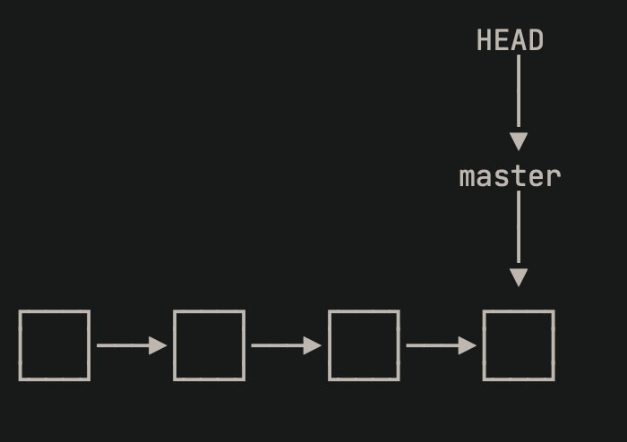

# git命令学习工具

GIT 是目前实际使用中最常见的**分布式版本控制系统**。没有中央服务器，每个人在自己的电脑中有项目的完整版本库，工作时不需要链接网络，只需要在个人修改后，将修改推送到协作者的中，就可以看到相互的修改。GIT对项目中的修改进行管理，而不是直接管理文件。

## GIT工作流程介绍


上图展示了git的工作流程：git将项目划分为 工作区(workspace)、暂存区(stage)、本地仓库(repository)、远程仓库(remote).

其中各个分区具体功能以及总工作流程如下：

- **工作区**用作在指定的branch分支上，进行文件的修改（创建、删除、修改内容）操作。工作区就是电脑中的显示呈现的目录，不包括.git目录。
- **暂存区**用于暂存在工作区进度，例如在工作区创建了文件或者添加了内容，使用`git add <file>`来将工作区中的修改加入暂存区。在项目根目录中，存在一个文件夹.git，该文件夹就是项目的仓库（repository），在仓库.git中存在一个暂存区（stage）。
- **本地仓库**用于保存本地工作的进度，在工作区的修改暂存到暂存区之后，使用`git commit -m "message"`将暂存区的进展按照message消息表示提交到本地仓库中。使用`git checkout`来对比**工作区**与**本地仓库**之间的区别。即是根目录中的.git文件夹，该文件夹中包括暂存区，同时在仓库初始化时，会自动创建一个名为main（master）的分支，以及指向该分支的HEAD指针。
- **远程仓库**用于将仓库中的内容存储在网络中，方便协作者进行拉取同步。在本地上，一项工作做完后，使用`git commit -m "message"`提交在本地仓库后，使用`git push <remote-name> <local-branch>`将本地的仓库内容推送到远程仓库中。此时协作者可以使用`git clone`或`git pull`命令进行拉取

## GIT的使用方法

在使用GIT之前，首先在本地上下载并配置git命令行工具。
在[git官网](https://git-scm.com/download)上按照对应的系统进行下载.

本电脑已经下载过，使用`git --version`查看git版本。


下载过后，使用全局方式配置git：

```shell
git config --global user.name "zip95297"
git config --global user.email "zip95297@gmail.com"
```

在配置时可以选择``--system``或者``--local``从系统级别或者本地一个指定的仓库进行配置。

### *本地* GIT代码管理

#### 本地仓库的建立 以及工作内容的提交

在对git进行了简单的配置之后，在本地建立一个仓库学习本地使用。以当前“PreLearn”为例子，建立一个仓库。首先在当前仓库**根目录**下，使用`git init`初始化本地仓库。在建立了本地仓库之后，可以发现在项目的根目录下，出现了一个名为.git的文件夹：


该.git的文件夹中即包括了暂存区和本地仓库的部分，若在本地想要删除git仓库，保留原文件，可以使用`rm -rf ./.git`

在建立了本地的git仓库后，在工作区中进行工作，然后使用`git status`检查工作区状态（提示将工作区的修改加入到暂存区中）

在使用该命令后git会将未暂存的改动标注出来。

然后使用`git add <file>`命令将工作区中的文件暂存到暂存区中。

添加到暂存区后会提示还未提交commit到本地仓库的暂存修改。

在将工作内容添加到暂存区之后，使用`git commit -m "message"`将暂存区中的修改提交到本地仓库中去。


至此，已经学会了如何使用本地的工作文件建立git仓库并使用git将工作修改保存在仓库中。

##### 提交时忽略部分文件：.gitignore

在提交时有些文件不需要提交到仓库中，可以在文件夹中建立.gitignore文件进行标注，在.gitignore中标注的文件将不会再被添加到本地仓库中去。例如当前仓库中的文件结构如下：

```txt
PreLearning
├── Direction.pdf
├── README.md
└── Week1
    ├── ML_note
    │   └── ML.md
    └── git_note
        ├── Git.md
        ├── image-1.png
        ├── image-2.png
        ├── image-3.png
        ├── image-4.png
        └── image.png
```

倘若在文件夹中，存在数据集或者其他不想同步到仓库中去的文件，可以在文件夹中`touch .gitignore`，然后在文件中标注不想被管理追踪的文件。

通过这样进行标注，文件夹中的所有的pth后缀的文件将不会被添加到仓库中。在检查状态时可以使用`git status --ignored`检查忽略掉不需要被追踪的文件之后的暂存区状态。

#### 回退&恢复&删除

##### 工作区与仓库中的内容对比

git作为版本控制工具，其在实际使用中，对工作内容进行时光回溯的功能非常重要。例如，我要对比当前工作修改的文件Git.md和仓库中保存的有什么区别，可以使用`git diff <file>`进行比较：（在命令符号':'后输入q推出查看）


##### 查看历史提交记录｜日志

使用git进行项目管理时，会在不同时间对不同的branch进行多次提交commit，可以使用`git log`来查看历史提交日志(会列出1.提交时的作者&邮箱2.提交编号3.提交时间4.提交时的消息。),在回退时能够更方便快捷的定位到要找的版本记录。通过`git log -pretty=oneline`将每个提交记录输出为一行，格式为"commit_version commit_message".
 

##### 版本回退

可以使用`git reset --hard HEAD^`将当前的工作区回退到上个版本，参数`HEAD^`改为`HEAD^^`即回退到上上个版本，若要回退至的版本更加早，可以使用`git reset --hard HEAD~24`这种写法将工作区回退到24个版本之前。也可以使用`git reset --hard <commit_version>`将工作区回退到指定的提交版本号。

在Git中存在一个HEAD指针指向指定的版本，回退即是通过修改HEAD指针的指向位置来实现。

倘若在回退时不慎回退到了目标版本更早的版本可以使用`git relog`来显示回退之前的commit版本号，通过这种方式来恢复到回退之前的版本。

##### 撤销修改Disgard Change

如果在对一个文件进行修改后想要撤销修改或者删除之后想要撤销删除，使用`git checkout -- <filename>`来将文件“filename”还原到最近的一次`git add`或者`git commit`之前。如果存在两者，则还原到最近的一个。

##### 在仓库中删除文件

如果想要在git仓库中删除一个文件：可以首先使用`rm <file>`将文件从工作区删除，然后再同步仓库中的文件状态。在删除后首先使用`git rm <file>`将文件从版本库中进行删除，然后使用`git commit -m "delete a file"`将暂存的删除修改提交。

#### 分支管理

分支管理就是将某一时间点的项目产生出多个分支进行不同的任务（例如一个分支写一个项目的新的特征），最后通过合并或变基操作将分支重新整理。Git的分支管理是一个十分重要的功能，相比于早期的管理工具而言git的分支管理速度更加快。

##### 分支创建与合并

think：分支指针（branch）例如main、master、feacher，指向一个commit。而工作区指针HEAD指向一个分支指针，HEAD指向那个，当前工作区的状态就是哪一次的commit。

在刚创建git仓库时，会自动生成一条分支名为main(master)，和一个指针HEAD。其中HEAD指向的分支就是工作区的文件状态，例如若HEAD指向main分支，当前工作区的文件状态就是main中的样子。


在仓库建立后仅有一个分支的情况下，main分支上的每一次commit都会在main分支中添加一个节点。然后main分支指针会自动指向最近的提交。所以在此时之前的所有状态中HEAD指向main，main指向提交。

当创建了一个新的分支（假设名字为dev）时，分支dev指针指向当前main的最近提交，然后HEAD指向新的dev分支，即将工作区变为新的dev分支上面。（创建一个新分支时工作区文件不产生任何变化，新增了一个新的分支指向当前工作区的最近提交，然后工作区指针HEAD指向新的分支）


在此之后，在分支dev上的工作提交，会在新的dev分支上产生新的commit，分支指针dev随着commit移动，HEAD随着dev移动，main分支指针保持不变。


对于当前情况，要将main分支与dev分支合并，可以直接将main分支移到dev分支所指的提交节点。


在合并之后可以将dev分支删掉，就只剩下了原始的main分支。



###### 实际操作如下

可以使用`git branch <branch_name>`创建一个分支，然后通过`git checkout <branch_name>`或者`git swich <branch_name>`切换到指定的分支。也可以使用`git checkout -b <branch_name>`在版本库中创建并切换到名为\<branch_name\>的分支.`-b`参数代表切换到创建的分支。`git branch -d <branch_name>`删除指定分支。使用`git branch`命令可以查看当前的所有分支。在完成了新的分支中的工作并commit之后，可以切回main分支然后使用`git merge <branch_name>`将指定的分支合并到当前（main）分支上。然后删除刚刚创建的分支即可。

###### 冲突合并

如果两个分支对同样的内容有不同的提交，在`git merge`时会出现冲突情况，git会在冲突的地方进行标记不同分支的具体内容，然后我们手动解决冲突，然后再add&commit才可以进行提交。在遇到冲突时可以使用`git status`查看冲突的文件。

##### 分支管理策略

一般情况下，在合并分支时，git会尽量采用`Fast forward`模式（直接移动当前分支指针向后移动到要合并到的分支指针上）。但是这种模式下，在合并后删除被合并的分支时会丢失信息。如果要强制禁用Fast forward模式，在merge时会多产生一个分支信息。可以使用`git merge --no-ff -m <merge commit msg>`强制禁用ff模式。通过这样合并分支，会产生一次提交信息（即使两个分支之间不存在冲突，原本可以使用ff模式合并）。

本可以ff合并的分支，如果强制禁用ff模式，相当于对要被合并的分支不进行修改提交一个commit，然后将当前分支移到最近的这个commit上去。这样删除dev分支后，不会丢失dev分支上提交的信息。其中绿色的commit就是--no-ff的merge时产生的commit，红色的则是dev分支上的commit。


##### 分支类别介绍

在上述中提到的main分支（用于发布）和dev（develop，用于开发功能）两条主要分支之外，还有三种临时性分支：

- feature分支
- release分支
- bug分支

这三种临时性分支使用完以后应当删除。

##### feature分支

该分支从develop分支中分离出来，用于开发某个特定的功能，开发完成后并入dev分支中并删除feature分支。该类分支命名为feature-*(对新特征的说明)。具体在开发中的例子如下：

```shell
git switch -c feature-order
# 进行新功能order的开发，完成后
git add ./order.py
git commit -m "add functional order"
git push -u origin main
# 如果开发过程中要删除该feature分支
# git branch -D feature-order
# 之后将新功能并入dev主开发分支中
git switch dev
git merge --no-ff -m "new feature order"

```

##### release分支

预发布分支，指发布正式版本之前（即合并到main分支之前），我们可能需要有一个预发布的版本进行测试。预发布分支是从Develop分支上面分出来的，预发布结束以后，必须合并进Develop和main分支。它的命名，可以采用release-*的形式。流程如下：

```shell
# 从dev上创建并切换到一个预发布的分支
git branch -b release-1.2 develop
# 在确认可以发布以后，使将该分支合并到main分支上
git checkout main
git merge --no-ff release-1.2
# 对合并的新生成的节点做一个标签
git tag -a 1.2
# 在合并到dev分支上
git checkout develop
git merge --no-ff release-1.2
# 最后删除预发布分支
git branch -d release-1.2
```

release分支可以看作开发分支和main要发布的分支的一个过渡，dev切换到release后进行最后检查以及修改之后再进行发布。

##### bug分支

软件正式发布以后，难免会出现bug。这时就需要创建一个分支，进行bug修补。修补bug分支是从**main**分支上面分出来的。修补结束以后，再合并进**main**和**develop**分支。可以采用fixbug-*的形式进行命名。


```shell
# 创建一个修补bug分支
git checkout -b fixbug-0.1 main
# 修补结束后，合并到master分支
git checkout main
git merge --no-ff fixbug-0.1
git tag -a 0.1.1
# 再合并到develop分支：
git checkout develop
git merge --no-ff fixbug-0.1
# 最后，删除"修补bug分支"
git branch -d fixbug-0.1
```

#### 标签管理

要发布一个版本时，我们通常先在版本库中打一个标签（tag），这样，就唯一确定了打标签时刻的版本。将来无论什么时候，取某个标签的版本，就是把那个打标签的时刻的历史版本取出来。所以，标签也是版本库的一个快照。Git的标签虽然是版本库的快照，但其实它就是指向某个commit的指针（跟分支很像对不对？但是分支可以移动，标签不能移动），所以，创建和删除标签都是瞬间完成的。

虽然commit也有commit版本号，但是版本号是一串没有意义的字符串，因此通过tag可以将特定的某个commit起一个名字，绑定在一起。

##### 创建标签

要对某个分支最近的commit创建标签很容易，首先切换到要打标签的分支上：

```shell
# 查看所有分支
git branch
# 切换要打标签的分支
git checkout main
# 创建标签
git tag v1.2
# 查看所有标签
git tag
```

通过上述方法可以在某个分支的最近的提交上打上一个tag，但是如果想要在历史commit中打tag，可以通过`git log`找到commit版本号，然后通过`git tag v1.1 <commit id>`的方式打上标签。

`git tag`列出标签不是按照时间顺序列出的，而是按照字母顺序，可以通过`git show <tag name>`查看标签名对应提交的具体信息。

还可以创建带有说明的标签:`git tag -a v1.0 -m "this is a publish version"`，通过-a选项指定tagname，-m选项提交标签说明文字。

##### 操作标签

- 发布标签：`git tag <tag name>`只会把标签打在本地，并不会自动推送，如果要发布标签到远程，可以使用`git push origin <tag name>`推送某个指定的标签或者使用`git push origin --tags`将所有尚未推送的本地标签推送到远程。
- 删除
  - 如果标签只在本地 `git tag -d <tag name>`
  - 如果已经推送到远程 `git tag -d <tag name>` 和  `git push origin :refs/tags/<tag name>`

### *远程* GIT代码管理

#### 配置GitHub账号

在首次使用git进行推送时，首先要配置ssh连接github服务器的key。

1. 创建SSH key：  
    `ssh-keygen -t rsa -C "zip95297@gmail.com"`
2. 在用户目录下的.ssh文件夹找到上一步生成的私钥文件和公钥文件(*.pub)
3. 在GitHub>>Account settings>>SSH Keys中添加公钥文件中的内容并Add Key。

至此，当前账号所登陆的电脑可以使用SSH服务连接到GitHub服务器，可以使用当前电脑进行推送。

#### 远程仓库管理-创建与推送、删除

在GitHub上创建了一个空的远程仓库之后，要想把本地的文件上传到远程仓库中去。在对本地仓库`git init`初始化之后，首先链接到远程仓库`git remote add origin git@github.com:zip95297/PreLearning.git`

如果在GitHub创建远程库时自动生成了README.md文件，可以首先使用`git clone <remote_repo_url>`拉取远程仓库的内容保持同步。

然后就可以把本地库的所有内容（当前分支main）推送到远程库中去`git push -u origin main`。由于远程库是空的，我们第一次推送main分支时，加上了-u参数，Git不但会把本地的main分支内容推送的远程新的master分支，还会把本地的main分支和远程的main分支关联起来，在以后的推送或者拉取时就可以简化命令。

在此之后推送至origin只需要`git push origin main`即可。

如果因为远程仓库地址填错了或者其他原因，要删除远程仓库连接。可以使用`git remote -v`查看远程仓库连接后，用`git remote rm origin`删除origin对应的远程库的连接。

`git pull`用于在建立了本地与远程连接的仓库之间，使本地仓库与远程同步。

#### 多人协作

#### rebase

如果使用远程仓库，多人在同一个分支上协作时，如果使用merge进行合并，很容易出现冲突。即使没有冲突，后push的童鞋不得不先pull，在本地合并，然后才能push成功。

Git rebase 是一个用于合并 Git 分支的命令，它可以将一条分支的修改转移到另一条分支上。通常用于保持项目历史的整洁和线性。

具体来说，使用 `git rebase` 可以做以下几件事情：

1. **将一个分支的修改应用到另一个分支上**：比如将当前分支的修改应用到主分支上。

   ```shell
   git checkout <目标分支>
   git rebase <源分支>
   ```

   这个命令的作用是将 `<源分支>` 上的提交逐个应用到 `<目标分支>` 上，然后将 `<目标分支>` 指向最新的提交。

2. **解决合并冲突**：如果在 rebase 过程中出现冲突，需要手动解决冲突并继续 rebase。

3. **修改提交历史**：通过 rebase 可以调整提交的顺序、合并提交等，使提交历史更加清晰和符合逻辑。

注意事项：

- 使用 `git rebase` 可能会改变提交历史，因此在公共分支上使用时要特别小心，以免影响其他开发者的工作。
- 建议在 rebase 前先备份当前分支，以防万一。
