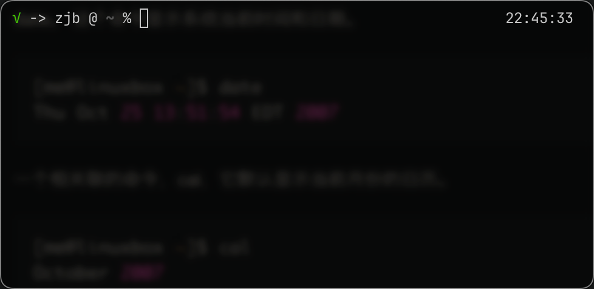

# Linux 环境配置以及基本命令

由于目前使用的是Mac电脑，MacOS与Ubuntu操作系统都是基于Unix内核进行开发出的，因此跳过Windows上使用Ubuntu，直接在当前电脑上学习，需要Ubuntu的一些操作在服务器上进行完成。

该学习笔记来源于[The Linux Command Line(中文版)](https://www.kancloud.cn/thinkphp/linux-command-line/39432)

## 引言

Linux操作系统是由许多分布在世界各地的贡献者们，合作开发而成的。 从技术层面讲，Linux 只是操作系统的内核名字，没别的含义。当然内核非常重要，因为有它， 操作系统才能运行起来，但它并不能构成一个完备的操作系统。

### 内核与操作系统

- 其中，内核是操作系统的核心部分，负责管理系统资源并提供底层服务，如硬件抽象、内存管理、进程管理和设备驱动程序。内核直接与硬件交互，负责硬件资源的分配和管理，包括CPU调度、内存分配、输入/输出操作等。它提供了系统调用接口，使用户程序可以通过系统调用与硬件进行交互。
- 而操作系统是管理计算机硬件和软件资源的系统软件，提供用户和应用程序使用计算机资源的接口。它包含内核以及其他系统组件和应用程序。操作系统不仅包含内核，还包括文件系统、网络协议栈、用户界面（如命令行界面和图形用户界面）、系统工具和应用程序管理等。它为用户和应用程序提供了一个友好的工作环境，简化了硬件操作的复杂性。

### Linux起源

在Linux操作系统发行之前，Unix的设计和源代码被许多不同的组织和公司采用、修改和扩展，产生了许多不同的Unix版本（AT&T, BSD, Solaris等等）。大多数基于Unix操作系统设计和架构的各种操作系统都是专有软件，受严格的版权限制。用户无法自由地复制、修改或分发Unix系统。

在这样的条件下，自由软件运动创始人Richard Stallman为了创建一个完全自由的操作系统，确保用户可以自由使用、修改和分享软件，开始了GNU工程，以及第一版GNU C编译器，并创立了GNU通用公共协议（the GPL）等等，开发了一套与Unix向上兼容的完全自由的软件系统，包括一个功能强大的文字编辑器Emacs、C语言编译器GCC以及大部分UNIX系统的程序库和工具。创建出了GNU/Linux，是一个完整的操作系统。基于Linux内核还有很多种发行版本的操作系统，例如（Debian, Ubuntu, CentOS等等）

## shell以及命令行

在Linux操作系统中，命令行操作界面shell本身就是一个程序，接受键盘的命令，并把命令传递到操作系统去执行。几乎所有Linux的发行版都提供名为bash的来自GNU项目的shell程序。bash是最初Unix上由Steve Bourne所写的shell程序sh的增强版（Bourne Again Shell）。

在图形用户界面中，想要与shell程序进行交互，需要一个叫做**终端仿真器**的程序（一般被称为terminal）。该程序用于给用户提供访问shell的界面。

下面对终端程序进行简单配之后得到如下界面：  



其中"%"是MacOS中的命令行提示符，在多数Linux发行版操作系统中，常见的提示符是"$".

### 命令历史

在终端中，通过按上下箭头，可以按照时间顺序切换到之前输入的命令。

### 移动光标

按左右箭头来移动光标定位到命令行中的不同位置。

### 简单的命令

- `date` 查看系统当前时间和日期
- `cal` 显示当前月份和日历
- `df` 查看磁盘剩余空间数量
- `free` 显示空闲内存数量
- `exit` 终止一个终端会话
- `cd` 更改目录
- `pwd` 打印当前工作目录
- `ls` 列出目录内容

## 文件系统中的跳转

在所有的类UNIX操作系统中，以分层目录结构来组织所有的文件。所有的文件组成了一棵目录树，一个目录中可能包含文件和其他目录。

在类Unxi系统中，多个存储设备（磁盘U盘等）只有一个单一的文件系统树（根目录唯一）。存储设备将根据管理连接到或者挂载到目录树的各个节点上。

在文件系统中，从根目录'/'开始的路径称之为绝对路径，而从当前工作目录'.'或者工作目录父目录'..'开始的路径称之为相对路径。

还有一些快捷目录例如：

- `cd`或`cd ~`：将工作目录更改为用户目录
- `cd -` ：更改工作目录到先前的工作目录
- `ls` : 列出目录内容 可以传入一个或者多个路径列出多个目录下的内容，也可以使用`-l`参数以长模式输出。在该输出模式下，每个字段的含义如下：

| 1 | 2 | 3 | 4 | 5 | 6 | 7 |
|:---:|:---:|:---:|:---:|:---:|:---:|:---:|
| 对于文件的访问权限。第一个字符指明文件类型。在不同类型之间， 开头的“－”说明是一个普通文件，“d”表明是一个目录。其后三个字符是文件所有者的 访问权限，再其后的三个字符是文件所属组中成员的访问权限，最后三个字符是其他所 有人的访问权限 | 文件的硬链接数目 | 文件属主的用户名 | 文件所属用户组的名字 | 文件大小，使用lh参数以人类可读而非字节数表示 | 上次修改文件的时间和日期 | 文件名 |

- `file` : 确定文件类型
- `less` : 浏览文件内容

大多数命令使用时格式如下：`command -option arguments`，大多数命令可以使用'-'和一个字符或者'--'带上一个单词来标注使用的选项。

### 文件名的一些重要规则

1. 以'.'开始的文件名是隐藏文件，使用ls命令不可以列出，一般一些软件的配置文件会以隐藏文件的形式存储。在MacOS中使用"Cmd+shift+."在访达中列出隐藏文件。
2. 文件名大小写敏感。
3. 在Linux操作系统中，没有文件拓展名这一概念，例如Windows中的".exe"代表可执行程序。
4. 在文件命名中不要使用空格，因为在一些程序中可能会出现错误，应以下划线代替。

## 操作文件和目录

在本章节中主要介绍一下这些命令：

- `cp` 复制文件和目录
- `mv` 移动和重命名文件和目录
- `mkdir` 创建目录
- `rm` 删除文件和目录
- `ln` 创建硬链接和符号连接

在一般的图形文件管理器中，完成这些简单操作的步骤更方便，例如将一个文件从一个目录移到另一个目录。但是对于复杂的文件操作任务，例如将所有后缀为html的文件从一个文件夹拷贝到另一个文件夹中，通过命令程序`cp -u *.html destination`会更加简单。

shell程序提供了通配符即特殊字符来快速指定一组文件名。以下列出了一些通配符以及他们对应所选择的对象：

- "*" : 匹配任意多个字符（包括零个或一个）
- "?" : 匹配任意一个字符（不包括零个）
- \[characters\] : 匹配任意一个属于字符集中的字符
- \[!characters\] : 匹配任意一个不是字符集中的字符
- \[\[:class:\]\] : 匹配任意一个属于指定字符类中的字符

下面是一个常见的字符类：

- \[:alnum:\] : 匹配任意一个字母或数字
- \[:alpha:\] : 匹配任意一个字母
- \[:digit:\] : 匹配任意一个数字
- \[:lower:\] : 匹配任意一个小写字母
- \[:upper:\] : 匹配任意一个大写字母

下面是一些例子：

|模式|匹配对象|
|:---:|:---:|
|*|所有文件|
|g*|文件名以"g"开头的文件|
|b*.txt|以"b"开头，中间有零个或任意多个字符，并以".txt"结尾的文件|
|Data???|以"Data"开头，其后紧接着3个字符的文件|
|\[abc\]*|文件名以"a"," b","c"开头的文件|
|BACKUP.\[0-9\]\[0-9\]\[0-9\]|以"BACKUP."开头，并紧接着3个数字的文件|
|\[\[:upper:\]\]*|以大写字母开头的文件|
|\[!\[:digit:\]\]*|不以数字开头的文件|
|*\[\[:lower:\]123\]|文件名以小写字母结尾，或者以"1","2","3"结尾的文件|

### mkdir

创建目录：`mkdir dir1 dir2 dir3`

### cp

复制单个文件或者目录： `cp item1 item2`

复制多个文件或者目录到一个目录下： `cp item1 item2 ... directory`

### mv

类似于cp

### rm

删除单个或者多个文件或者目录 `rm i1 i2 ...`

常用的一些选项：

|选项|作用|
|:---:|:---:|
|-i,--interactive|在删除已存在的文件前，提示用户确认信息。 如果不指定这个选项，rm 会默默地删除文件|
|-r,--recursive|递归地删除文件，这意味着，如果要删除一个目录，而此目录 又包含子目录，那么子目录也会被删除。要删除一个目录，必须指定这个选项|
|-f, --force|忽视不存在的文件，不显示提示信息。这选项颠覆了“--interactive”选项|
|-v, --verbose|在执行 rm 命令时，显示翔实的操作信息|

!!!在使用rm命令搭配通配符号时要小心误删到不该被删除的文件，可以在删除之前使用ls进行测试通配符是否选择正确。

### ln

ln 命令即可创建硬链接，也可以创建符号链接:

- `ln file link` : 创建硬链接
- `ln -s item link` : 创建符号连接(可以使文件或者目录)

#### 硬链接

硬链接和符号链接比起来，硬链接是最初 Unix 创建链接的方式，而符号链接更加现代。

在默认情况下，每个文件有一个硬链接，这个硬链接给文件起名字。当创建一个硬链接以后，就为文件创建了一个额外的目录条目。硬链接有两个重要局限性：

1. 一个硬链接不能关联它所在文件系统之外的文件。这是说一个链接不能关联与链接本身不在同一个磁盘分区上的文件。
2. 一个硬链接不能关联一个目录。

一个硬链接和文件本身没有什么区别。不像符号链接，当你列出一个包含硬链接的目录内容时，你会看到没有特殊的链接指示说明。

当一个硬链接被删除时，这个链接被删除，但是文件本身的内容仍然存在（这是说，它所占的磁盘空间不会被重新分配）， 直到所有关联这个文件的链接都删除掉。硬链接很重要，但现在实际中更喜欢使用符号链接，下一步我们会讨论符号链接。

#### 符号连接

创建符号链接是为了克服硬链接的局限性。符号链接生效，是通过创建一个特殊类型的文件，这个文件包含一个关联文件或目录的文本指针。在这一方面，它和 Windows 的快捷方式差不多。

一个符号链接指向一个文件，而且这个符号链接本身与其它的符号链接几乎没有区别。 例如，如果往一个符号链接里面写入东西，那么相关联的文件也被写入。然而，当删除一个符号链接时，只有这个链接被删除，而不是文件自身。如果先于符号链接删除文件，这个链接仍然存在，但是不指向任何东西。在这种情况下，这个链接被称为坏链接。在许多实现中，ls 命令会以不同的颜色展示坏链接，比如说红色，来显示它们的存在。

## 使用命令

在Linux操作系统中，命令是下面四种形式之一：

1. 可执行程序，例如/usr/bin中的文件。包括可编译的语言例如C/C++写成的程序、脚本语言的程序，例如python、shell等。
2. 内建于shell中的命令，例如cd这种自建命令。
3. shell函数，小规模的shell脚本，混合在环境变量中。
4. 命令的别名。

下面是如何进一步了解一个命令的更多信息：

### type 识别命令类型

`type`是shell的内部命令，他会显示命令的类别，使用方法如下：`type command`，通过type可以查找要执行的命令属于上述四种命令中的哪一个。

### which 显示可执行程序的位置

在一个操作系统内，同一个命令可能被安装了多个版本，通过`which command`可以找到被执行的程序的准确的位置。

需要注意的是，这个命令仅对可执行的程序有效，不包括内部命令和命令的别名（可执行程序的替代物）。

### 获得命令文档

#### help 用于获取shell builtin程序的文档

对于shell中内建的命令，可以使用`help command`可以查找shell内部命令的用法。下面是一个例子：

```shell
Input:
    help cd
Output: 
    cd : cd [-L|-P] [dir]
    Change ...
```

其中"\[\]"表示可选项，"|"表示互斥选项。

#### man 显示程序的手册页

许多被command line使用的可执行程序，提供了一个正式的文档，即手册-man page. 有一个特殊的man分页程序用于浏览程序的手册。用法如下：`man program`

手册页的格式一般包含一个标题，命令语法的纲要，命令用途的说明，命令选项列表，以及每个选项的说明。但是不包括例子。手册作为一个参考而非教材。

#### alias 创建命令的别名

可以通过alias将一串命令变成一个命令：

1. 在进行别名之前，可以通过type查看是否已经存在同名的命令
2. `alias newcmd='cd /usr; ls; cd -'` 在命令”alias”之后，输入“newcmd”，紧接着（没有空格）是一个等号，等号之后是一串用引号引起的字符串，字符串的内容要赋值给新的命令。定义了别名之后， 这个命令别名可以使用在任何地方。
3. 使用`unalias newcmd`来取消别名。

## 重定向

todo
