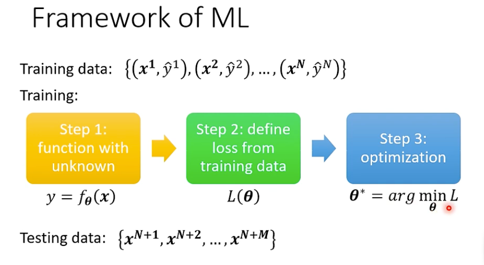
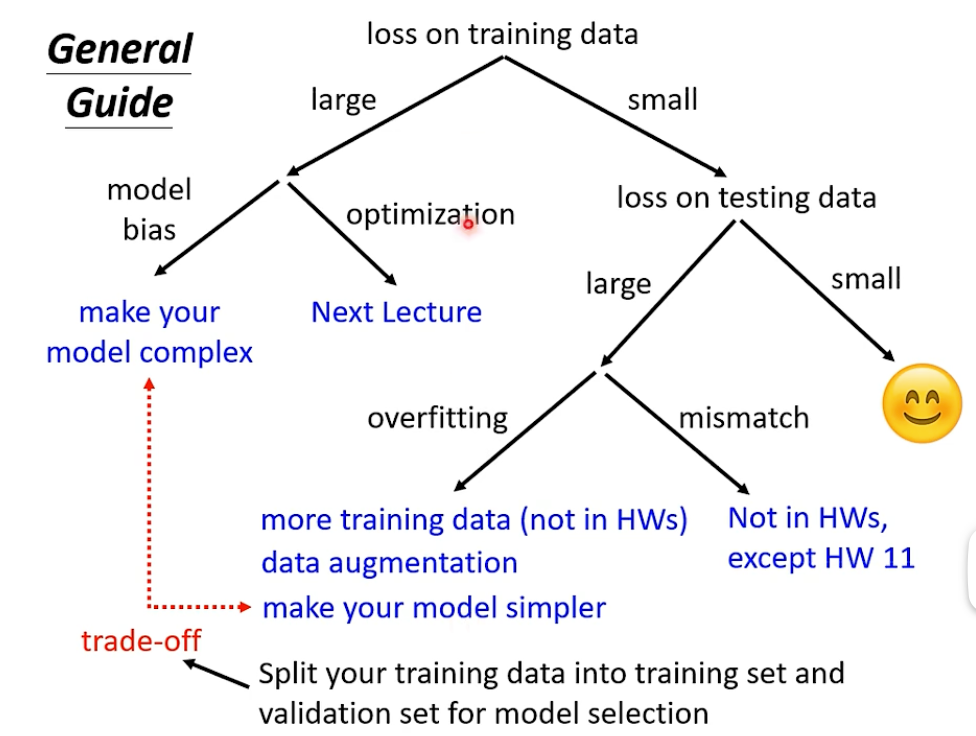
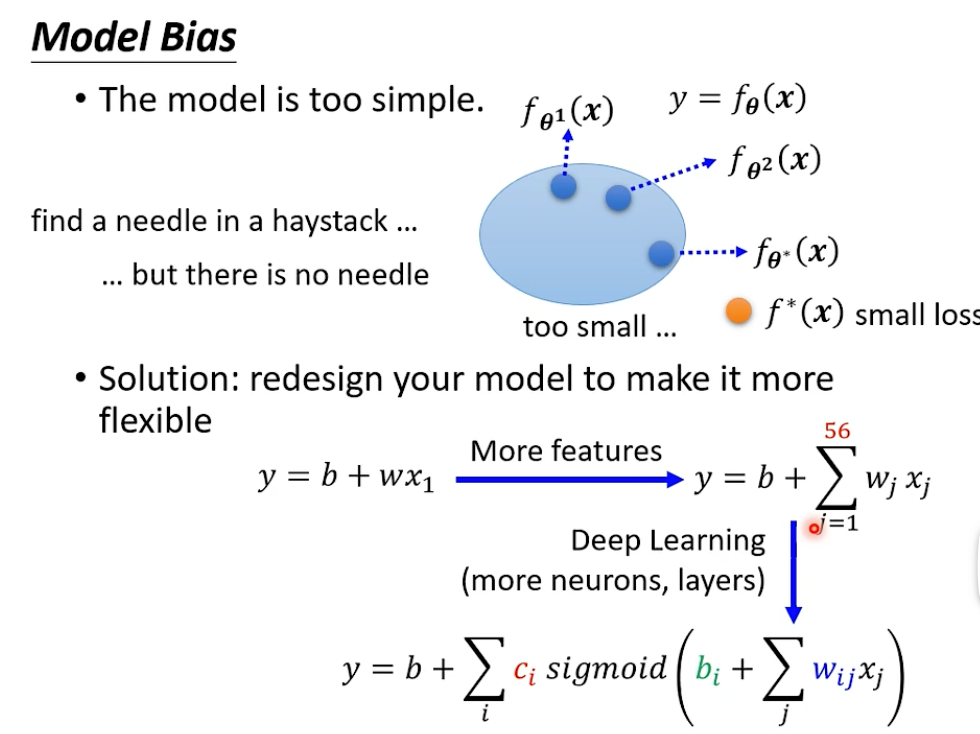
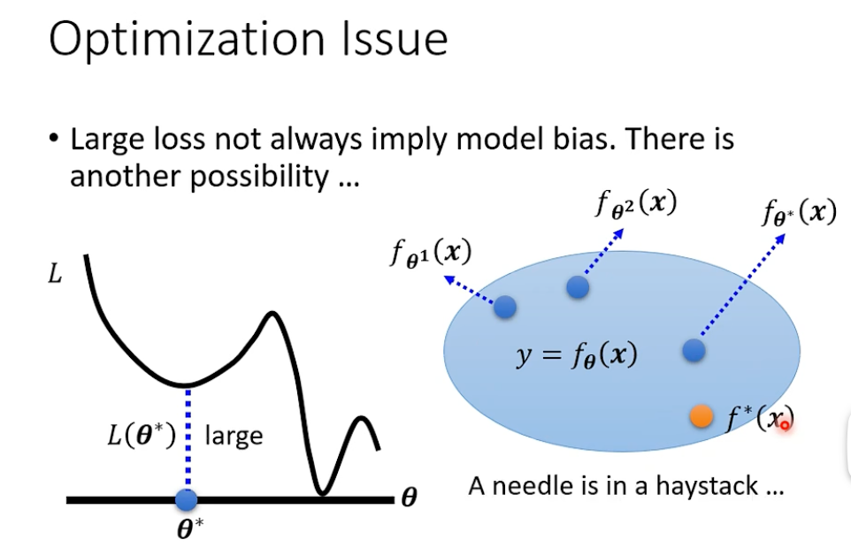
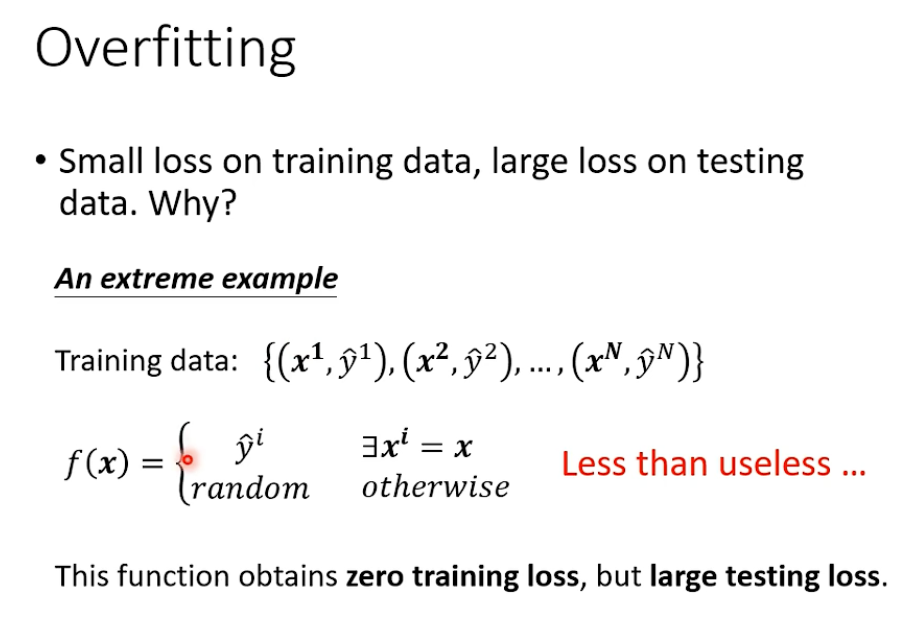
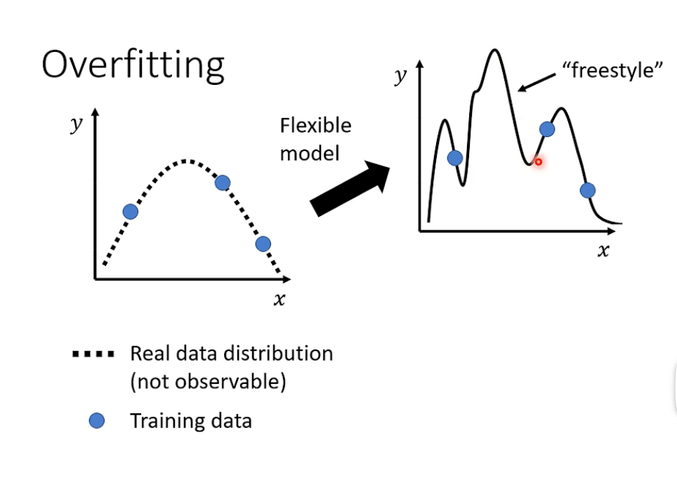
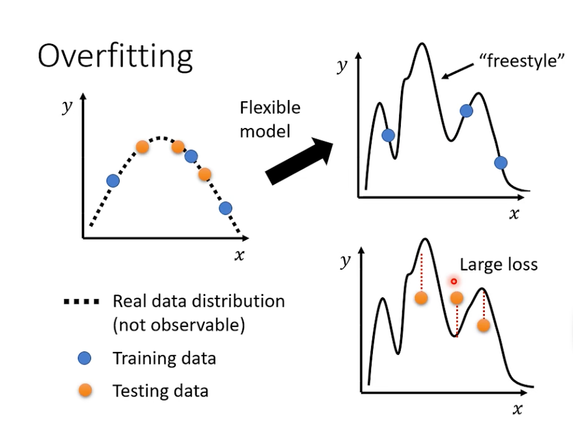

# 机器学习第二章学习笔记

## 机器学习的训练测试流程

首先明确训练数据以及测试数据：

如之前第一章所提过的， 机器学习训练过程主要分为三个步骤：

1. 建立含有未知数的函数
2. 定义损失函数
3. 使用训练数据对模型中的参数进行优化

## 机器学习训练中的通用指导方法

如下图所示，当机器学习方法训练效果不尽人意时，可以采用以下的流程进行检查。

首先判断模型是过拟合还是模型的能力还是优化过程不足。如果模型的拟合能力不足，可以增大模型的弹性，使模型更加复杂。

例如在训练数据和测试数据上效果都很差时，可能存在的问题是存在模型偏差，模型的拟合能力不足无法拟合目标函数。如下图所示：

模型是一个函数的集合，其中每个函数取决于模型中的参数$\theta$的取值。如果模型太简单的话，可能出现这种情况：该模型描述的函数集合太小，即使是最优的参数也无法使函数拟合目标函数。所以表现为在训练集和测试集上的效果都不好。

还有种情况是训练时优化方法出现问题，导致本来有更高的弹性/复杂度的模型反而拟合能力不如简单模型。例如神经网络中 56层的深度学习网络反而效果不论是训练数据还是测试数据都比25层的网络差。这样显然是优化方法出现问题，因为加上56层的网络的前25层identity copy简单网络，后面的层即使什么也不做，效果也不会更差。如下图所示：

Overfitting，过拟合，指的是在训练集上效果非常好，但是在测试集合上出现问题。如下图例子所描述：

通过模型函数可以看出，这个模型在训练集上的loss为0，但是在测试集合中完全不具备预测能力。

在弹性很大的模型中，更容易出现overfitting，原因如下：
在模型弹性较高的模型中，可能出现这种情况：

在存在训练数据的点上模型存在良好的约束关系，但是在不存在训练数据的点上，模型没有经过任何约束，拟合的分布很抽象，称之为freestyle。此时测试集的效果也很差：

这种过拟合可以通过增加训练数据的方法减小数据的过拟合问题，或者使用数据增强（对数据图像进行反转变换）。

## 