# 机器学习第二章学习笔记

## 机器学习的训练测试流程

首先明确训练数据以及测试数据：

如之前第一章所提过的， 机器学习训练过程主要分为三个步骤：

1. 建立含有未知数的函数
2. 定义损失函数
3. 使用训练数据对模型中的参数进行优化

## 机器学习训练中的通用指导方法

如下图所示，当机器学习方法训练效果不尽人意时，可以采用以下的流程进行检查。

首先判断模型是过拟合还是模型的能力还是优化过程不足。如果模型的拟合能力不足，可以增大模型的弹性，使模型更加复杂。

### 模型偏差 Model Bias

例如在训练数据和测试数据上效果都很差时，可能存在的问题是存在模型偏差，模型的拟合能力不足无法拟合目标函数。如下图所示：

模型是一个函数的集合，其中每个函数取决于模型中的参数$\theta$的取值。如果模型太简单的话，可能出现这种情况：该模型描述的函数集合太小，即使是最优的参数也无法使函数拟合目标函数。所以表现为在训练集和测试集上的效果都不好。

### 优化问题

还有种情况是训练时优化方法出现问题，导致本来有更高的弹性/复杂度的模型反而拟合能力不如简单模型。例如神经网络中 56层的深度学习网络反而效果不论是训练数据还是测试数据都比25层的网络差。这样显然是优化方法出现问题，因为加上56层的网络的前25层identity copy简单网络，后面的层即使什么也不做，效果也不会更差。如下图所示：

### 过拟合

Overfitting，过拟合，指的是在训练集上效果非常好，但是在测试集合上出现问题。如下图例子所描述：

通过模型函数可以看出，这个模型在训练集上的loss为0，但是在测试集合中完全不具备预测能力。

在弹性很大的模型中，更容易出现overfitting，原因如下：
在模型弹性较高的模型中，可能出现这种情况：

在存在训练数据的点上模型存在良好的约束关系，但是在不存在训练数据的点上，模型没有经过任何约束，拟合的分布很抽象，称之为freestyle。此时测试集的效果也很差：

#### 可行的解决办法

这种过拟合可以通过增加训练数据的方法减小数据的过拟合问题，或者使用数据增强（Data Augmentation）（对数据图像进行反转变换）。
或者降低模型的弹性，（让模型变简单一些），可以通过

- 减小参数量的手段，或者共用参数
- 减少输入特征数量
- early stopping
- 正则化
- dropout

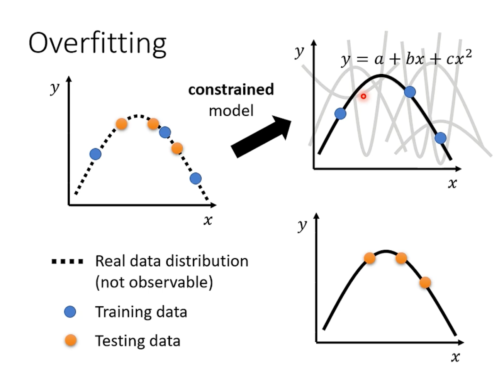

一个显著的例子就是全连接神经网络经过弹性降低（共用参数）之后，就是卷积神经网络。

#### 模型复杂度折中 过拟合的补充解释

模型的复杂程度和loss的关系：

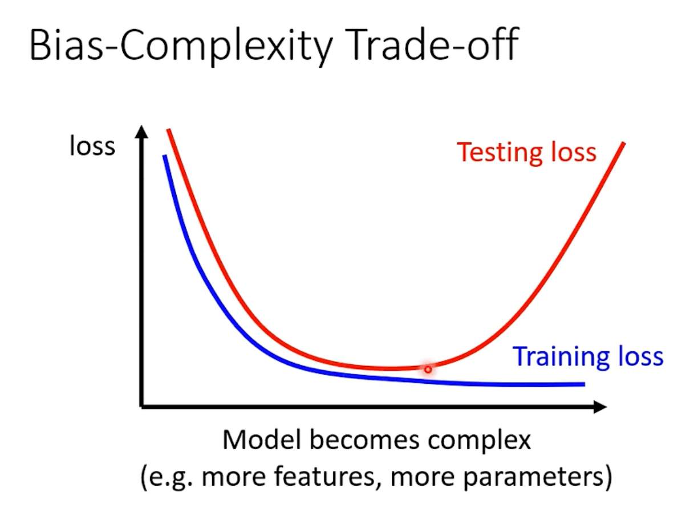

由上图可见，当模型的复杂度增高，在训练集上效果会变好，但是在测试集上效果会随着模型复杂度变大先变好后变大。可以发现，当模型的尺寸大到一定程度时，就会出现过拟合现象。

所以应该选择loss很低但是又不会出现过拟合现象的折中（trade-off）的模型复杂度。

### Mismatch  （类似domain shuffle？

训练集和测试集的数据分布不同，如下图这种情况：

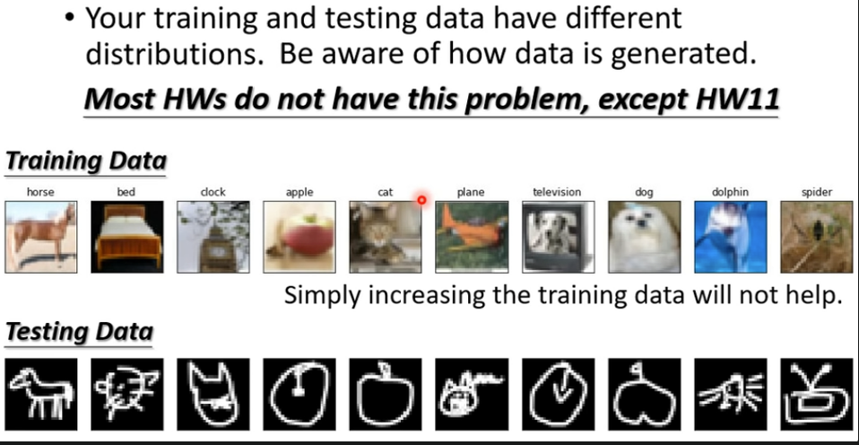

### 交叉验证

把训练数据分成训练数据和验证数据，使用训练数据训练，然后再验证数据集上调整模型，最后使用最终的模型在测试集上训练。

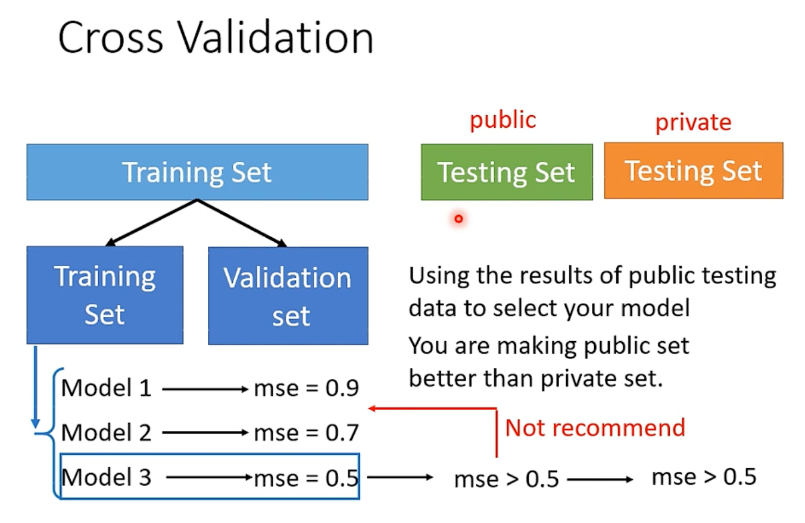

#### N分交叉验证

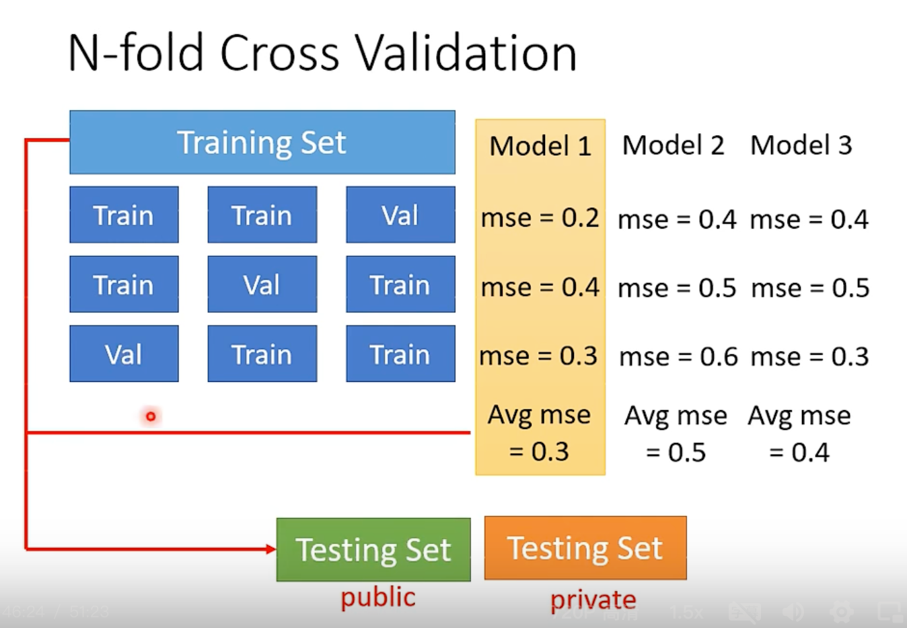

讲训练数据N等分，然后一次让每份作为验证集合，其余为训练数据进行训练，然后得到N个模型，使用效果最好的模型。

## 深度学习神经网络的优化方法

首先要认识到在优化时会出现效果不好的问题是因为：模型在优化时陷入在局部梯度为零的地方，局部最小点（local minima），或者鞍点（saddle point），如下图所示：

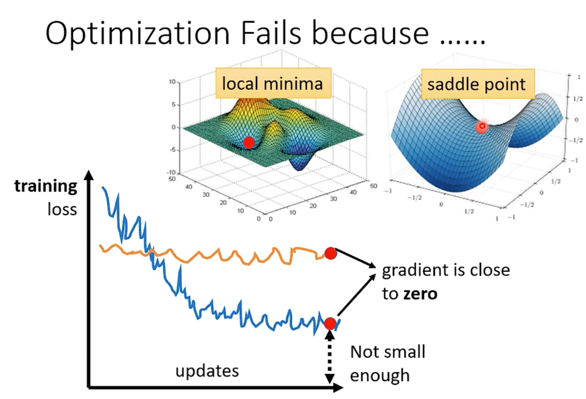

### 如何判断一个梯度为0的点是鞍点还是局部最优点？（使用数学理论解释）

在一组参数时对Loss函数进行泰勒展开：

上图主要是在解释多元函数的泰勒展开式，其中g是被展开函数的（一阶微分，也就是梯度）梯度 Gradient，而 H是被展开函数的（二阶微分）海森矩阵。

    这个可以类比函数的一阶导数二阶导数。

把函数在$\theta'$处泰勒展开后，无论是local minima、local maxima还是saddle point梯度均为0，因此只需要考察第三项来判断。

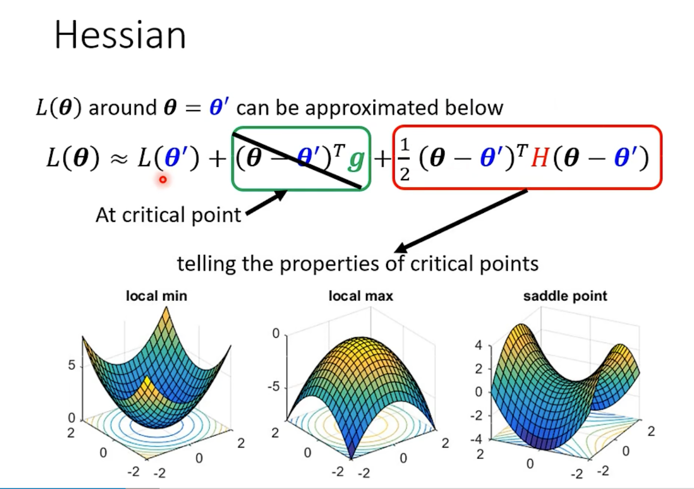

下面是对第三项的分析:$assume\ \vec{v}={(\theta-\theta')}^T$, 通过计算$v^T H v$进行判断：

下面是一个例子：

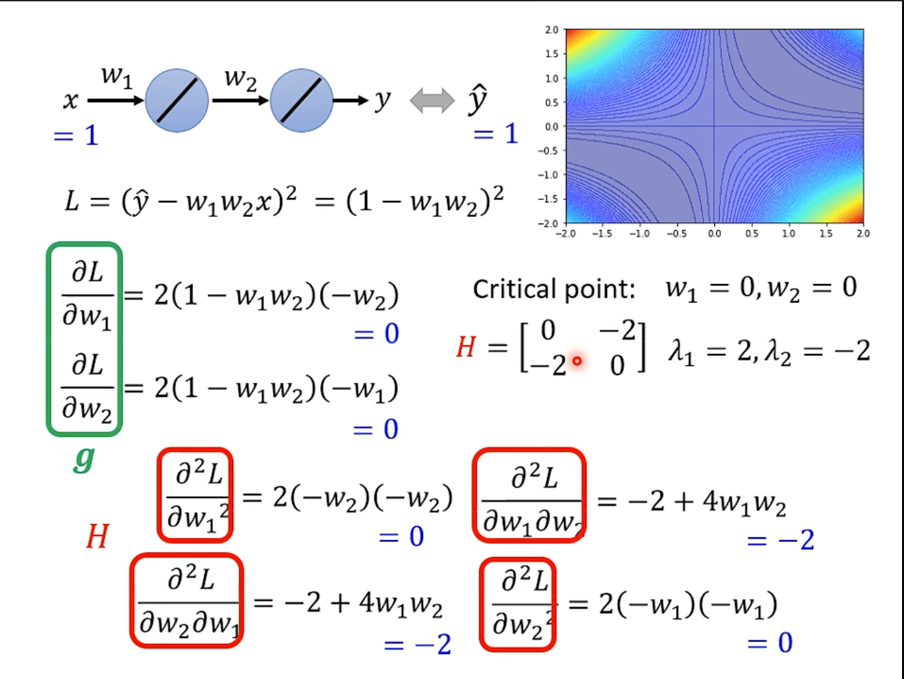

通过上面方法如果遇到了saddle point，可以通过H指出更新的方向：

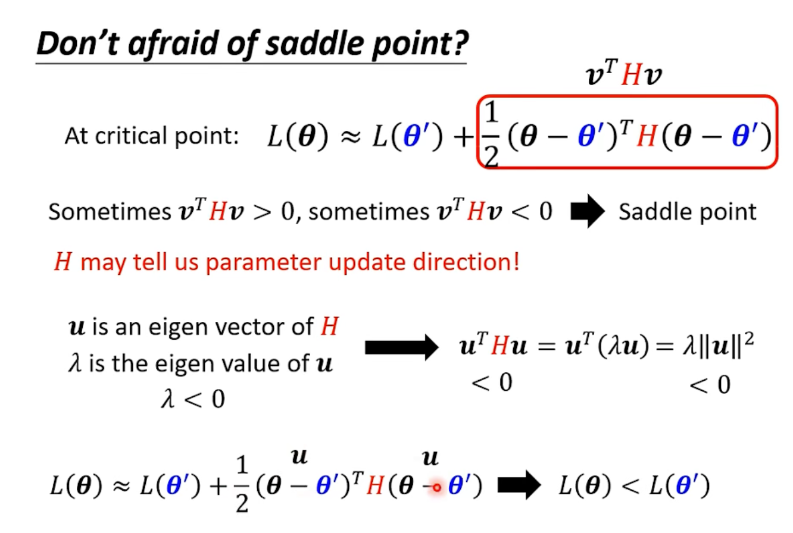

其中u是H的特征向量。

### local minima 没有那么常见。

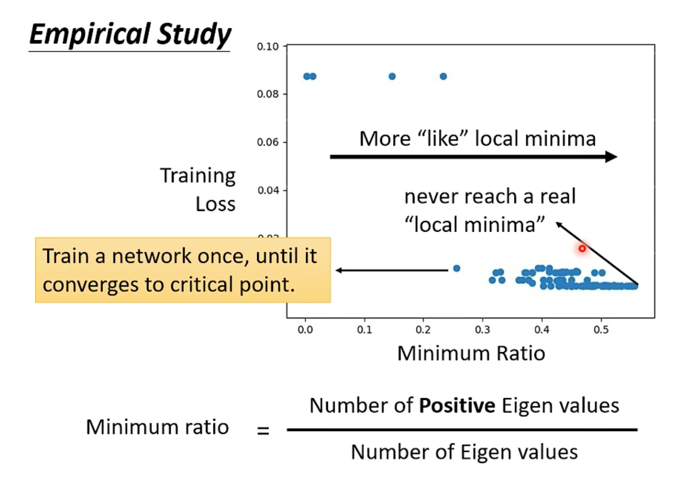

Loss 在一个纬度很高的空间中，往往只会遇到鞍点而几乎不会遇到局部最小值点。从上图可以看出，正的特征值的数目最多只占所有特征值的 60%，这说明剩余的 40%-50% 的纬度都仍然可以使loss下降。（是 saddle point）

## Batch and Momentum

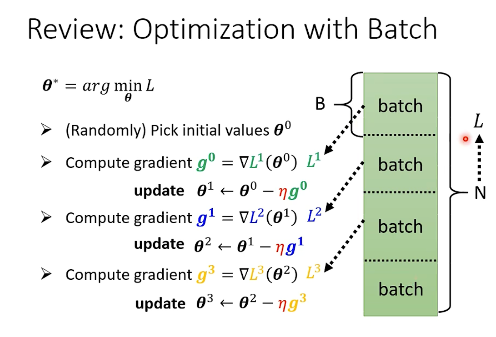

在每次对参数的更新时，拿出B个样本出来，然后计算loss，梯度。将训练集中的所有数据计算一遍之后称为一个epoch。
