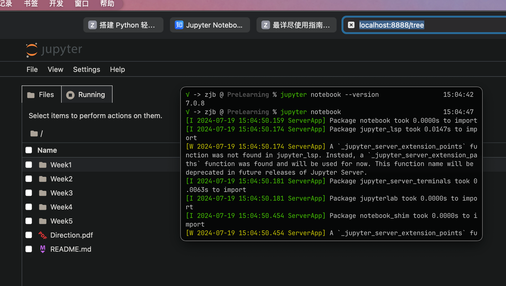

# 安装并配置Jupyter notebook



## Jupyter的基本使用教程

### 启动Jupyter服务器

1. 使用默认端口号8888启动Jupyter 
notebook服务器进程：

    ```shell
    jupyter notebook
    ```

    启动jupyter notebook服务器之后会在浏览器`http://localhost:8888/tree`中显示启动服务的文件夹。

    如果同时启动了多个Jupyter Notebook，由于默认端口“8888”被占用，因此地址栏中的数字将从“8888”起，每多启动一个Jupyter Notebook数字就加1，如“8889”、“8890”……

2. 指定端口号启动：

    ```shell
    jupyter notebook --port <port_number>
    ```

3. 启动服务但不打开服务器：

    ```shell
    jupyter notebook --no-browser
    ```

### 主页面

在启动了之后服务器会展示启动服务的文件夹中的内容，可以在终端中使用cd或者ls来切换目录，如果需要配置文件路径，使用下面命令：

```shell
jupyter notebook --generate-config
```

该命令可以查看配置文件所在路径，但是主要用途是是否将这个路径下的配置文件替换为默认配置文件。

下面介绍如何修改配置文件：

1. 打开配置文件
2. 在配置文件中查找关键词"c.NotebookApp.notebook_dir"
3. 编辑配置文件并保存
