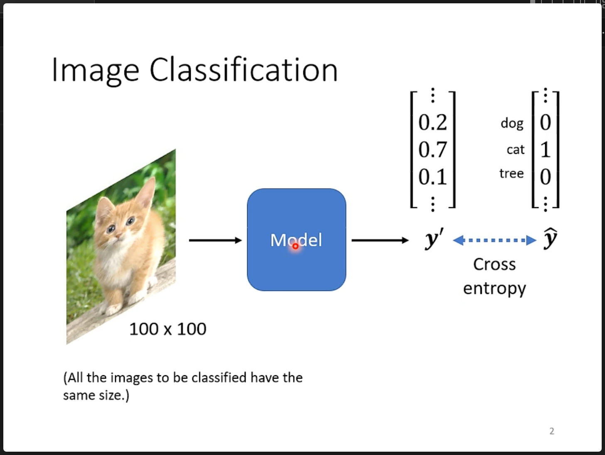
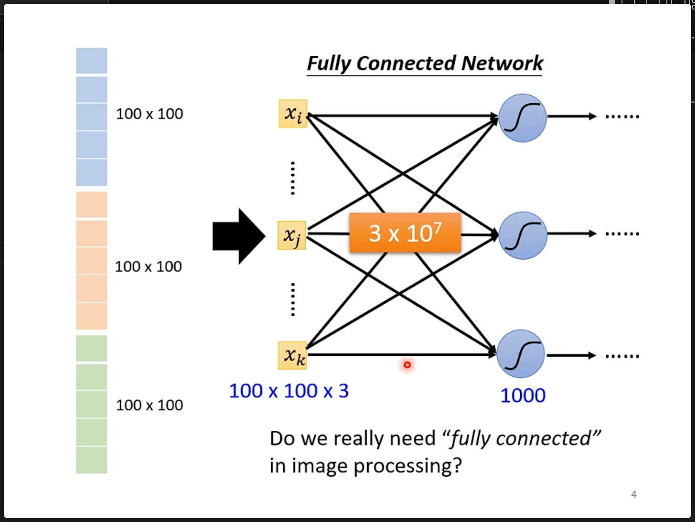
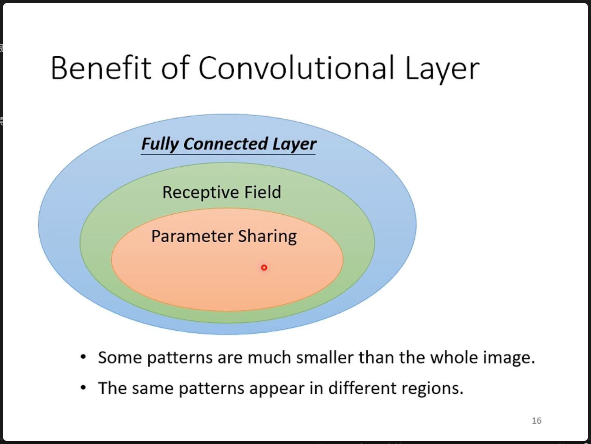
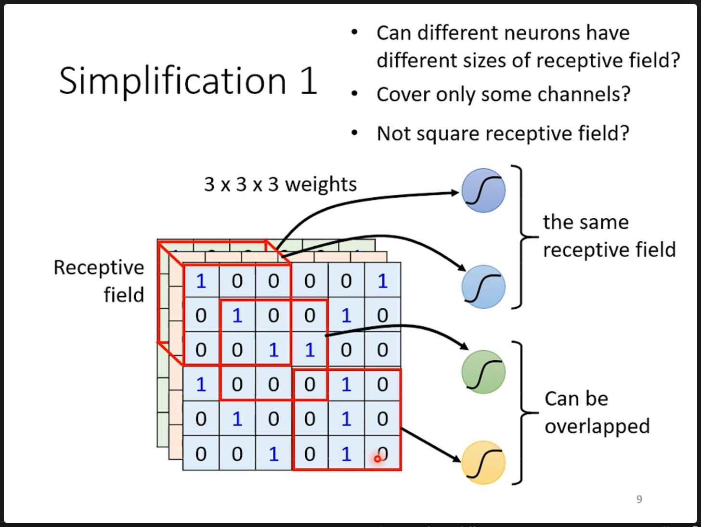
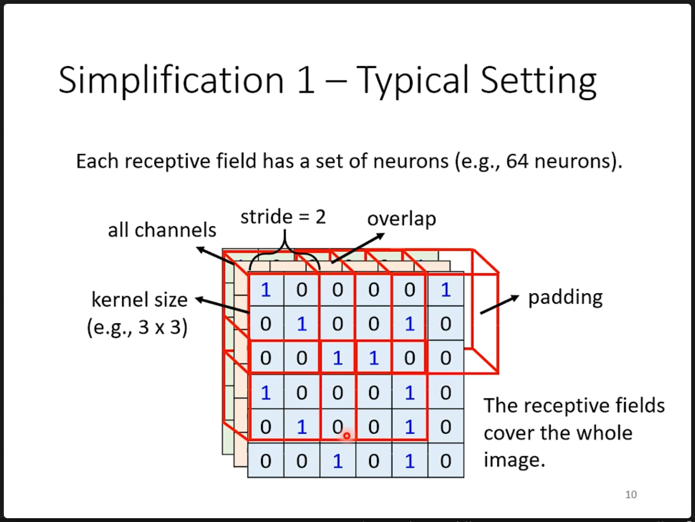
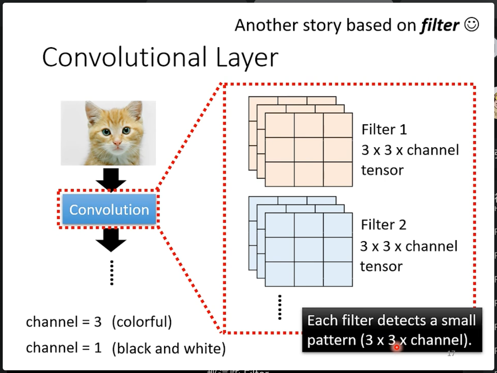
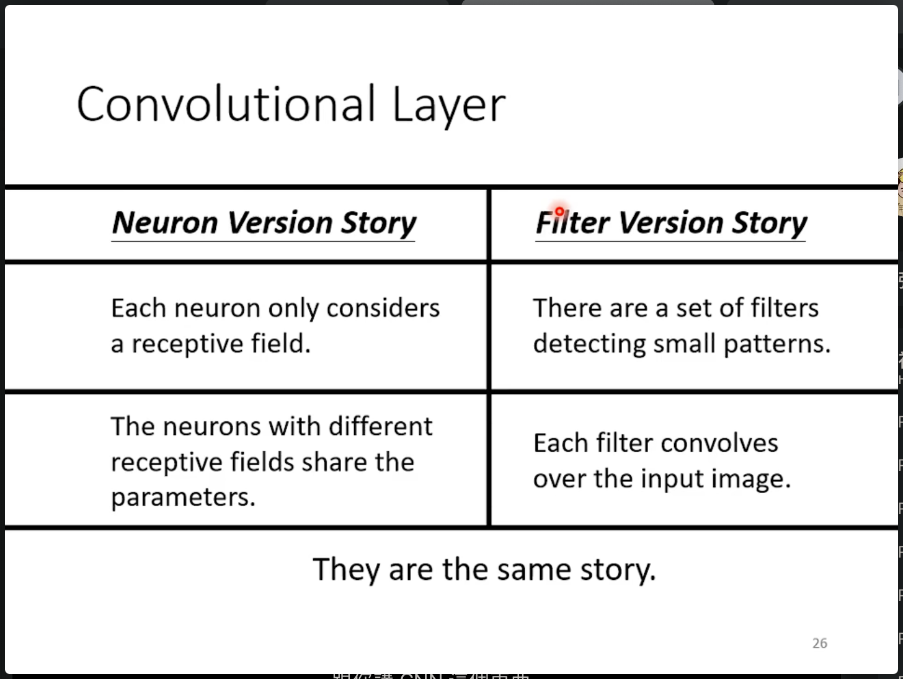
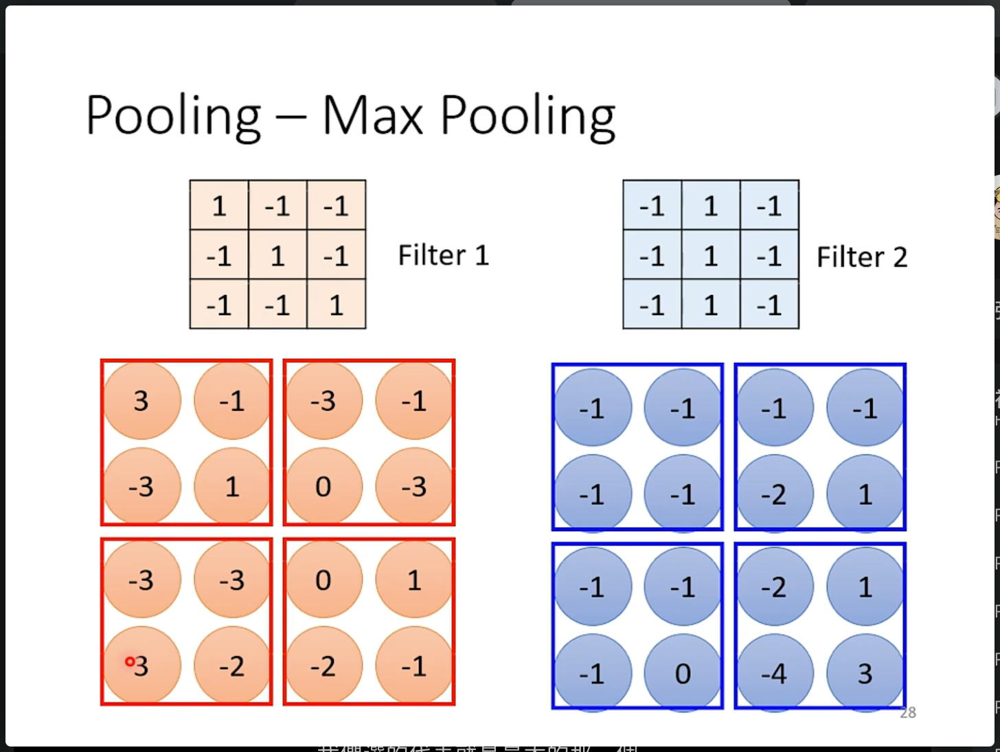
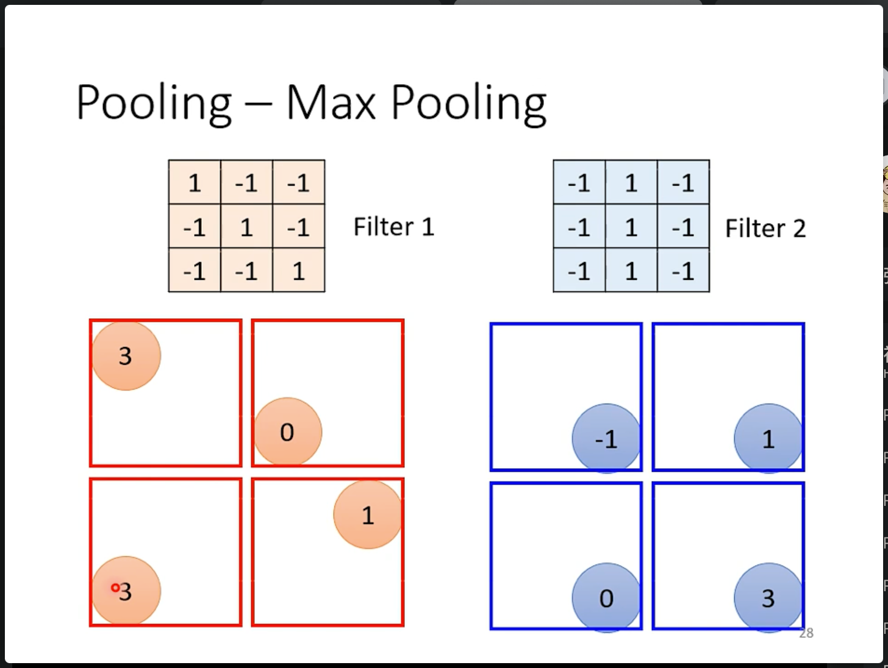
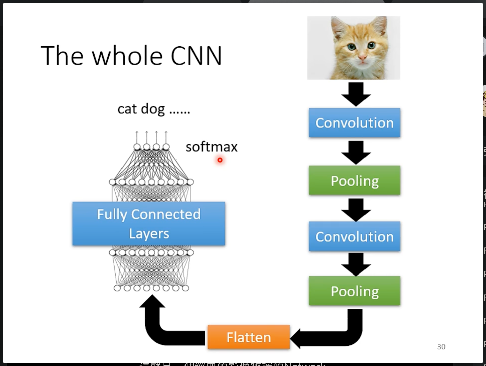

# 卷积神经网络CNN

在深度学习中，通过卷积神经网络来对图片进行计算以及进一步操作。
例如图片的分类是一个常见的任务：

其中每个彩色图片（RGB）是一个有三个通道channel的图片，将要被输入到网络中的图片必须有相同的尺寸。

在全连接神经网络中，每个样本需要被拉成一个一维的向量，然后再进行计算。如果是一张100x100x3的图片就会变成一个30000x1的向量。
按照这样的输入结构，如果下一层的有1000个神经元，其间就会有30000000个连接，会导致巨大的参数量，模型弹性太大就会让模型的更容易overfitting，难以得到良好的训练效果。

对于图片任务来说，像素级的计算会导致网络的巨大弹性，会是模型太过复杂，难以训练。所以将全连接每个神经元计算一个pixel的想法，转换为一个神经元（卷积核）关注一个小区域，从而使网络有更大视野，能够看到一个区域的像素。（也更符合人理解一张图片的过程）。通过这样的过程，在每次卷积过程中可能会是图片的尺寸变小（相当于一个对上一张图片提取出的特征，或者一个概括。这样下一层卷积核在就会获得更大视野【相对于输入图片来说】）或者不变。这种通过卷积操作来处理图像数据的网络就叫做卷积神经网络（Converlution Neural Network，CNN）。

从全连接神经网络到卷积神经网络，有两次简化：

第一种简化的想法，就是通过receptive field，在神经网络中不使用全连接的方法将所有的参数与像素交叉连接，而是通过Receptive field的方法是参数与区域对应连接，通过这样的方法简化了大量的参数。神经元或者说一个卷积核的接受域可能会不同（receptive field），同样的每个receptive field的对应参数也可能不同。

其中一种经典的卷积核有这样的特征：每个卷积核会看所有的channel，所以决定receptive field的是kernel size。同时可能一个receptive field可能会被很多个kernel关注。其中kernel的步进长度叫做stride，一般stride的设置不会大于kernel size。如果步进超过了图片的尺寸，就会使用padding 填充操作。

第二次简化是指：在卷积神经网络中，不将每一个receptive field都设立对应的参数，而是通过共享参数的操作，将多个receptive field的对应参数简化成卷积核，通过这种方法将全连接神经网路进一步简化。得到了卷积神经网络。其中每个被共享的参数称为filter。每一层中可能又多个filter。

卷积层由这些filter构成：

其中每个filter的channel数和输入相同，输出的channel个数和filter（kernel）的个数相同。

计算的过程是，每个filter和输入对应位置相乘然后求和，得到一个数值，作为一个输出，然后按照padding和stride知道把整个输入全部扫完。

每个卷积层的输出称为特征图（输出的channel可能不为3）

## 两个角度考虑CNN

从对全连接神经网络的角度来说，全卷积神经网络通过两个步骤：设计Recepive filed，参数共享来降低全连接神经网络的数量。

而从filter的角度，本质上是上面两个步骤的融合设计。

## 最大池化 Max Pooling

在一个窗口内选择最大的那个数值作为代表。通过这种方法可以降低网络中间层输出的特征图的尺寸。从而减小运算量。

其中池化操作的窗口大小可以自行设置。

## 整个CNN的组成

由一下基本模块 卷积 非线性激活 池化 展平 最后 连接全连接分类器。

