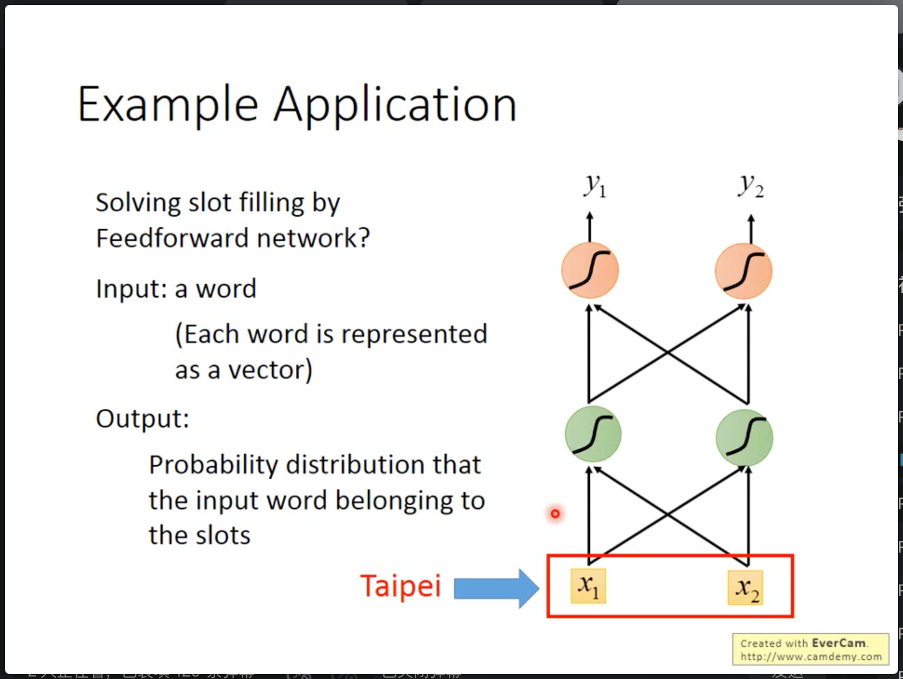
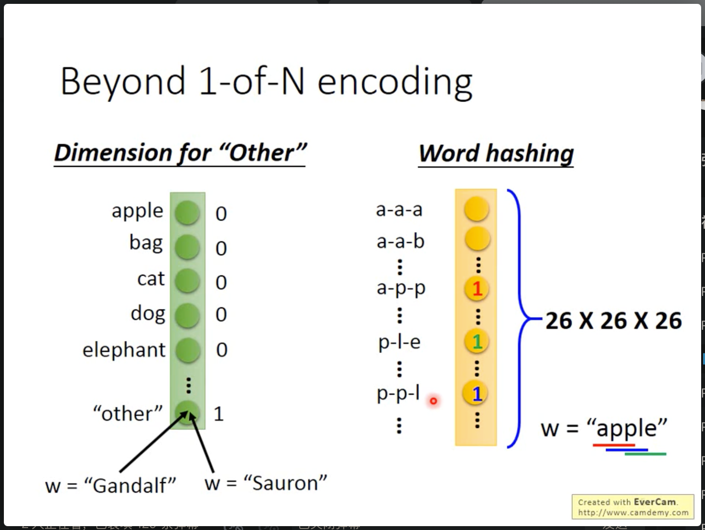

# Recurrent Nerual Network  循环神经网络

这种网络的主要特点是，不仅仅关注“当前”时刻的输入，而是考虑“序列”在输入产生的区别。

## 引入

在一些智能订票系统或者智能客服中，需要神经网络将一些词汇分入到不同的slot中，例如beijing是目的地，或者出发地，10:22是时间。

如何将词汇填入到前馈神经网络中？一种思路是对词汇进行分类：

但是这样的问题是一句话的上下文不同，会影响词语分类的结果。

所以要使前馈神经网络记忆之前的输入。就提出了循环神经网络：

如上图所示，将前一次的隐藏层输出暂存在内存中，然后再和下一次的输入一同输入到另一层。下面是一个实际的例子：

通过这种方法，对上述问题提出了一个解决方法：

### word encodeing 词汇编码为可计算的向量

将词汇编码的方式，常见的有 1 of N 编码：

而如果设计词典中没有的词汇可以使用下面的两种编码方式：

## 不同想法的实现方式

可以把每个隐藏层输出，先暂存，然后在与下次输入一同输入到下一层中，称为Elman Network。

还有一种是只把整个网络的输出暂存，伴随着下次输入一同输入到网络中。称为Jordan Network。

还有一种双向的RNN。上面两种，只能沿着序列的一个方向进行训练。而Bidirectional RNN，可以双向的计算序列数据：

## LSTM(long short-term memory)

（比较长的short-term memory）

LSTM是一种RNN实现结构。

上图是LSTM的基本结构，可以理解为有四个输入，一个输出的神经元。其中三个Gate什么时候可以传输数据都是网络自己学到的。其中起到门Gate作用的函数是sigmod，一种连续的但是接近二值函数的一种函数。

这个特别的神经元的流程如下：

如果将常见的普通神经网络中的神经元替换为LSTM的神经元：

所以一个LSTM神经元有4个input，一个output。

通过上面的图像可以看出，由于LSTM要控制四个Gate，因此需要的参数量几乎是四倍。

说完了LSTM的基本神经元，下面来介绍一下怎么搭建成一个RNN网络。

## LSTM network

其中左边的C是所有cell的值组成的一个vector，然后输入xt经过多个metric的linear transform得到绿色的z，其中，每个z vector控制一种门（例如input gate）或者变换后的输入，z的维度和LSTM神经元的数量相同。

下面是简化的计算的过程：

但是在实际的计算过重中，要在下次输入时，考虑到了上一次的输出y，和神经元中所记忆的c，一同与当前输入结合起来，组成计算Z：

现在LSTM基本是一个标准的RNN网络。

[第二节p29](https://www.bilibili.com/video/BV1J94y1f7u5?p=29&vd_source=fc131029c76216a5e8da1df9dbb8fea1)