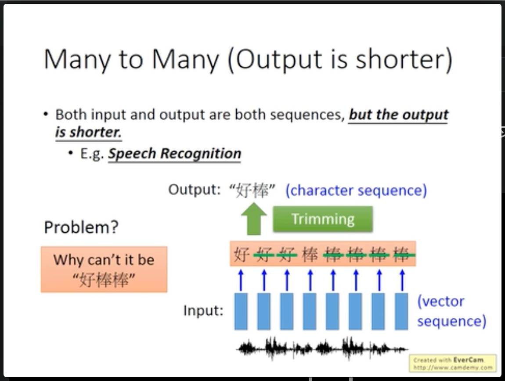

# RNN Part 2

## 如何训练RNN & RNN的梯度爆炸

循环神经网络在训练时和前馈神经网络相同，计算出loss后，优化目标函数loss，计算梯度后求导。

对于循环神经网络，针对其特点，使用了Backpropagation（BPTT）来计算梯度。

RNN在训练时比较困难，一般在实际训练中，会有如下的现象：

其中绿色的是实际训练中的loss下降曲线，蓝色的是预期中的。

经过分析之后，发现RNN的Error Surface十分陡峭，如下图所示：

可以看出特点，要么十分平坦要么十分陡峭，因此权重可能在接近“悬崖”上时，梯度非常大，倒是训练时很难平稳地向地点下降。梯度爆照。

解决办法：提出RNN的人面对这个现象，提出了一个应对方法：Clipping，当gradient大于一个threshold的时候，限制其大小，不能过大。

出现这种现象的分析：和激活函数的选择关系不大。而是由于RNN独特的结构导致的：

gradient在很小的范围内的变化特别大。同样的位在不同的时间点会被反复使用。

有效的面对梯度爆炸的解决办法：

- Long Short-term Memory（LSTM）
    能够有效的处理梯度爆炸。原因如下：
    - RNN中的记忆单元，其Mem中的值是被新的输出的覆盖掉，上次的Mem会被完全刷新。
    - LSTM中的记忆单元则是每次被叠加（INPUT+MEM CELL），除非Forget Gate打开，不会把cell中的值完全刷新，而是叠加。

    

    自己的理解：LSTM有了可以遗忘的选择，而RNN中的记忆单元会毫无选择的讲每次输入的影响叠加进来，并对之后的选择产生影响。而LSTM可以在某个节点遗忘之前的影响。所以RNN中的w有小的变动可能会对结果产生特别大的影响。而LSTM相比而言在推理过程中有遗忘的选项，所以对最后影响很大的可能性就会降低。

## RNN的应用

### 多对一

语义分析，对语句的含义进行分类。

### 多对多（输出是更短的序列）

语音辨识，输入是一个声音序列，输出是一个更短的序列。

一个语音分为很多片段，但是通过这样的方法可能无法识别诸如：“好棒”或者“好棒棒”这种序列。因此提出了下面的解决办法：为语音片段标注时不只有所有characters，而是还有null。

### 多对多（没有限制）

例如：机器翻译，两个语言序列的长度是不一定的：

语音直接转为另一个语言的文字：

