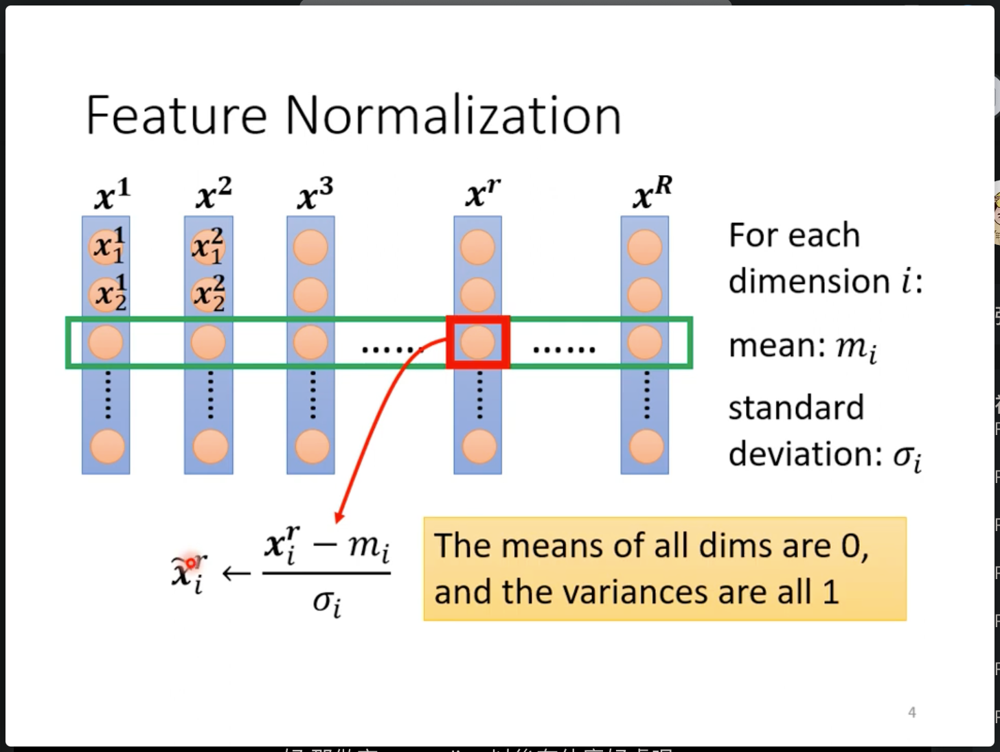
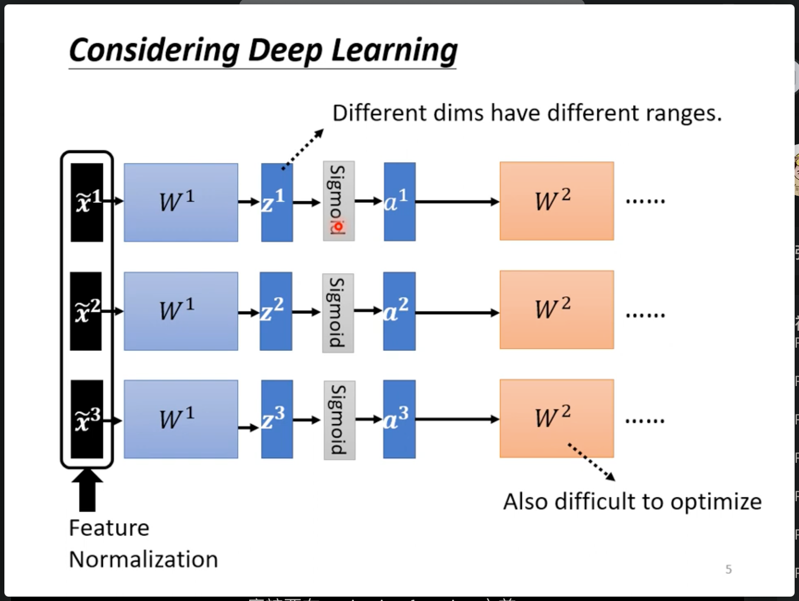

# 模型Train不起来怎么办 - 训练时的一些技巧

## Batch Normalization in Train Progress

batch normalization的想法是把error surface崎岖的的landspace铲平，使在optimization时可以更好的优化。

在上面这个简单的线性模型的例子中，可以看出，如果x1的值很小，w1的变化对结果的变化影响会更小。而如果x2比较大，那么w2的变化就会对结果Loss的影响更大（相较于w1而言）。

 那么有什么方法，可以使w1 w2对于loss的影响能够与输入x1或者x2的值无关的方法呢？

 

 即像上图绿色的线，一样无论x1和x2的大小规模如何，loss对于w1和w2的变换都是均匀的，与x的值无关。或者说 是通过一定的方法将输入的x1，x2等等变换到相同的范围中去。

 这个方法就是feature normalization。使输入在不同的维度都有相同的维度。

 所谓feature normalization就是将所有的输入限定在同样的维度。

 

 这样做相当于调整了输入在所有维度上的均值为0，方差为1.
 
 保留了数据分布的特征，而忽略数据绝对的数值的大小的影响。

在深度学习中，一般是在线性层之间（以及开始）做normalization，如下图，其中每个x是一个样本。

其中在激活层前后的具体哪个位置做normalization一般差别不大。

需要注意的是如果使用sigmoid作为激活函数，在激活之前做normalization可能会导致梯度爆照，因为sigmoid在0附近的gradient比较大。

可以发现，如果不做normalization，如果z1改变，会影响a1，而不影响a2，a3。但是做了normalization之后，当z1改变，同时z2，z3也会被影响。

因此可以理解为做了normalization之后，网络在一定程度上具备了可以学习sample在数据集中的分布的信息，而不仅仅是一个sample的可能的分布。也就是说样本之间的某种关系体现在normalization中。

在实际中一般输入的sample被打包为一个batch，做normalization也是对一个batch中做。就是batch normalization。其中batch所采样的样本至少有一定的能力代表整体数据集中的分布。

在batch normalization中除了上面中减均值除反差的操作之外，还有一步操作让网络自己学习所需要的输出的均值以及方差：

## Batch Normalization in Testing （Inference）Progress

在推理时，可能被输入网络中的所有样本凑不够训练时候的一个batch。可能只有部分输入是就要进行模型的测试或者推理。这种情况该如何计算上面所提到的均值以及方差呢？

pytorch提出一种叫做moving average方法。

在训练时，如果使用了batch normalization的话，在每次输入一个batch时，会计算出一个$\mu_1,\mu_2,\mu_3...$，每个$\mu$和batch的index对应。然后使用$$\bar{\mu}\leftarrow p\bar{\mu}+(1-p)\mu^t$$其中t就是第t个batch的均值。通过这样的方法计算出$\bar{\mu}$，其中p是一个超参数。

之后在训练时直接使用训练时产生的$\bar{\mu}$，$\bar{\sigma}$直接作为normalization中的参数。

batch normalization 可以让error surface变得更加不崎岖，在理论上和实验上都有所支撑。