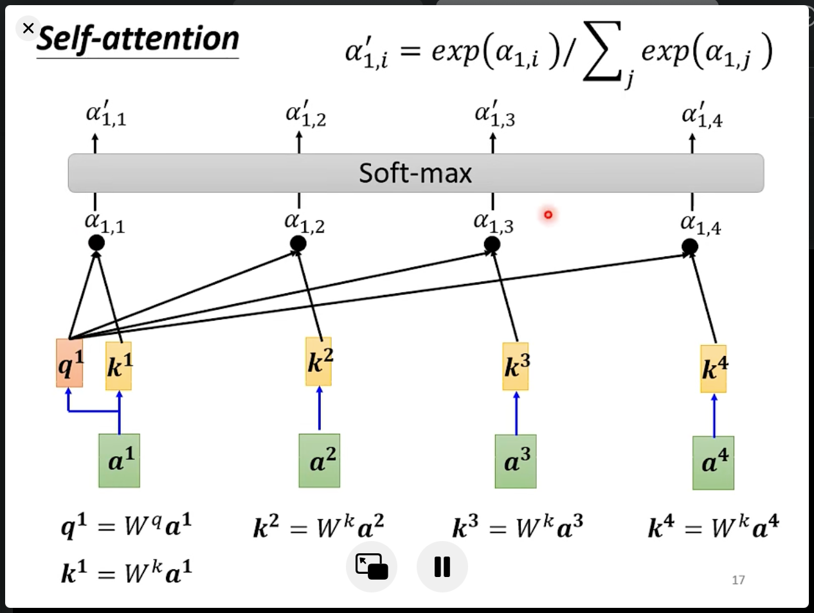
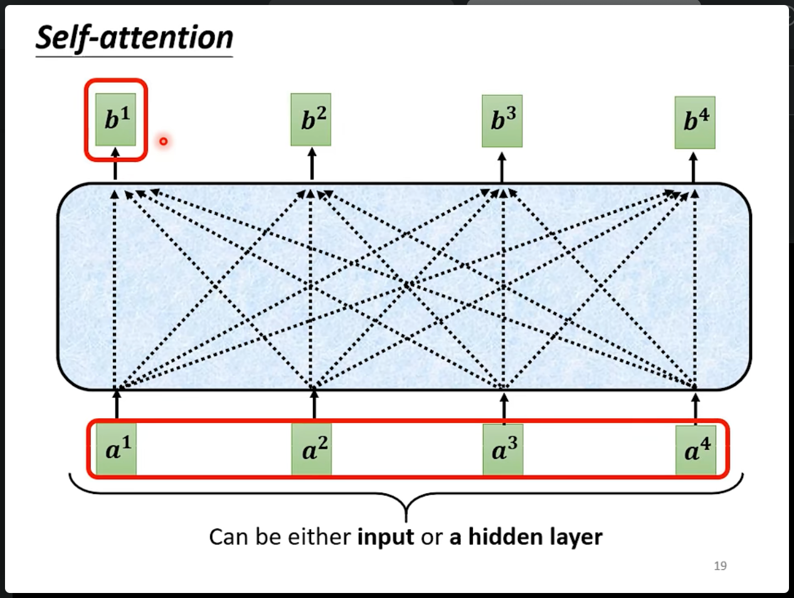
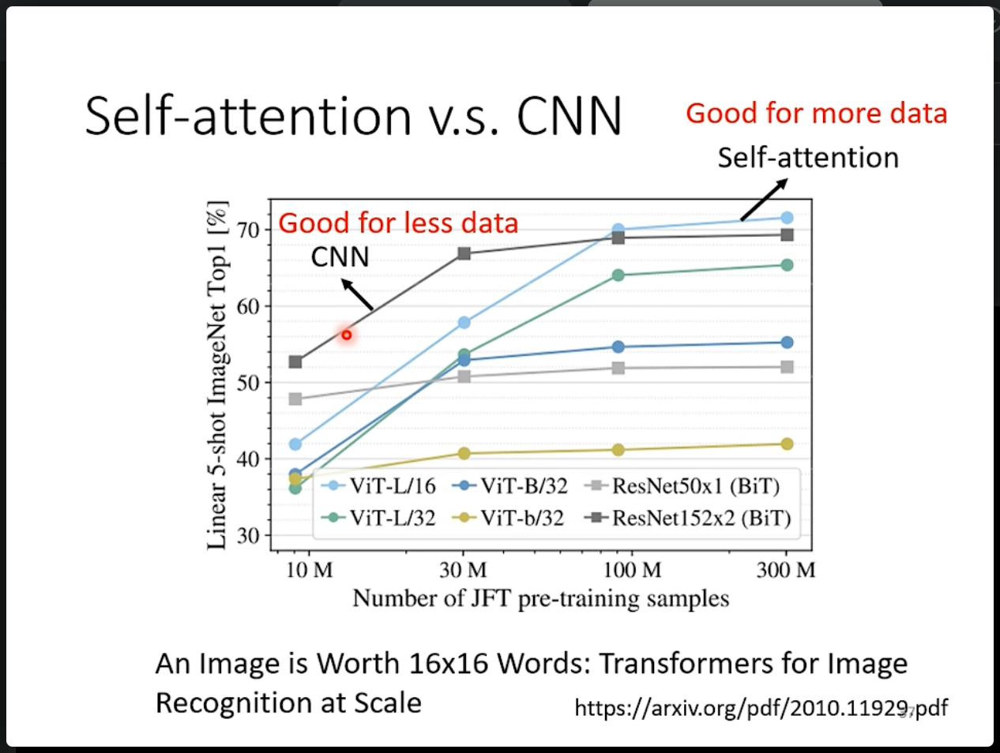

# Self-Attnetion 自注意力机制

在之前介绍的不论全连接网络还是CNN网络，其所能够处理的输入往往是一个vector（形状大小是固定的）。但是在面对复杂的输入时，例如如果输入的向量是数目不确定个数甚至维度的一组向量，网络难以处理。

对序列进行处理的RNN模型或者LSTM中在处理中长距离的依赖时仍然存在困难，因为在实际中这两种网络倾向于遗忘早起信息，自注意力机制可以直接建模模型序列中的任意位置的依赖关系，而不受距离的限制。使模型在处理长序列时更为高效。

RNN和LSTM，在计算时，下一步的输入往往依赖于上一次计算产生的结果。而自注意力机制，在计算时可以并行计算所有位置的注意力得分，通过多个位置并行参与计算，大大提高速度。

其出发点：CNN无法处理序列，但是后来引入的RNN，LSTM对序列长期记忆能力不足。

## 场景介绍

自注意力机制所要解决的问题就是在面对输入是一组向量时，而且输入为一个序列，可能是一个不定长度的向量，或者大小不同个数不同的向量序列时。CNN模型无法适应。

具体的输入输出的特点如下：

- 输入：

    - 文字输入：

        

        如果使用之前所提到的one-hot编码的话，这种表示方法几乎没有能力表示出词汇之前的寓意信息。

        更有可能被使用的是word embedding方法表示词汇，为每一个词汇一个向量（并非简单的one-hot形式），然后将输入的句子转化为一排长度不一的向量。

    - 语音输入：

        

        声音信号也是一组向量。

- 输出：

    - 标签（分类）：
        
        1. 每个输入vector对应一个类别。
        2. 一个序列对应一个类别。
        3. 网络模型来决定输出多少个类别（seq2seq）例如在翻译任务中。

        

## 具体例子 Sequence Labeling - 输入输出一样多

在输入序列的输入单元个数和输出的结果一样多时，例如对一句话中的所有词标注词性。

首先想到的是使用简单的全连接神经网络对序列中的每一个输入进行计算标注，但是这样做的缺陷显而易见，同样的输入单元在输入序列中的不同位置可能产生的结果不同，如下图所示：

那么如何让一个网络具备理解上下问的能力呢？

一个简单的想法是，输入一个词汇时，不仅仅输入一个word，而是以word为中心，把左右几个word都输入进fully-connected网络中，即输入一个window。

使用这种方法，也会有一些问题，例如：

- 这种方法的视野范围十分有限。
- 如果通过加大window size解决上面问题，会产生庞大的参数（容易overfitting）以及计算量
- 输入序列的长度不固定，难以找到适用于大部分输入的window size

## 引入自注意力机制

如何让模型能够具有观察到一个序列中的所有输入单元的视野能力呢？即 Self-Attention。

通过自注意力模块理解整个序列的信息，而不是一个小范围windowed区域。然后再对每个具体的单元进行下面后续的任务。

需要注意的是，自注意力机制模块并不是只可以用一次，而是可以叠加很多次，例如对输入序列首先使用自注意力模块计算后，通过全连接神经网络得到一个输出，然后对第一层输出继续使用自注意力模块，再次考虑整个输入序列的信息，然后再进行后面的任务。

其中，自注意力机制能够帮助获取整个序列作为一个整体的信息，而FC网络则是专注于一个输入序列的某个具体部分。

自注意力机制模块 被发扬是来自google的tranformer网络模型。

## Self-Attention的运行方式

输入可能是一串的vector（可能是直接的输入，也可能是隐藏层的输出）

输出的一串向量中的每一个都会考虑输入的所有向量。

下面以b1为例子，来介绍计算过程：

1. 根据a1找出整个序列中与a1相关的其他向量。（通过非窗口的方法考虑整个序列）
2. 用$\alpha$来表示其他的向量与a1的相关程度。即注意力的计算：

    - 输入两个向量。输出$\alpha$的数值
    - 其中常用的方法叫做Dot-product：
    
        

        将输入的向量与一个矩阵相乘，然后dot
    - 在注意力模块中的计算过程如下：

        

        需要注意的是，也要计算与自身的关联度。

        

        在计算之后，对一组$\alpha$进行softmax计算。（没有物理意义，只是一种normalization实际的实现方法）

3. 根据$\alpha$抽取序列中的重要信息。

    1. 首先对a1-4向量乘$W_v$的到$V_i$
    2. 然后对v向量通过$\alpha$向量放缩的到b
    
    

上述过程就是根据整个输入的序列的到一个输入单元对应输出。

需要注意的是，b1-4是被同时计算出来的，并不需要依次计算出结果。下面通过矩阵乘法的角度理解这个过程。

1. 将a合并成一个矩阵，和W_qkv计算出结果

2. $k^T$合成一个矩阵 和 q合成一个矩阵计算 得到所有输入向量之间的normalizition之前的$\alpha$即Attention分数。然后对每个b对应的$\alpha$ normalization 

3. V · A' = O 得到b1-b4

- Sammury：

    

    I是注意力模块的输入，O是模块的输出。

    可以看出只有Wqkv是需要学习的参数。

## 自己的理解

q-query ，k-key ，v-value

- 流程：

    其中Q像是一个“官方”的特征提取器，对待计算相关度输入向量进行正确的概括，得到query作为一个，与本向量计算相关度的一个标准。然后使用K矩阵去提取其他向量的特征或者说是关键字keys，然后计算keys与query的相似程度（内积，同时考虑方向与长度）。

    W_Q W_K两个矩阵相当于将输入的向量映射到一个更加抽象的语义空间中，然后计算两个输入向量之间的相似度。

    然后再用W_V矩阵对输入变换后，使用相关度加权求和作为输出。

    分步的说：

	1.	输入变换：
		对输入序列的每个向量（如词嵌入）进行线性变换，得到查询向量Q、键向量K和值向量V。这些线性变换分别由权重矩阵 W_Q、W_K 和 W_V 完成。
	2.	计算相关性得分：
		计算每个查询向量Q与所有键向量K之间的相似度，通常通过点积计算得到相关性得分。这个步骤衡量了序列中每个位置的向量与其他位置的向量之间的相似度。
	3.	归一化相关性得分：
		使用 softmax 函数将相关性得分归一化，得到注意力权重。这些权重表示了每个位置对其他位置的关注程度。
	4.	加权求和值向量：
		使用注意力权重对所有值向量V进行加权求和，得到最终的输出表示。这个输出表示综合了序列中各位置的信息，反映了模型对整个输入序列的全局关注。

- 各个权重矩阵的作用

    1. W_Q 矩阵（Query 权重矩阵）

            作用：
            将输入向量映射到查询向量空间。查询向量Q用于与键向量K计算相关性得分。
            W_Q 矩阵负责提取输入向量的特征，使其能够在新的语义空间中表示输入向量的查询信息。

    2. W_K 矩阵（Key 权重矩阵）

            作用：
            将输入向量映射到键向量空间。键向量K用于与查询向量Q计算相关性得分。
            W_K 矩阵负责提取输入向量的特征，使其能够在新的语义空间中表示输入向量的关键字信息。

    3. W_V 矩阵（Value 权重矩阵）

            作用：
            将输入向量映射到值向量空间。值向量V是最终输出表示的基础。
            W_V 矩阵对输入向量进行变换，使其在新的语义空间中表示输入向量的值信息。

？怎么理解注意力机制
？为什么要有三个负责提取特征的矩阵->可能是更好理解向量的语义信息？

## 多头注意力机制

可以从多个角度理解输入的语义信息

把qkv变成多个，得到多组qkv，q123，k123，v123，然后只在组内做attention。有多少组，在最后一个输入会得到多少个b，然后通过线性变换变为一个。

## 位置性编码

至此，注意力机制无法提取位置信息，即使序列的顺序有任何改变，输入到自注意力模块向量对应的输出都不会改变。

可以通过把位置信息掺入输入向量中来使位置信息添加到模型中。这样输入的序列即使只有其中的向量位置不同，也能使输入vector在不同位置时得到不同的输出。

具体实现是把位置编码成一个向量与原输入向量进行相加。

每个位置都有一个位置编码向量e，该向量与位置分布可见于上图中的右侧部分。

由于位置向量e是人设的，可能设置的长度小于序列的长度。

但是如果使用某种一定的规则来编码位置，即可以解决设置与输入长度不对齐的问题。

## 应用

### 文本

在transformer和bert中都有self-attension的应用。

### 语音

不仅仅在文本上，在语音任务上也可以使用自注意力机制。但是由于语音任务输入的向量数量规模非常大，模型的计算量也会很大：

因此需要进行一定的处理，使用truncated self- attention，人设定一个一定范围的语音，去理解序列。

### 图像

将图像看作一个vector set，例如一个像素位置看作一个vector（注意是vector不是matix）

## Self-Attention v.s. CNN

在图像上CNN与自注意力机制有很大的差异。

在CNN中每个神经元只考虑receptive filed，而自注意力机制则是考虑了整个图片（例如对一个像素，计算本身的query和其他所有像素的key的关联程度）。

因此可以把CNN理解为自注意力的简化。也可以把自注意力理解成CNN中的receptive filed由网络自己学习，而CNN是人为设定了receptive filed。

通过上述可以看出CNN是self-attention的一个（限定了接受域）的子集。也就是自注意力的弹性更大，按理说需要更多的数据，而CNN相较而言可能更少的数据量更不会导致其过拟合。实验结果也印证了这一点（self-attention的弹性更大）：

## Self-Attention v.s. RNN

首先可以看出，RNN在处理序列中前面位置的数据时无法只能考虑前面出现过的数据，无法注意到之后的输入。（除非使用双向的RNN，bi-directional）

但是即使是使用bi-direction的RNN，可能会出现距离过长的问题，导致RNN可能会忘记长距离的记忆。

Self-Attention可以并行计算，而RNN是串行计算。