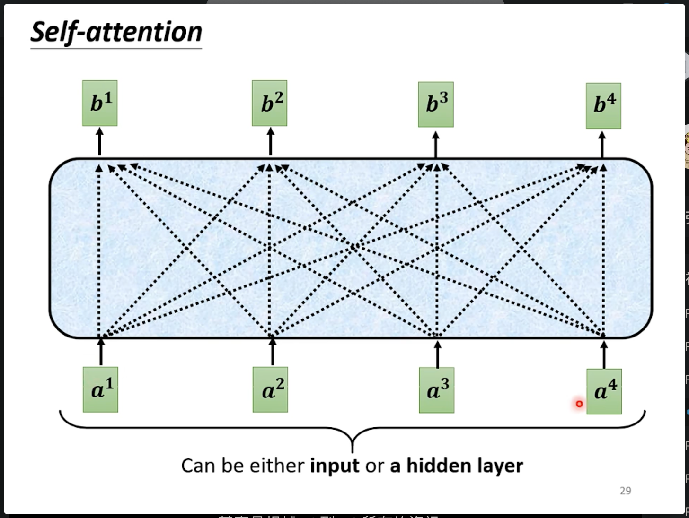

# Transformer - Seq2Seq

Transformer就是一个sequence-to-sequence(Seq2Seq)的模型。输入是一个序列输出也是一个序列，例如语言对话或者文字翻译、语音转文字、甚至是直接语音翻译为文字等任务中使用的模型。输入和输出的长度可能不同，机器自己决定输出的长度。

## 如何做Seq2Seq

一般Seq2Seq被分为两个部分，一个是Encoder，一个是Decoder：

现在来说transformer就是Seq2Seq的代表

## Encoder

Encoder就是输入一排向量，输出另一排向量：

可以用CNN RNN 或者 Self-Attention 做到，在transformer中使用Self-Attention来实现Encoder。

在Transformer中，Encoder会被分为很多个Block，每个block都是输入一组向量，输出一组向量。

其中每个block不是一个layer，而是做很多layer的工作：

在现在的transformer中block其实包括了自注意力模块然后将其输出连接全连接层作为block的输出。

在早期的transformer中的block还会使用残差连接，和normalization的操作对数据进行处理：

整体encoder组成如下：

## Decoder

decoder的作用就是将encoder的结果转换为输出。

有两种常用的decoder：

- Autoregressive
- Non-autoregressive

### Autoregressive - Speech Recognition as example

下面以语音辨识（语音转文字）作为例子介绍这个decoder方法。

首先decoder会把encoder的输出读入进去。然后再计算输出。

在输出时，会在最开始添加一个开始的标识向量（可能使用one-hot标识）作为decoder的初始输入，然后再继续输出其他的向量。

在语音辨识中产生输出文字的过程如下：会输出一个和字典vocabulary中字个数一样维度的向量，然后做softmax（分类取最大结果），然后查找字典输出汉字。

然后将新的输出作为Decoder的新的输入（这样decoder可以看到之前所有的输出包括最开始的BEGIN），继续得到下一次输出。

在transformer中Decoder的结构如下：

与上面的encoder对比如下：

可见把decoder的中间部分去掉，和encoder结构十分相似：

但是需要注意的是，第一个多头注意力机制多了一个masked。下面是masked注意力机制的运作方法：

当要产生某个位置的输出时，不可以把后面的输入加入进计算，而是只看之前的部分。

这么做的原因是：decoder的输出是一个一个产生的，而不是并行计算得到序列中所有位置的结果。

Decoder自己来决定输出多少内容：通过在字典中加入一个结束回答的标识符，然后由模型自己决定何时输出结束符。

### Non-autoregressive

non-autoregressive与autoregressive不同，后者，在最开始被输入一个BEGIN，然后依次产生输出。前者则是，一开始给定一定数量的BEGIN然后，对每个BEGIN计算一个输出。

如何确定一开始喂给decoder的begin的数量呢？

1. 训练一个分类器classifier，输入input sequence，输出应该输出的seq长度（BEGIN个数）。
2. 一开始喂入特别多的BEGIN，然后处理输出，忽略掉输出中第一个END之后的输出内容。

前者的好处是：
1. 可以并行的计算出输出结果；
2. 可以人为控制输出的长度。

目前NAT的效果往往比AT更差。原因是Multi-modality的问题。

## Encoder-Decoder

Encoder和Decoder之间如何传递信息呢？

首先看transformer的e-d的结构：

在decoder中的非masked的自注意力模块中，有两个来自encoder的输出作为输入，和一个decoder中前一层masked self-attention的输出作为输入。这个注意力模块叫做交叉注意力模块，下面是其运作过程：

1. decoder对输入向量通过Q进行变换
2. encoder的输出通过K进行变换
3. 通过k和q计算出各个encoder输入的注意力的比例
4. 将输入通过V进行变换，然后按照注意力的alpha值进行加权求和得到一个向量
5. 输出到下一层全连接层

## 如何对Transformer 的 Encoder-Decoder 进行训练

可以当作每次输出都是一次分类。下面是一次训练的流程：要注意还有END

[p50 38min](https://www.bilibili.com/video/BV1Wv411h7kN?p=50&spm_id_from=pageDriver&vd_source=fc131029c76216a5e8da1df9dbb8fea1)

[3blue1brown-transformer1](https://www.bilibili.com/video/BV13z421U7cs/?spm_id_from=333.337.search-card.all.click&vd_source=fc131029c76216a5e8da1df9dbb8fea1)

[3blue1brown-transformer2](https://www.bilibili.com/video/BV1TZ421j7Ke/?spm_id_from=333.337.search-card.all.click&vd_source=fc131029c76216a5e8da1df9dbb8fea1)
