# Word to Vector

这部分可以看3blue1brown在将transformer的编码的部分，方便理解。

## 引入

如何让计算机系统去理解人类语言？如何准确的表达一个词的意义？

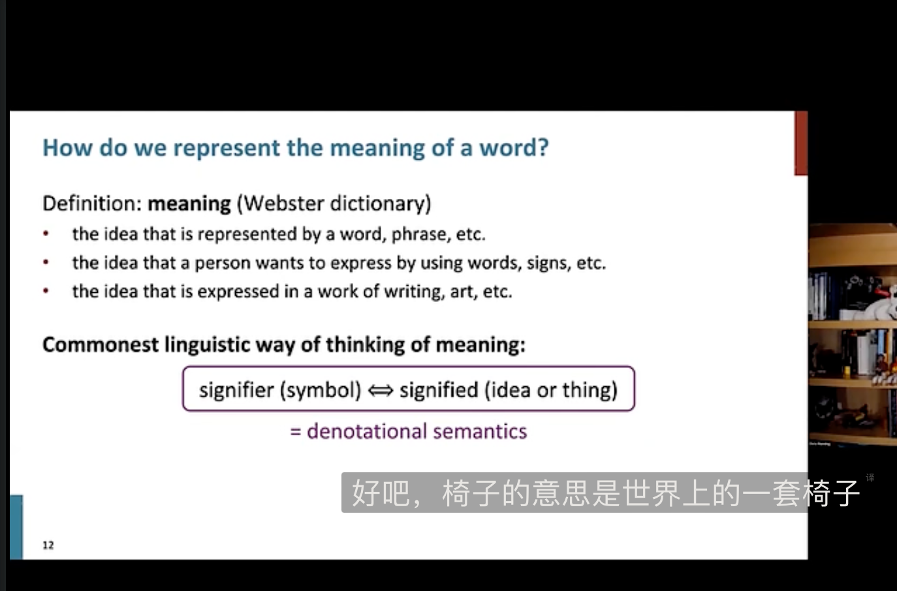

传统人类的做法是，用一个想法或者事情的标识去解释词语，就是语义标识。

早期的NLP中，通常使用WordNet，一个包含同义词集和超名词列表的同义词库。将词语与其同义词关联起来。

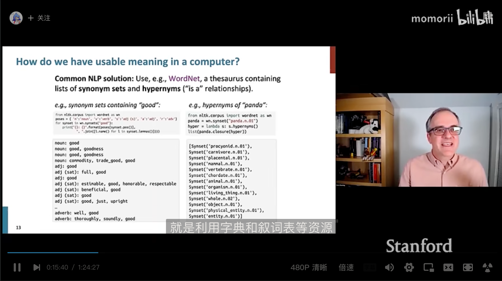

但是这种联系相近词意的方法存在一些问题：
    
  - WordNet是一个很好的资源，但是无法准确的区分意思相近的词语（例如“熟悉” “好” 被归为同一词意）。
  - 缺乏某个词的新的含义（梗或者日常含义），例如一些词随着时间变换会出现新的含义但是这种方法无法保持最新。
  - 主观性，词与词之间的联系是由人主观建立的。
  - 需要人工去创造连接以及更新改写。
  - 无法由计算机去计算词与词之间的相似度。

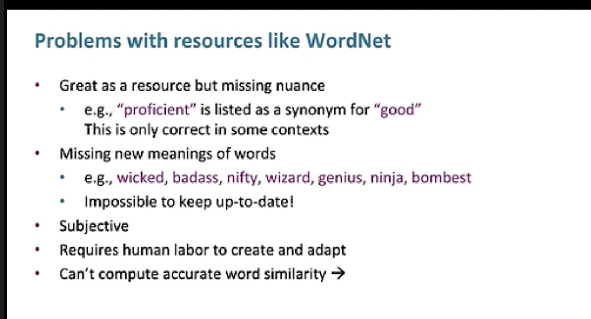

上面这些问题，就是深度学习模型能够解决的，也是其优势所在。

在传统的NLP中，把词语看作离散符号（discrete symbol）。
例如hotel，conference，motel这些词在传统NLP中被称为localist presentation（地方性表示），因为这些单词通常被表示为one-hot向量。每个不同的单词在某个指定的维度是1，其余为0。

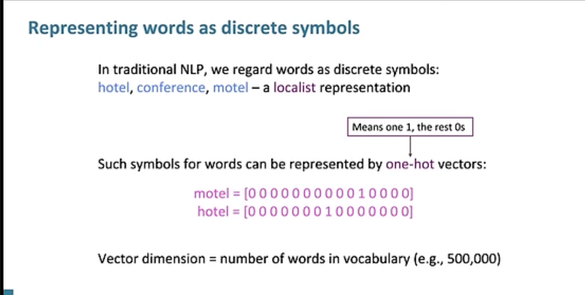

在这种方法中，如果字典中的词特别多，每个词会对应一个维度很高的向量。

而且一个重要的问题是，这种离散的表示方法没有办法表示出词与词之间的相似性：

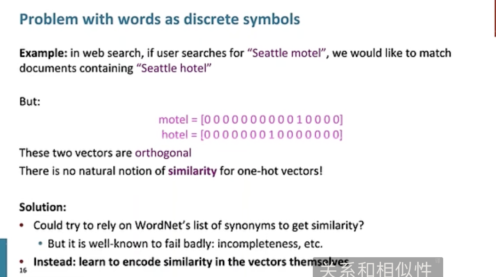

例如，如果用户想要搜索Seattle hotel，却写成了Seattle motel，系统本应该匹配与“西雅图酒店”的搜索结果，但是这种表示方法下，hotel和motel对应的两个one-hot向量是正交的，相似度为0。

对于这种情况，提出了一些解决办法：例如在wordNet中，把字形相似的词当作“同义词”，来表示这些词之间的相似性；或者建立一个方法同时表示多重含义。

而现在的方法是深度学习中，在向量中自己编码这些词之间的相似性。也就是word2vec

## 理论支持

分布语义（Distribution Semantics）：一个词的含义是由其附近的词语（上下文）决定的。

这个思想是在深度学习中一个非常成功的思想。

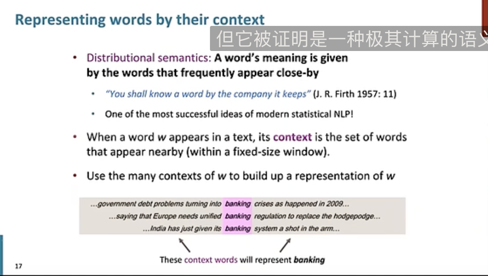

就是使用上下文来代表一个词的含义。

在深度学习中，就是把一个词表示为一个向量，让这个向量能够 在上下文中有相似含义（上下文内容相似）的词中 表现出相似性。

这样的表示方法被称作为分布性表示（distributed representation），与上面的提到的地方性表示（localist representation）相区别。一个词的含义被分布在一个向量的各个维度，而不是像one-hot那种集中在一个维度上。

这样的表示方法也被称为word embedding，这种向量被嵌入在一个高维度空间中。

## Word2vec算法介绍

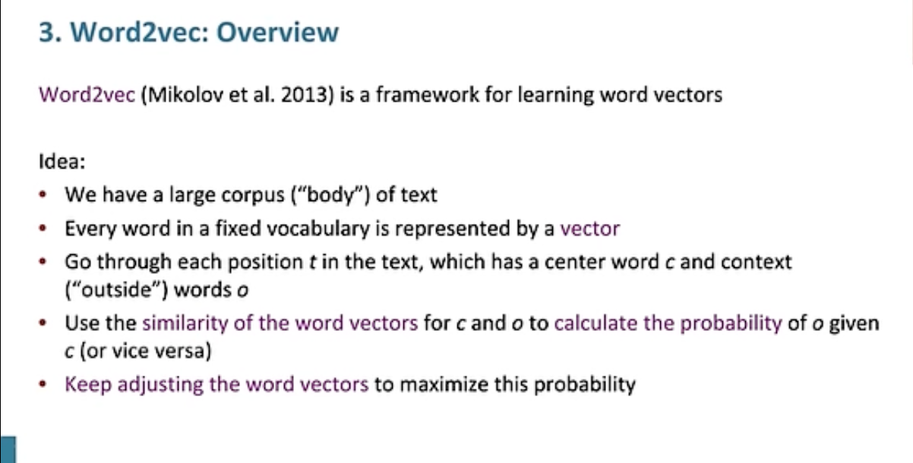

word2vec是用于学习词向量的框架。

想法如下：
  - 有一个很大的文本语料库（corpus of text）
  - 每个词语将会在一个固定的（fixed）词汇表（可能被剔除了很罕见的词汇）中被表示为一个向量
  - 遍历文本中的每个位置t，有一个中心词c和若干上下文词o
  - 通过c和o词向量的相似性，来计算给定c的条件下o的概率，反之亦然
  - 一直调整词向量知道将这个概率取得最大值

下图是一个例子，给定了c的情况下，计算o的概率：

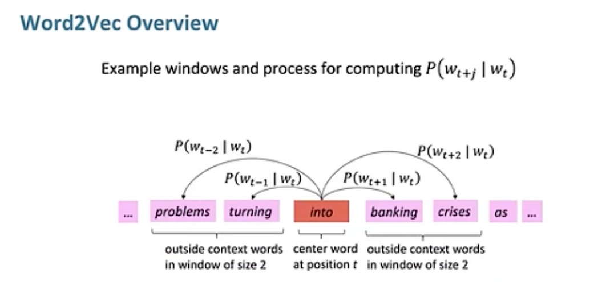

关键的问题是如何调整vectors来最大化这个概率。

## word2vec 的优化过程

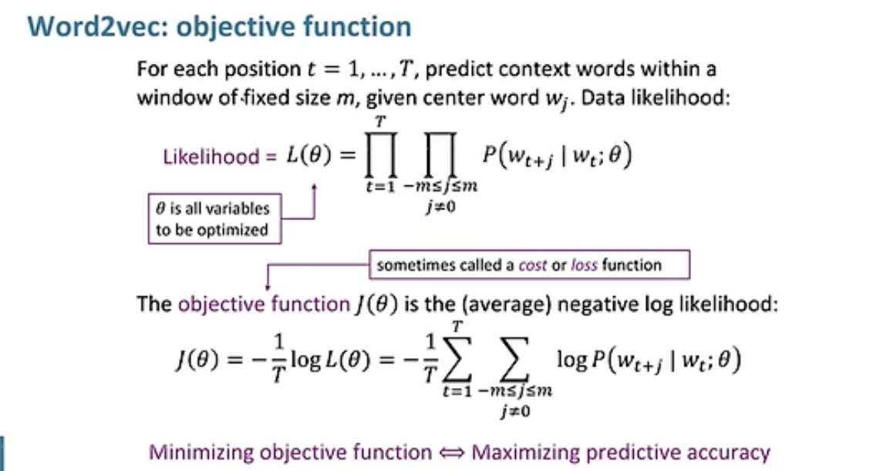

在文本上使用滑动窗口，依次计算每个t位置的中心词C和窗口内的上下文词O的相似度，并得出似然性likelihood

提出了一个likelihood（似然性）来描述对词语预测的准确程度。公示在上图中展示，其中$\theta$是一组待优化的模型参数。

而目标函数J（又称为loss或者cost 损失函数），是平均负log likelihood函数的值。

最小化损失函数就是最大化likelihood。

有了目标函数之后，如何计算$P(w_{t+j}|w_t;\theta)$呢？

方法如下，对于每个单词w使用两个向量$v_w$,$u_w$： 
  - $v_w$ 是w作为中心单词的词向量
  - $u_w$ 是w作为上下文词的词向量
  - //上面这种做法是因为简化了数学上的计算和优化的过程，在构建单词向量时会更加容易

然后对于一个重新向量为c，上下文向量为o的窗口：$$P(o|c)=\frac{e^{u_o^T v_c}}{\sum_{w \in V} e^{u_w^T v_c}}$$

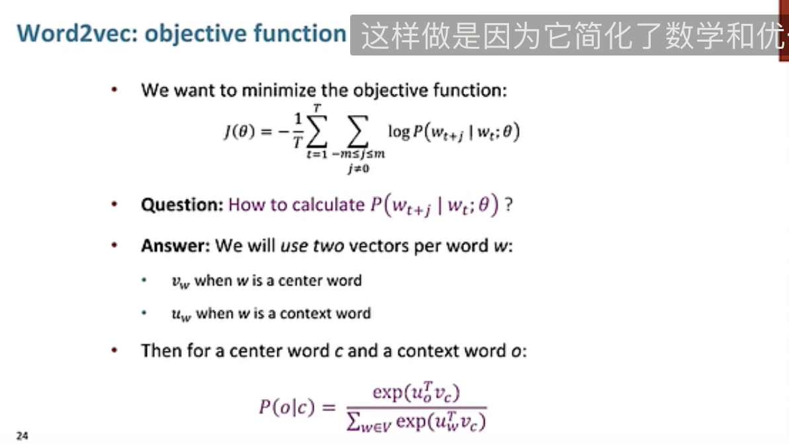

下面是介绍该方法的例子：

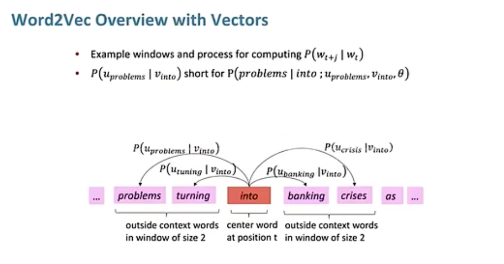

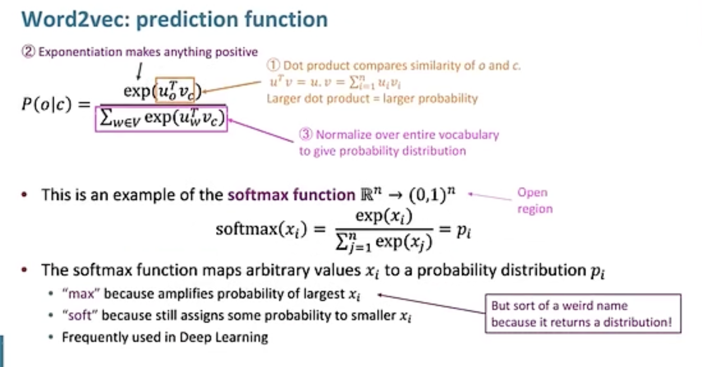

1. 通过点积运算，来计算两个向量之间的相似度
2. 通过e取指数操作将所有的数映射为正数（同时保证了大小关系）
3. 为了计算的结果是概率分布，在整个词汇表中做归一化。（就是softmax操作）

## word2vec的训练过程

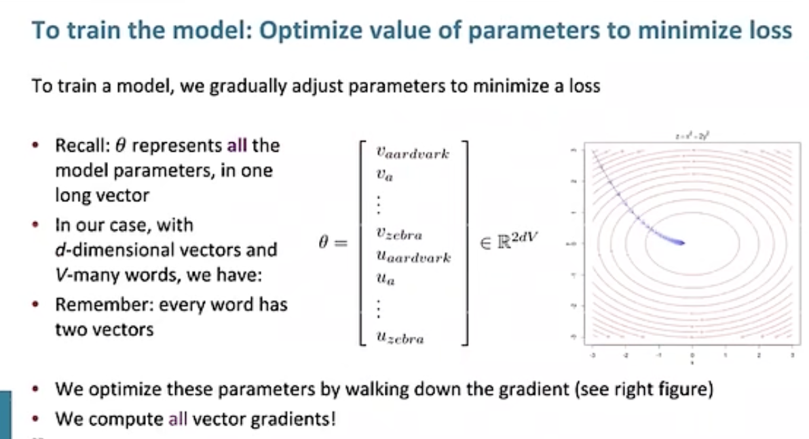

如上图，模型的参数是一个 2V x D 的矩阵，有V的词（一个词有uv两个词向量），每个词向量的维度是D。
  - 通过梯度下降的方法来优化参数
  - 计算所有词向量的梯度

对上述条件概率表达式计算对于Vc的梯度过程如下：

换底：

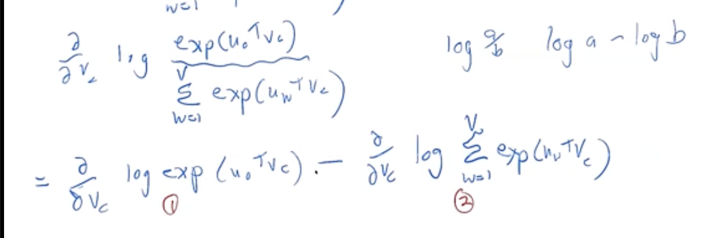

复合函数求导 链式法则：

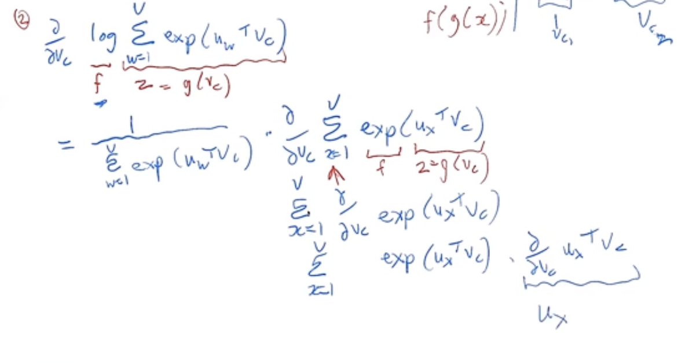

最终化简为：

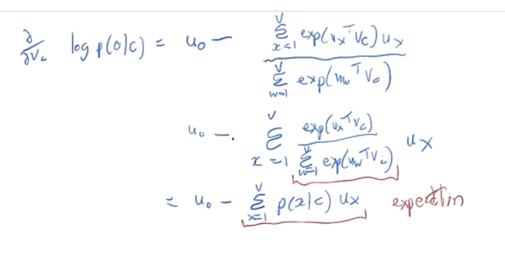

理解： 后面的减数可以看做一个Uo期望（在整个词汇表中的加权平均值），而前面的则是一个Uo的观察值。

如果向量在平均意义上准确预测了我们实际看到的某个单词向量Uo说明模型效果很好。（虽然通过这种方法很难让梯度降低为0）

课程1 Word2Vec的后面部分56:48之后结合ipynb下面介绍

## code note

在实例中，依赖于训练模型，并对其进行微调然后对评论进行分类，其中也展示了文本生成的操作。

### 自监督学习

NLP中，预训练模型是针对不同的任务进行训练的。而计算机视觉中的迁移学习则不是这样。

通常所说的语言模型是一种经过训练后可以预测文本中的下一个单词是什么的模型。这种任务称为自监督学习。

自监督学习（self-supervised learning）：不需要对数据进行标注，只需要提供大量的文本。模型可以自动从数据中获得标签。

这样的任务并不简答，为了能够正确的预测句子中的下一个单词，模型需要对语言具有一定的理解。自监督学习也可以用于除了语言模型之外的其他领域。

通常情况下，自监督学习不用于直接对模型进行训练，而是用于对迁移学习 预训练的模型。

### 示例中的任务场景

将在wikipedia预训练过的IMDb评论进行分类的语言模型进行微调，使其成为电影评论分类器。

由于维基百科中的英语和IMDb中的英语略有不同，因此将预训练的模型微调到IMDb语料库并使用微调后对IMDb语料库有了一定理解的模型作为分类器实现的基础。

语言模型已经学习了（电影评论）任务中使用的语言基础（例如都是英语，pretrained模型对语言已经有了一定的理解），有助于适应目标任务语料库的语言风格（可能是更加非正式的语言，或者更具有技术性的语言，需要学习新单词和造句方式）。

就IMDb语料库而言，会有大量电影导演和演员的名字，并且其语言风格通常没有维基百科中的正式。

### 任务流程：

在微调分类任务模型时，首先微调基于序列的语言模型（文本生成任务）。如果预训练模型仅在wikipedia上训练，然后使用IMDb情感分析任务的数据集（50k test，25k labeled train，25k labeled validation）进行微调，可以得到一个很擅长生成电影评论下一个单词的基于序列的语言模型。

  研究显示，在将模型从生成任务转移到分类任务之前，就对语言模型进行额外的微调能够获得更好的效果。（相比于直接从wikipedia得到的语言模型转移到IMDb情感分析分类任务上。）

因此在NLP中进行迁移学习的三个阶段，如下所示。


1. 可以先通过fastai下载预训练的英语语言模型，得到最新的NLP分类的最新模型。
2. 有了预训练模型的语言基础之后，在模型进行进行微调，使其能够更好的适应新的语料库。
3. 将语言模型转移到分类任务上。

### 神经网络中的语言建模

#### 文本预处理

想要用目前所学的知识来对语言模型建模并不简单。文本一个重要的特点是：句子的长度可以不同，文档可以特别长。

如何用神经网络预测句子中的下一个单词呢？

将自然语言处理中的文本数据转化为可以用神经网络进行处理的形式，特别是如何预测句子的下一个单词。以下是关键点的详细解释：

	1.	词汇表（vocab）：首先，需要构建一个包含所有可能词汇的列表（词汇表）。这可以通过将所有文档串联成一个长字符串，然后将字符串拆分为单词来实现。这些单词就构成了我们的词汇表。
	2.	词汇索引：每个词汇在词汇表中的位置（索引）将用来替代实际的单词。也就是说，我们将文本中的每个单词用它在词汇表中的索引来表示。
	3.	嵌入矩阵（embedding matrix）：接下来，我们创建一个嵌入矩阵。这个矩阵的每一行对应词汇表中的一个词汇。矩阵的行向量可以看作是单词的向量表示。对于预训练模型中的词汇，我们可以直接使用预训练模型中的嵌入向量；对于新的词汇，我们可以随机初始化这些向量。并将嵌入矩阵作为网络的第一层。（输入的是原始词汇索引（这种方法与onehot矩阵输入等效，并且更快更高效），然后在embedding matrix查找对应的vec）
	4.	序列建模：文本处理的新概念是序列。我们将整个文档串联成一个长字符串，然后拆分成单词，得到一个很长的单词列表。独立变量是从第一个单词开始到倒数第二个单词的序列，依赖变量是从第二个单词开始到最后一个单词的序列。这两个序列是错位一个单词的。

具体来说，步骤如下：

  - 把所有文档串联起来，形成一个大的长字符串。
	- 把字符串按单词分割，形成一个很长的单词列表。
	- 词汇表包括预训练模型中的常见词汇和我们语料库中特有的新词。
	- 嵌入矩阵包含两部分：预训练模型中常见词汇的嵌入向量和新词的随机初始化向量。
	- 独立变量序列是从第一个单词到倒数第二个单词的序列，依赖变量序列是从第二个单词到最后一个单词的序列。

通过以上步骤，神经网络可以接收独立变量序列，并预测每一步的下一个单词（依赖变量序列中的对应单词）。这样就实现了基于神经网络的文本生成或预测。

至此，词汇表以及包括了 预训练模型中包括的常用单词 以及 我们的语料库中的新单词（如电影术语或演员名），并构建了嵌入矩阵。在构建时：
  - 预训练模型中词汇表中的单词，直接采用预训练模型中embedding matrix的对应vector
  - 对于新单词，由于没有可参考的向量，使用随机初始化embedding中的相应的vector

##### 创建语言模型的具体实现

在自然语言处理的领域中，构建语言模型涉及多个步骤，每个步骤都有其专业术语，并且可以使用fastai和PyTorch中的类来帮助实现。这些步骤如下：

1. **分词（Tokenization）**：
   - **定义**：将文本转换为单词列表（或字符、子字符串，取决于模型的粒度）。
   - **操作**：将句子或文档拆分成一个个单词，这些单词称为“token”（标记）。
   - **工具**：fastai中的`tokenize`函数可以实现这一操作。

2. **数值化（Numericalization）**：
   - **定义**：列出所有出现的唯一单词（词汇表），并通过查找词汇表中的索引将每个单词转换为数字。
   - **操作**：创建一个词汇表，并将每个单词映射为一个唯一的数字（索引）。
   - **工具**：fastai中的`numericalize`函数可以将标记转换为数字索引。

3. **语言模型数据加载器的创建（Language Model Data Loader Creation）**：
   - **定义**：fastai提供了一个`LMDataLoader`类，它自动处理创建依赖变量和独立变量，并将依赖变量按一个标记偏移。此外，它还处理了一些重要的细节，比如如何打乱训练数据以保持依赖变量和独立变量的结构。
   - **操作**：通过将文本序列分成训练数据和标签数据，训练数据是前面的单词序列，标签数据是对应的下一个单词。
   - **工具**：fastai中的`LMDataLoader`类可以帮助创建适当的训练数据和标签数据。

4. **语言模型的创建（Language Model Creation）**：
   - **定义**：我们需要一种特殊类型的模型，它能够处理长度可以任意大或小的输入列表。在本章中，我们将使用一种*循环神经网络*（RNN）。
   - **操作**：RNN能够处理序列数据，并能够记住序列中的先前信息，这使得它非常适合处理语言数据。
   - **工具**：fastai和PyTorch中的RNN类可以用来创建语言模型。

###### 具体操作步骤如下：

1. **分词**：
   - 示例代码：`tokens = tokenize(text)`

2. **数值化**：
   - 示例代码：`numericalized_tokens = numericalize(tokens, vocab)`

3. **语言模型数据加载器的创建**：
   - 示例代码：
     ```python
     from fastai.text.all import *
     dls = TextDataLoaders.from_folder(path, is_lm=True)
     ```

4. **语言模型的创建**：
   - 示例代码：
     ```python
     learn = language_model_learner(dls, AWD_LSTM, drop_mult=0.5)
     learn.fit_one_cycle(1, 1e-2)
     ```
  - 其中dls就是被加载进的训练数据
  - AWD_LSTM 是一种用于自然语言处理的高级循环神经网络架构，全称是 “Attention-based Weight-Dropped LSTM”（基于注意力机制的加权丢弃 LSTM）
  - drop_mult是训练时的超参数，用于放弃神经元更新的工具，防止过拟合

###### Tokenization

在将文本转换为单词列表时，有一些问题，例如，如何处理标点符号？如何处理"don't"这样的词，是当做一个还是当作两个？长的化学术语或者医学术语单词该怎么处理 是否要分成独立的含义？连字符单词如何处理？

这些问题没有标准答案，但是为了应对这些问题，主要的三种token化的方法如下：
  - 基于单词：在空格上分割句子，以及应用特定于语言的规则来尝试分离含义的各个部分，即使没有空格（例如将`don't`变成`do n't`） 。一般来说，标点符号也被分成单独的标记。
  - 基于子词：：根据最常出现的子字符串将单词分割成更小的部分。例如，`occasion`可能被标记为`oc ca sion`。
  - 基于字符：：将句子拆分为各个字符。
token则是标记化中的一个元素，可以是一个单词、子单词、单个字符。

在例子中使用了fastai的API对IMDb数据集进行tokenize的尝试。

```python
from fastai.text.all import *

# 解包IMDb语料库数据
path = untar_data(URLS.IMDB)

# 获取文本文件，将数据集中的测试集，训练集，验证集读取.类似get_image_files
files = get_text_files(path, folders = ['train', 'test', 'unsup'])

# 预览读入的文本，此时是一个字符列表，将要被tokenize
txt = files[0].open().read()
print(txt[:75])

# 使用fastai的WordTokenizer函数（始终使用fastai的默认tokenizer，不一定是spaCy）将文本txt进行tokenize，first 是 fastai 提供的一个函数，用于从可迭代对象中获取第一个元素。在这里，它用于从 spaCy 分词器返回的标记列表中获取第一个列表。
spacy = WordTokenizer()
toks = first(spacy([txt]))

# spacy([txt])返回了一个generator的对象，用于送出结果。

# 使用fastai的coll_repr(collection,n)来显示结果。显示collection的前n个项目，以及完整大小。
print(coll_repr(toks, 30))

# 使用Tokenizer类向tokenize过程添加一些细节
# 例如一些xxbos xxmaj的特殊符号
tkn = Tokenizer(spacy)
print(coll_repr(tkn(txt),31))

```

通过结果发现spaCy主要知识分离了单词和标点，以及把it's分离为it和's。

还有一些小细节，例如U.S.这种缩写单词中的'.'并没有被分离，仅仅作为句号时被分离。

而fastai的tokenizer类，可以在tokenize是加入特殊标记，例如xxbos代表文本的开始，xxmaj表示下一个单词是大写开头，xxunk代表该词未知。这些特殊令牌并不直接来自 spaCy。它们之所以存在，是因为 fastai 在处理文本时应用了许多规则。

xx代表特殊标记，bos（begin of stream），major，unknown

这些标记旨在使模型更容易识别句子的重要部分。从某种意义上说，通过tokenize将原始英语语言序列翻译成简化的标记语言，旨在使模型易于学习的语言。

例如，规则将用特殊的*repeat charactor*（xxrep）标记替换四个感叹号的序列，后跟数字4，然后是单个感叹号'!'。通过这种方式，模型的嵌入矩阵可以对有关一般概念（例如重复标点符号）的信息进行编码，而不需要为每个标点符号的每次重复次数使用单独的标记。同样，大写单词将被替换为特殊的大写标记，后跟该单词的小写版本。这样，嵌入矩阵只需要单词的小写版本，节省了计算和内存资源，但仍然可以学习大写的概念。

可以将很多种字符序列使用这种方式表示。

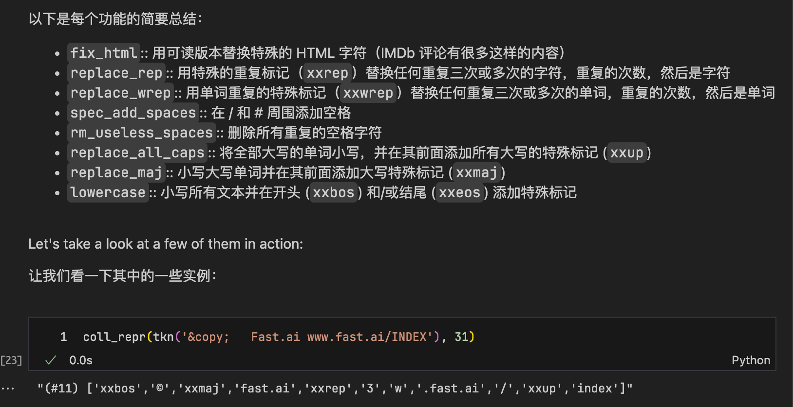

##### subword tokenize

下面部分直接在notebook上做