# Word to Vector

这部分可以看3blue1brown在将transformer的编码的部分，方便理解。

## 引入

如何让计算机系统去理解人类语言？如何准确的表达一个词的意义？

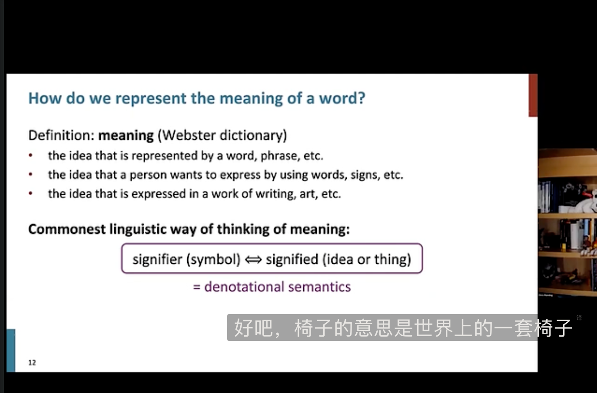

传统人类的做法是，用一个想法或者事情的标识去解释词语，就是语义标识。

早期的NLP中，通常使用WordNet，一个包含同义词集和超名词列表的同义词库。将词语与其同义词关联起来。

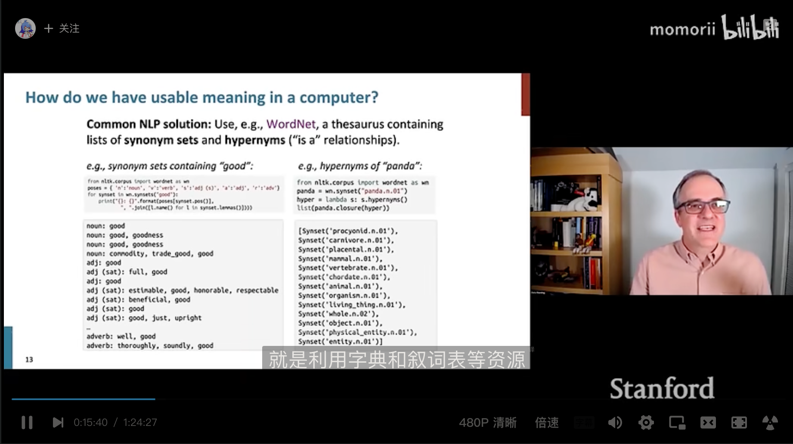

但是这种联系相近词意的方法存在一些问题：
    
  - WordNet是一个很好的资源，但是无法准确的区分意思相近的词语（例如“熟悉” “好” 被归为同一词意）。
  - 缺乏某个词的新的含义（梗或者日常含义），例如一些词随着时间变换会出现新的含义但是这种方法无法保持最新。
  - 主观性，词与词之间的联系是由人主观建立的。
  - 需要人工去创造连接以及更新改写。
  - 无法由计算机去计算词与词之间的相似度。

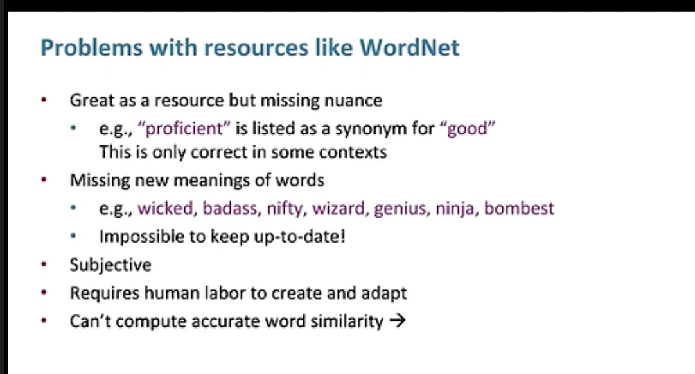

上面这些问题，就是深度学习模型能够解决的，也是其优势所在。

在传统的NLP中，把词语看作离散符号（discrete symbol）。
例如hotel，conference，motel这些词在传统NLP中被称为localist presentation（地方性表示），因为这些单词通常被表示为one-hot向量。每个不同的单词在某个指定的维度是1，其余为0。

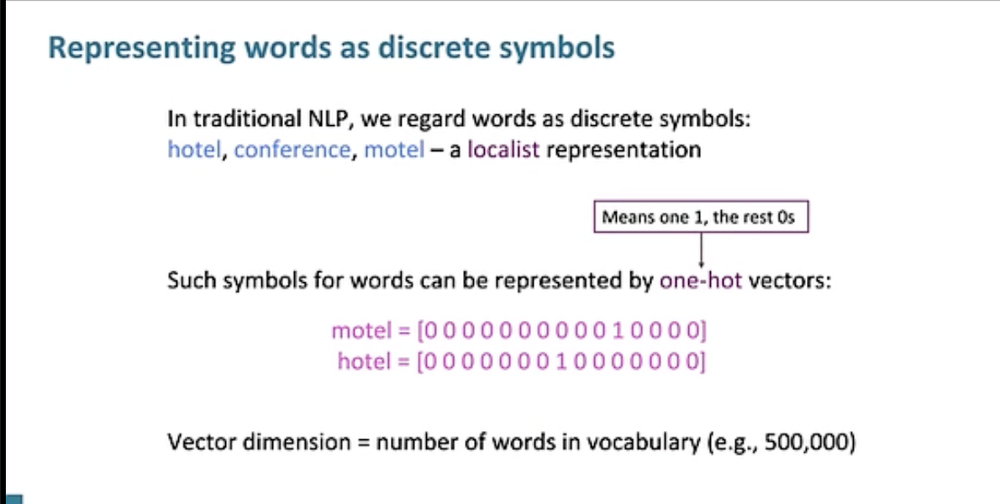

在这种方法中，如果字典中的词特别多，每个词会对应一个维度很高的向量。

而且一个重要的问题是，这种离散的表示方法没有办法表示出词与词之间的相似性：

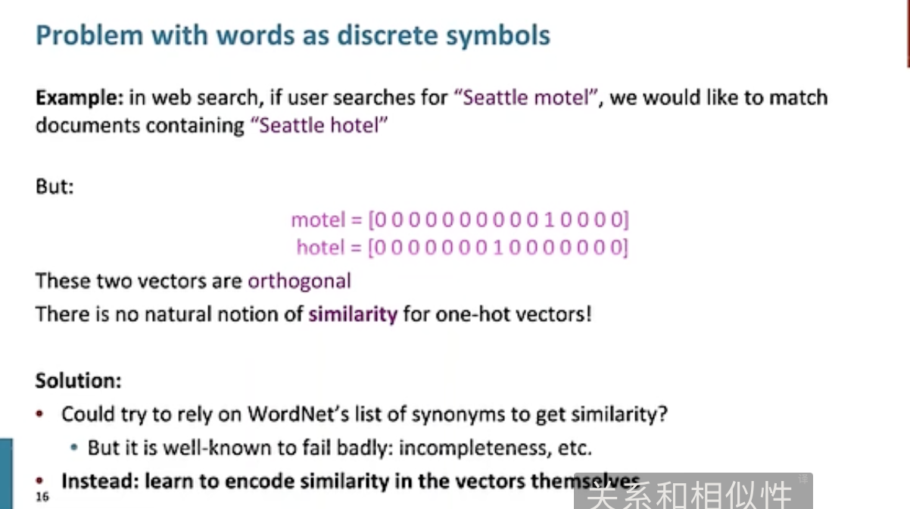

例如，如果用户想要搜索Seattle hotel，却写成了Seattle motel，系统本应该匹配与“西雅图酒店”的搜索结果，但是这种表示方法下，hotel和motel对应的两个one-hot向量是正交的，相似度为0。

对于这种情况，提出了一些解决办法：例如在wordNet中，把字形相似的词当作“同义词”，来表示这些词之间的相似性；或者建立一个方法同时表示多重含义。

而现在的方法是深度学习中，在向量中自己编码这些词之间的相似性。也就是word2vec

## 理论支持

分布语义（Distribution Semantics）：一个词的含义是由其附近的词语（上下文）决定的。

这个思想是在深度学习中一个非常成功的思想。

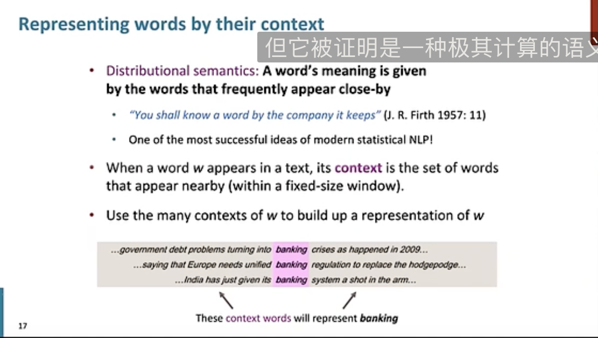

就是使用上下文来代表一个词的含义。

在深度学习中，就是把一个词表示为一个向量，让这个向量能够 在上下文中有相似含义（上下文内容相似）的词中 表现出相似性。

这样的表示方法被称作为分布性表示（distributed representation），与上面的提到的地方性表示（localist representation）相区别。一个词的含义被分布在一个向量的各个维度，而不是像one-hot那种集中在一个维度上。

这样的表示方法也被称为word embedding，这种向量被嵌入在一个高维度空间中。

## Word2vec算法介绍

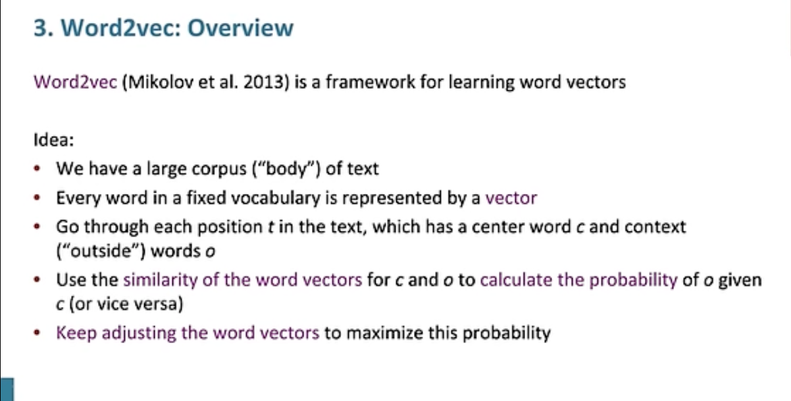

word2vec是用于学习词向量的框架。

想法如下：
  - 有一个很大的文本语料库（corpus of text）
  - 每个词语将会在一个固定的（fixed）词汇表（可能被剔除了很罕见的词汇）中被表示为一个向量
  - 遍历文本中的每个位置t，有一个中心词c和若干上下文词o
  - 通过c和o词向量的相似性，来计算给定c的条件下o的概率，反之亦然
  - 一直调整词向量知道将这个概率取得最大值

下图是一个例子，给定了c的情况下，计算o的概率：

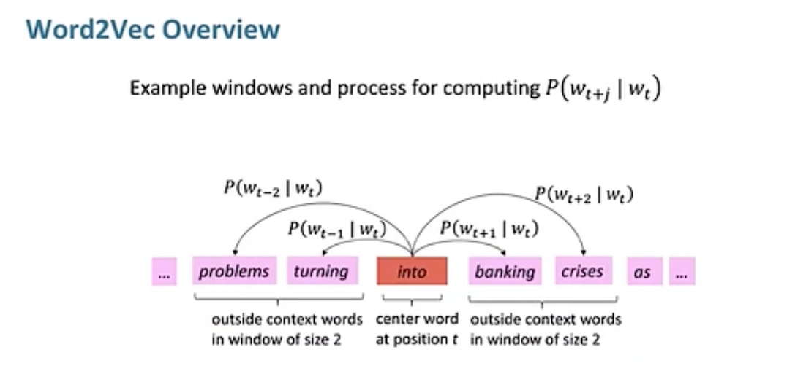

关键的问题是如何调整vectors来最大化这个概率。

## word2vec 的优化过程

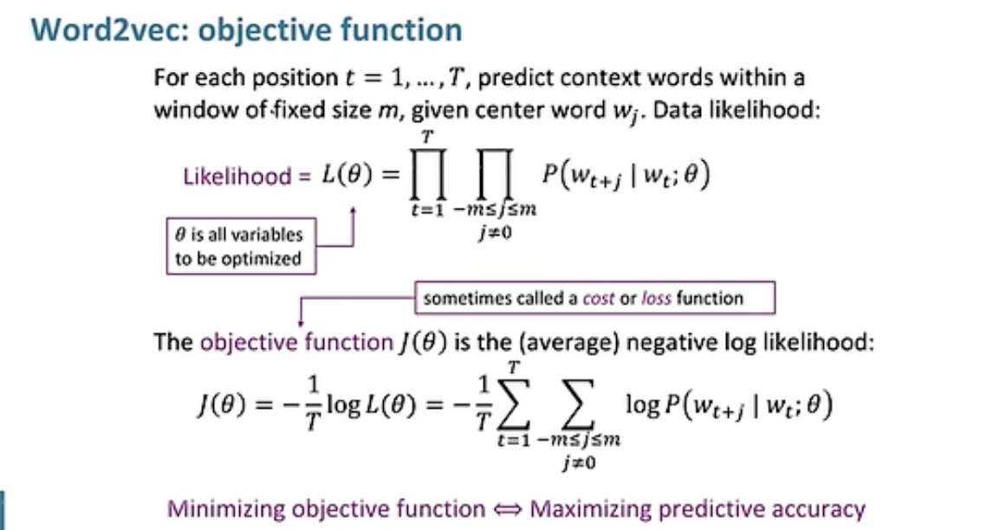

在文本上使用滑动窗口，依次计算每个t位置的中心词C和窗口内的上下文词O的相似度，并得出似然性likelihood

提出了一个likelihood（似然性）来描述对词语预测的准确程度。公示在上图中展示，其中$\theta$是一组待优化的模型参数。

而目标函数J（又称为loss或者cost 损失函数），是平均负log likelihood函数的值。

最小化损失函数就是最大化likelihood。

有了目标函数之后，如何计算$P(w_{t+j}|w_t;\theta)$呢？

方法如下，对于每个单词w使用两个向量$v_w$,$u_w$： 
  - $v_w$ 是w作为中心单词的词向量
  - $u_w$ 是w作为上下文词的词向量
  - //上面这种做法是因为简化了数学上的计算和优化的过程，在构建单词向量时会更加容易

然后对于一个重新向量为c，上下文向量为o的窗口：$$P(o|c)=\frac{e^{u_o^T v_c}}{\sum_{w \in V} e^{u_w^T v_c}}$$

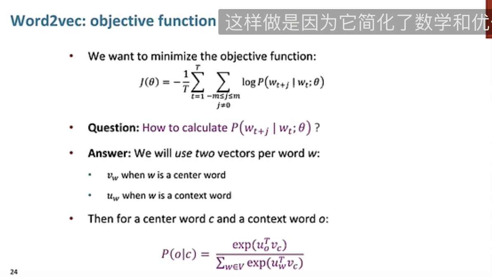

下面是介绍该方法的例子：

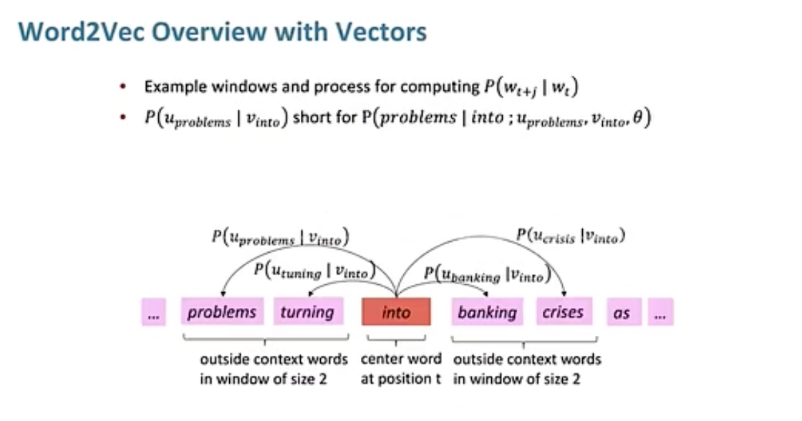

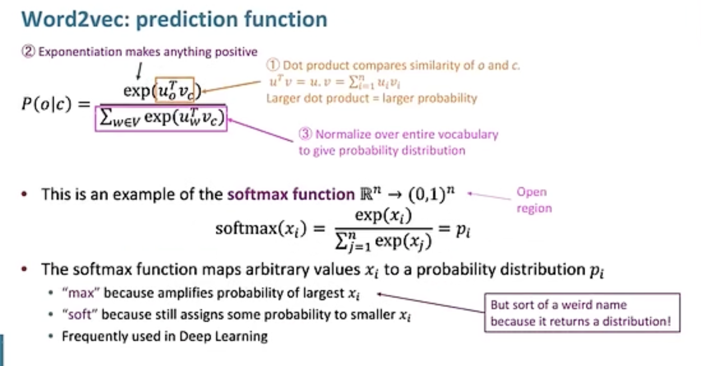

1. 通过点积运算，来计算两个向量之间的相似度
2. 通过e取指数操作将所有的数映射为正数（同时保证了大小关系）
3. 为了计算的结果是概率分布，在整个词汇表中做归一化。（就是softmax操作）

## word2vec的训练过程

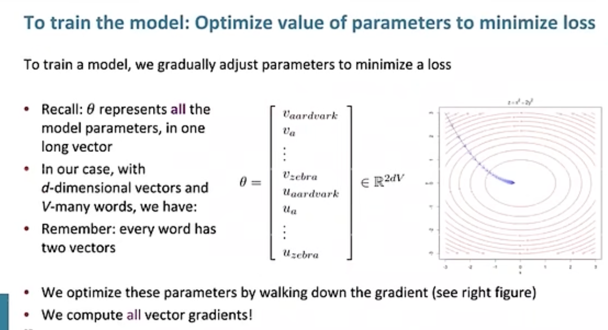

如上图，模型的参数是一个 2V x D 的矩阵，有V的词（一个词有uv两个词向量），每个词向量的维度是D。
  - 通过梯度下降的方法来优化参数
  - 计算所有词向量的梯度

对上述条件概率表达式计算对于Vc的梯度过程如下：

换底：
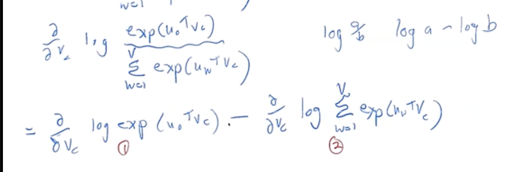

复合函数求导 链式法则：
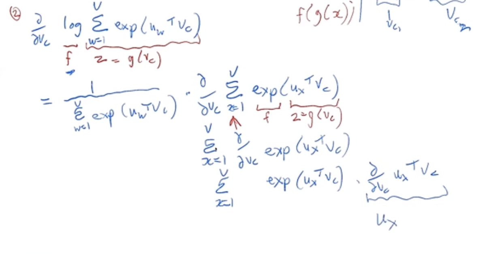

最终化简为：
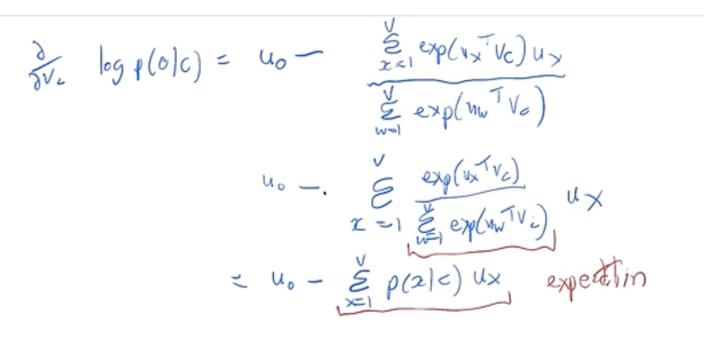

理解： 后面的减数可以看做一个Uo期望（在整个词汇表中的加权平均值），而前面的则是一个Uo的观察值。

如果向量在平均意义上准确预测了我们实际看到的某个单词向量Uo说明模型效果很好。（虽然通过这种方法很难让梯度降低为0）

课程1 Word2Vec的后面部分56:48之后结合ipynb下面介绍
