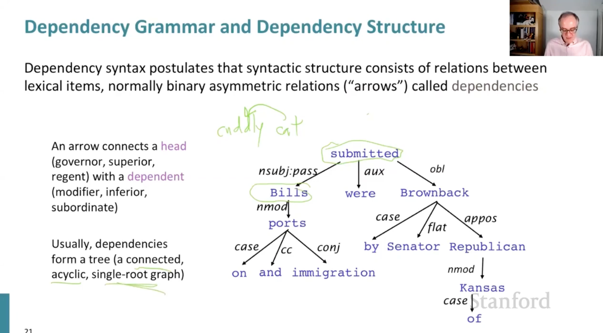
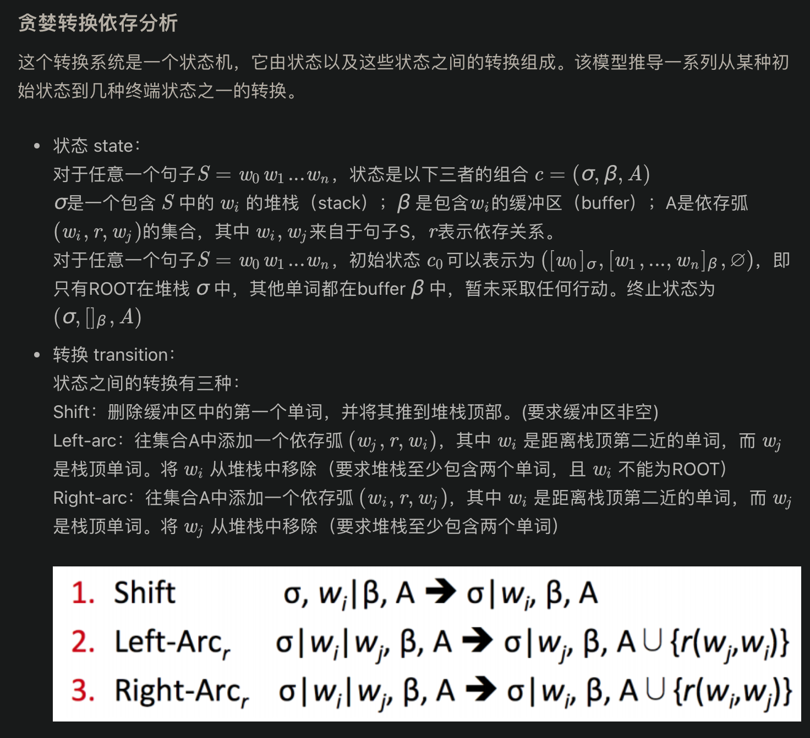
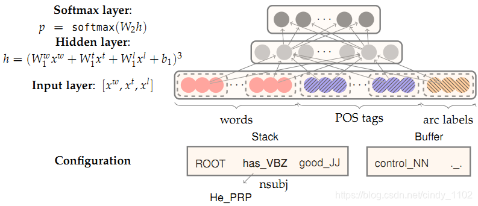

# Dependency Parsing

在这一节中讨论的中心放在语言学和自然语言处理上

介绍语言句法结构，选区和依赖的想法。关注于语言中的依赖结构和依赖树，思考如何自己创建语言系统。

## 句法结构 一致性和依赖性  Syntactic Structure:Consistency and Dependency

与编译器中的解析树类似，NLP中的解析树用于分析句子的句法结构。使用的结构主要有两种类型——constituency和dependency。

其中：Constituency Grammar：使用短语结构语法将单词放入嵌套的组件中。

而 Dependency Parsing：句子的从属结构显示哪些词依赖于(修饰或是)哪些词。这些单词之间的二元非对称关系称为依赖关系，并被描述为从head到dependent。通常这些依赖关系形成一个树结构。经常用语法关系的名称进行分类(主语，介词宾语，同位语等)。有时会将假根节点作为head添加到树中，所以每个单词都依赖于一个节点。

## 依赖性语法和树资料库 Dependency Grammar and Treebanks

依存分析：分析给定输入句的语法依赖结构。依存解析器的输出是依赖树，其中输入句的单词通过类型化依赖关系连接。在形式上，依存关系问题要求从输入语句到依存关系树创建一个映射。

依存分析有两个子问题：

  - 学习：给定一组用依赖关系图标注的句子训练集D，导出一个解析模型M，该模型可用于解析新句子。
  - 解析：给定一个解析模型M和一个句子S，根据M推导出S的最优依赖关系图D。

## 基于转换的依赖项解析 Transition-based dependency parsing

基于转换的依存解析依赖于状态机，状态机定义可能的转换，以创建从输入语句到依赖项树的映射。学习问题是根据状态机的过渡历史，建立预测状态机下一个过渡的模型。解析问题是根据前面推导的模型，构造输入句子的最优转换序列。大多数基于转换的系统不使用正式语法。

贪婪转化依存分析：

## 神经依赖项解析 Neural dependency parsing

依存分析有许多深入的模型，本节特别关注贪婪的基于转换的神经依存分析器。与传统的基于特征的依存分析器相比，这类模型具有相当的性能和显著的效率。与以前模型的主要区别是依赖于密集而非稀疏的特性表示。

这里介绍的模型运用前面介绍过的弧转换系统，目的是从一个初始的配置 c c c，预测出直到终止配置的转换序列，在这个过程中编码一棵分析树。每次训练，模型都会基于当前的配置$c=(\delta,\beta,A)$预测出一轮转化$T \in {shift,left-arc.right-arc}$

  - 特征选择：根据模型所需的复杂性，可以灵活地定义神经网络的输入。某句话的特征一般包括以下部分：
    - $S_{word}$ ：在堆栈 σ \sigma σ 和缓冲区 β \beta β 顶部的S(及其依赖项)中的一些单词的向量表示。
    - $S_{tag}$ ：词性(POS)标签是由一个小的离散集合构成的，它包括 P={NN,NNP,NNS,DT,JJ，…}
    - $S_{label}$ ：S中的一些单词的arc-label，由一个小的离散集组成，描述依赖关系 L={amod,tmod,nsubj,csubj,dobj，…}
    对于单词三个特征对应的独热码，会训练出三个embedding矩阵，将稀疏的独热向量转换成稠密向量。$$E^w\in\mathbb{R}^{d*N_w},E^t\in\mathbb{R}^{d*N_t},E^l\in\mathbb{R}^{d*N_l}$$
 
  - 特征选择示例
    - $S_{word}$ ：堆栈和缓冲区上的前3个单词 $s_1,s_2,s_3,b_1,b_2,b_3$。堆栈上顶部两个单词的第一个和第二个最左边/最右边的子单词：$lc_1(s_i),rc_1(s_i),lc_2(s_i),rc_2(s_i),i = 1,2,i=1,2$。堆栈上最前两个单词的最左边/最右边的子元素：$lc_1(lc_1(s_i)),rc_1(rc_1(s_i)),i = 1,2$.总共包含18个元素。$(n_w=6+2*4+2*2)$
    - $S_{tag}$ : $S_{word}$对应的POS标签（$n_{t}=18$）
    - $S_{label}$ ：$S_{word}$中除了stack/buffer中的6个单词之外其他词的arc-label
  - 前向传播神经网络
    包含输入层$[x_w,x_t,x_l]$隐藏层和输出层（交叉熵损失softmax层）
    
    
