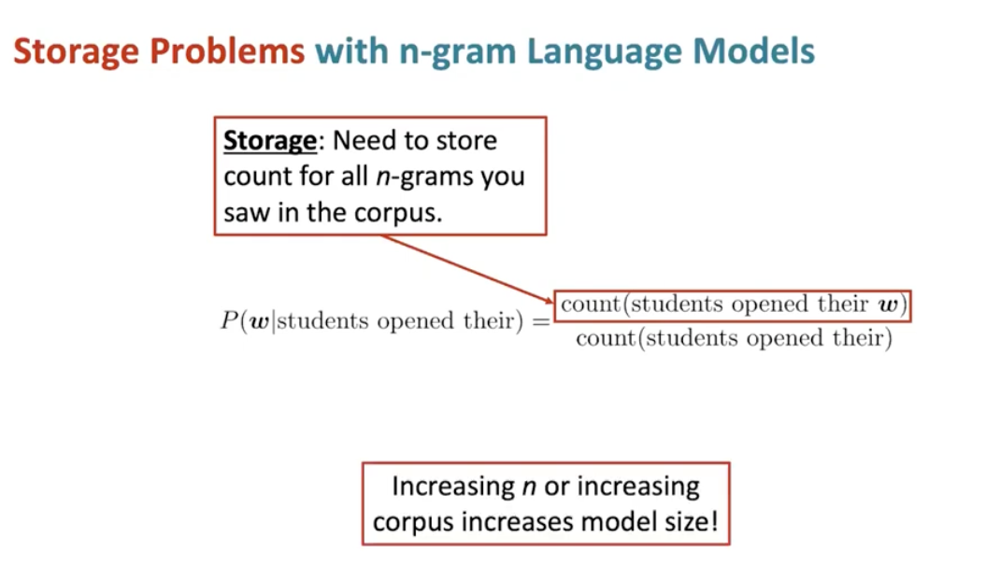

# Language models and RNNs

## 依赖分析的小尾巴

基于特征的依赖分析有一些问题，例如特征很稀疏，不完整，消耗大量的计算资源。

下面会介绍一种基于神经的依赖分析方式：学习一种紧凑密切的表示。

通过这种方式可以得到一个分布的表示方式，一个词会被转化成一个密集的向量，例如word embedding。

还有一个好处是，深度学习的分类器是一个非线性的分类器：

而传统的机器学习方法分类器达到不是非常有效的分类方式，仅仅给出线性决策边界，无法很好的拟合实际情况。

通过简单的神经网络多分类任务的结构就可以得到良好的效果：

将这种方法应用在依赖分析中，输入stack和buffer。然后由神经网络预测下一步动作：

## 神经网络的一些tips

### L2正则化

关于神经网络，在训练时，在损失函数loss上加上模型参数的L2正则项损失：

L2正则项损失可以保证模型的中的参数较小且分布均匀，从而使模型更平滑，能够更好的对抗异常值。

在最后介绍L1和L2两种正则化对模型参数的影响。

### Dropout

也是防止模型过拟合的一个办法，在训练时按照一定的概率放弃（每个batch或者instance）前向传播时（在每个neural）的输入，将其直接置为0。

### Vectorization

在matrix product计算时使用矩阵乘法而不是循环的写法，是因为循环写法会在CPU进行计算，而矩阵dot是在GPU加速计算的。

## language modeling

语言模型是预测下一个词的任务。

或者说给出一个序列，计算下一个单词的是某个时的概率。

或者也可以理解为是一个计算出一段文本的概率的系统。例如计算一个特定文本序列的概率是多少：

## 如何构建语言模型呢？

### N-gram Language Model

在深度学习方法之间，使用n-gram Language Model 

一个Ngram是大量N个连续的词

这种模型通过收集Ngram的统计结果，然后通过结果对文本中的下一个词进行预测。

假设一个卡尔科夫过程：假设第$x^{t+1}$个仅取决于前N-1个词

然后在统计语料库ngram和n-1gram作为prob，计算得到结果。

例如：

但是这样的方法存在稀疏问题，如果一个ngram在语料库中从未出现，概率计算为0。这种问题的实际解决方法，是添加一个很小的实数防止为0.

如果n-1gram（分母序列）在语料库中没有出现过，分母为0，无法进行有效计算。解决办法是backoff，shorten分母，变成n-2gram，然后作为分母参与计算。

一般情况下，n的取值不会超过5.

除了稀疏问题（出现的频率过低）之外，还有存储问题（storage）：

需要记录 每个ngram和n-1gram对 中的每一个可能项的概率，导致模型大小很大。

### Neural Language Model

那么如何构建一个神经网络语言模型呢？

能不能使用一个固定的窗口预测窗口后的词呢？

这种模型称为fixed-window neural language model

这种模型不存在稀疏问题和存储问题，因为模型可以一定程度上理解单词的语义。

但是仍然存在一些问题：

  - 固定窗口太小，记忆期很短
  - 增大窗口会增大W参数量，并且窗口永远都不够大
  - x1和x2被W中完全不同的权重处理，输入在处理过程中不存在对称性。忽略的序列对语义的影响。

因此提出了循环神经网络RNN，可以有任意数量的输入。

## L1正则化和L2正则化的区别

L1正则化和L2正则化在其数学性质和优化过程中表现出不同的特性，导致它们对模型参数的影响有所不同。以下是对为什么L1正则化会导致稀疏性，而L2正则化会导致更小且平滑的详细解释。

### L1正则化（L1 Regularization）

L1正则化通过在损失函数中增加所有参数绝对值的和来约束模型参数：

$$ \text{L1正则项} = \lambda \sum_{i} |w_i| $$

#### 为什么L1正则化会稀疏：
1. **梯度特性**：
   - L1正则化的梯度是常数，而不是依赖于参数的值。对于一个参数 $ w_i $，其梯度为 $ \lambda $ 或 $ -\lambda $。
   - 当参数接近于零时，L1正则化的梯度仍然是一个固定值，这导致参数更容易被推向零值。

2. **优化过程中**：
   - 在优化过程中，L1正则化通过逐步减小参数的绝对值。当参数足够小且接近零时，这种减小的效果会变得更加显著。
   - 因此，一些较小的参数最终会被压缩到完全为零，这就导致了稀疏性。

这种稀疏性使得L1正则化非常适合用于特征选择和生成稀疏模型，其中只有少数特征被赋予非零权重。

### L2正则化（L2 Regularization）

L2正则化通过在损失函数中增加所有参数平方和来约束模型参数：

$$\text{L2正则项} = \lambda \sum_{i} w_i^2 $$

#### 为什么L2正则化会更小且平滑：
1. **梯度特性**：
   - L2正则化的梯度是线性的，依赖于参数的值。对于一个参数 $ w_i $，其梯度为 $ 2\lambda w_i $。
   - 当参数值较大时，梯度也较大；当参数值较小时，梯度也较小。这种梯度特性会使得所有参数值趋向于缩小，但不会直接变为零。

2. **优化过程中**：
   - 在优化过程中，L2正则化通过均匀地缩小所有参数，使得较大的参数减小得更快，而较小的参数减小得较慢。这种效果导致了参数值的整体缩小和平滑。
   - L2正则化不会强迫参数值变为零，而是将它们都缩小到一个较小的范围内，从而使得模型更加平滑和稳定。

这种特性使得L2正则化适用于需要整体参数值较小且分布均匀的场景，能够有效防止模型对特定特征的过度依赖，从而提高模型的泛化能力。

### 直观理解

- **L1正则化**：
  - 想象一下，你在一个二维平面上进行优化，L1正则化的等高线是菱形（每个坐标轴上的绝对值和相同的值形成的菱形）。
  - 当你在这个菱形上进行优化时，很容易碰到坐标轴（其中一个参数为零），这就导致了稀疏性。

- **L2正则化**：
  - 想象一下，你在一个二维平面上进行优化，L2正则化的等高线是圆形（每个坐标轴上的平方和相同的值形成的圆形）。
  - 当你在这个圆形上进行优化时，优化路径更倾向于均匀缩小每个参数的值，而不会特别推向零。

通过这种几何直观的理解，可以更好地理解为什么L1正则化会导致稀疏，而L2正则化会使得参数更小且分布更平滑。
