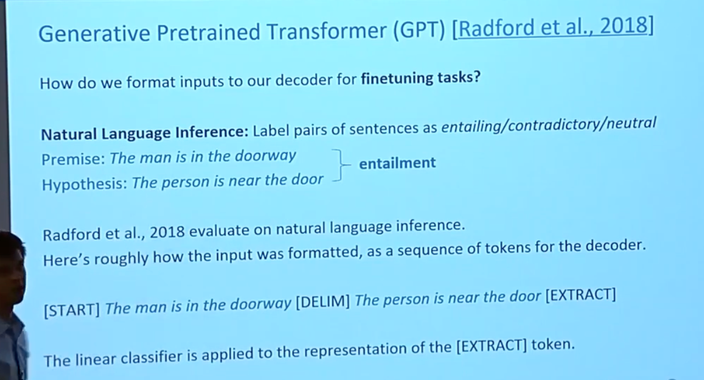

# Transformers & Pretraining

## Word structure and Subword models 词语结构和子词模型

在传统的得到词汇表（为了编码使其可计算）的方式：

假设从训练集中将数以万计的单词words构建成一个固定的词汇表vocab。新的词汇（在训练时没有见到过的）都能够映射到一个单一的UNK（unknown）标识符。

这样的假设方式 是一个有限的词汇表，在很多语言中的意义不大。

在很多展现出复杂形态或者词语结构的语言中，很可能存在一些更长更加复杂的词汇，并且出现的频率很低（在训练集合出现的可能性更低）。

### 子词建模

为了解决这种问题，提出了一类算法，用与子词建模 -> Subword Modeling

子词建模在 “所有基本单位被分为完整的训练集中可以见到的单词+UNK(unknown)” 和 “基本单位就是以字符组成” 。

上述两者中的子词建模，作为中间立场，有很多种单词层级进行建模，例如基于单词的部分，字符，或者字节等等。

现代主流范式是学习单词部分的词汇（subword token），在训练和测试时，每个单词被分成一些 已知序列的子词。

### 字节对编码算法

其中一种 字节对编码算法（the byte-pair encoding algorithm）

字节对编码是定义子词词汇表的一种简单、有效的策略：

  1. 从仅包含字符和“词尾”符号的词汇表开始。
  2. 使用文本语料库，找到最常相邻的字符序列，例如“a，b”；然后添加“ab”作为子词。
  3. 用新的子词替换字符对的实例；重复直到所需的词汇量。
  4. 例如：起始字符{a,b,...,z}。结尾词汇：(a, ..., z, ..., apple, app#, #ly, ...)

最初用于NLP中的机器翻译；现在预训练模型中也使用了类似的方法（WordPiece）。

常见的单词最终成为子词词汇的一部分，而罕见的单词则被分割成（有时是直观的，有时不是）的组件。

在最坏的情况下，单词会被分割成与它们具有的字符一样多的子词。

下面是一个分词结果的例子。

可以这种方法 相较于单词层级的分词 更可以在一定程度上 帮助模型理解单词的语义，但是还有一些（例如错误拼写）错误模型无法理解。

## Motivating model pretraining from word embedding 通过 word embedding 激励模型的预训练

应该通过一个词附近的词来理解它的意思。这句话是 分布性语义 的总结，也是 word2vec 的原因。

一个词的完整含义总是与上下文有关，离开完整的上下文就无法研究其含义。

幻灯片上的最后一句话中的两个record单词的含义是不同的，很直观的说明了一个词的含义是取决于其上下文的。

    在transformer中，embedding提供了一个词的含义的起点，但是其具体的含义究竟是什么，要在注意力机制中通过对上下文的理解来获得，在多次注意力机制对原始embedding的转换后，得到这个位置的词在句子中的含义。

### 两种预训练方式

#### 预训练word embbeding

在2017年早期，从 预先训练的word embeddings（没有使用上下文信息） 起手，（此时的预训练word embedding中每个词的embedding是独立于上下文的）。
然后 通过LSTM或者transformer在任务的训练时结合上下文信息。如下图所示：

但是有一些问题：
  - 我们为下游任务（如问答）提供的训练数据必须包含 上下文语义信息。
  - 网络中的大部分参数（出了embedding matrix的网络部分，没有经过预训练）被随机初始化。

#### 预训练整个模型

在现代的NLP中，（几乎）所有的参数通过预训练进行初始化。预训练方法 通过： 隐藏 模型的部分输入 ，然后再通过 训练模型 来 预测（重建） 那些隐藏的部分。【就像transformer中的masked self attention，但是隐藏的不一定是最后的部分】【相当于把一个模型脱离其下游任务当作一个语言生成模型来通过 语料库进行预训练，帮助模型来理解words】

通过这种方式进行预训练，模型的embeding matrix和网络部分都能被同时训练。输入了独立的词组成的序列，编码了词义信息的embeding被更新时，会结合到上下文中的信息。

这种方法十分有效：
  - 语言表示方面非常有效，也就是word编码为embedding 目的是为了能够进行之后的计算
  - 模型参数的初始化
  - 可以从语言中采样到概率分布

## Transformer Encoder Decoders

在 Attention is all you need中，transformer的结构：

在transformer的输入中，输入输出序列不仅仅是word的编码（embeding），而且也包含了位置信息。

上面是transformer的encoder-decoder结构

encoder内部结构，encoder中在序列中位置靠前的文本可以看到之后的文本的信息

decoder内部结构，decoder中在序列中位置靠前的文本无法看到之后的文本的信息，用于预测下一个词。

其中的multi head cross attention是为了让其注意到encoder最后一层的输出。

如果没有encoder只有decoder，decoder的结构中没有multi head cross attention和residual&layer norm层，因为不需要注意encoder的输出。

- 参考之前介绍的transformer结构：

  

## 通过 语言建模 任务 进行预训练 然后 微调

回顾一下 语言建模任务 ： 让模型能够预测下一个word，使模型具备一定的语言理解能力。

这种任务只需要使用 对应语言的文本即可自监督学习，无需进行标注。

预训练可以 通过 （训练的方式）初始化参数 提升NLP的应用。

所以一般是先 通过语言建模生成预训练模型，然后在对下游任务进行微调finetune。

### technical note

随机梯度下降 与 预训练/微调 stochastic gradient descent and pretrain/finetune

从“训练神经网络（数学）”的角度而言，为什么 先pretrain然后再finetune 对最后的结果有好处呢 ？

首先通过 语言生成 作为 预训练任务，使模型参数得到一个对于pretrained loss得到较优解的参数组 $\hat{\theta}$ 。

然后再 从这个已经在语言生成任务中较优的参数组（有一定的语言理解能力）开始，对于下有任务进行优化，得到对于finetune loss的较优解对应的参数组。

起作用可能的原因：

观察到了现象： 随机梯度下降会使 微调时的参数组 与 预训练得到参数组 $\hat{\theta}$ 保持 相对接近。
  - 所以，可能 finetune 任务的 local minima 在 $\hat{\theta}$ 附近 能够 更好的【概括？】。
  - 或者，也可能是 在finetune 任务 的 loss 的 梯度 可能在 $\hat{\theta}$ 附近 能够 更好地传播

  - 理解是在language modeling时具备了对语言的一些理解能力。但是这个说法不是很数学。

## 模型的预训练也有三种方式

1. 仅仅预训练 Decoders
  - 主要是 语言模型 
  - 可以很好的用于生成
  - 不能用未来的词作为条件
    decoder中的在对某个词进行预测或者是计算时，不能看之后的词，只能通过前面的词进行预测
    
2. 仅仅预训练 Encoders
  - 可以看到之后和之前的所有输入 ： bidirectional context
  - 但是很难进行训练，因为数据输出难以标记
3. 预训练 Encoder-Decoder 整个结构
  - 该如何对这个结构进行很好的训练呢？

### 仅仅预训练 Decoders

#### 方式1

使用语言模型language model预训练decoders时，我们可以忽略他们被训练来模拟（建模）$ P(W_t|W_{1:t-1})$，而是直接使用隐藏层的输出，不进行计算概率的步骤。

在finetune时，通过对 最后一个单词对应的隐藏层输出 添加一个 分类器（线性变换）

也就是说 $ Decoder(w_1,w_2,...,w_t) $ 会在其隐藏层输出一个序列 $ h_1,h_2,...,h_t $ 然后通过一个分类器来得到最后的结果,这个分类器就是一个线性变换 $y～Ah_t+b$ , 其中A和b被随机初始化，其size是根据具体任务来确定的。然后梯度反向传播到整个网络。

#### 方式2

很自然的想到 将decoders 作为 语言模型（预测下一个词） 进行预训练 ，然后再用其作为文本生成器 ，微调预测下一个词的概率 $ P(W_t|W_{1:t-1})$

对于在预训练时 输出是 词汇 的序列的任务很有帮助 

同样的，通过decoders网络获得隐藏层输出： $ h_1,h_2,...,h_t = Decoder(w_1,w_2,...,w_t) $ ，然后通过线性变换进行下一个单词的预测：$w_t～Ah_{t-1}+b$  

在finetune之前，最后一层的线性分类器已经被预训练过了，在finetune时候也是对整个网络进行的。

2018年的GPT就是一个预训练的decoder

在微调时候如何调整输入的格式呢？

输入被整理成如下的类似对话的格式：

自然语言推理（NLI）任务

  - 任务定义：
  - 给定两个句子，判断它们之间的关系：包含、矛盾或中立。
    - 例如：
    - 前提（Premise）：The man is in the doorway
    - 假设（Hypothesis）：The person is near the door
    - 关系：包含（entailment）

输入格式化

  - 输入序列格式：
  - 将前提和假设组合成一个序列，加入特定标记。
  - 例如：
  - [START] The man is in the doorway [DELIM] The person is near the door [EXTRACT]

线性分类器

  - 应用于 [EXTRACT] 标记的表示：
  - 线性分类器应用于 [EXTRACT] 标记的隐藏层输出表示，以进行分类任务。
  - 该过程类似于前面描述的通过特定标记提取隐藏层表示的方法。

在finetune时 ，线性分类器 应用于 [EXTRACT] token的表示 （相当于上面提到的方式1）

### 仅仅预训练 Encoder

上图解释了在对编码器（Encoders）进行预训练时使用的目标，即 **Masked Language Model (MLM)** 方法。这种方法在BERT等模型中被广泛采用。以下是图片中的主要内容和解释：

#### 预训练目标
编码器在预训练过程中使用双向上下文（bidirectional context），因此不能像标准的语言模型那样仅使用前向或后向上下文来预测单词。为了解决这个问题，提出了Masked Language Model (MLM) 方法。

#### Masked Language Model (MLM) 方法
1. **掩码策略**：
   - 输入序列中的一部分单词被随机替换为特殊的 `[MASK]` 标记。
   - 模型的目标是预测这些被掩码的单词。

2. **编码过程**：
   - 输入序列经过编码器（例如BERT）生成隐藏状态表示 \( h_1, h_2, ..., h_T \)。
   - 在此过程中，编码器能够利用序列中的双向上下文信息。

3. **预测和损失计算**：
   - 使用隐藏状态表示 \( h_i \) 通过线性变换和softmax函数预测被掩码的单词。
   - 仅计算那些被掩码单词的预测损失。

#### 公式解释
- \( h_1, ..., h_T = \text{Encoder}(w_1, ..., w_T) \)：输入序列 \( (w_1, ..., w_T) \) 经过编码器后生成对应的隐藏状态表示 \( h_1, ..., h_T \)。
- \( y_i \sim A w_i + b \)：使用线性变换 \( A \) 和偏置 \( b \) 对隐藏状态 \( h_i \) 进行预测，得到预测的单词 \( y_i \)。

#### 示例
右侧的图示展示了一个具体例子：
- 输入序列为 "I [MASK] to the [MASK] store"。
- 模型需要预测被掩码的单词 "went" 和 "store"。

#### 总结
- **预训练方法**：通过MLM方法，编码器可以学习到如何利用上下文信息来预测被掩码的单词，这种双向上下文的使用增强了模型的表示能力。
- **微调方法**：在实际任务中，可以通过微调预训练模型的参数，使其适应特定任务的需求。

### 预训练 Encoder-Decoder

这张图片解释了如何为编码器-解码器（encoder-decoder）模型设置预训练目标。以下是图片内容的详细解释：

#### 预训练目标

对于编码器-解码器模型，我们可以采用类似语言模型的预训练方法，但需要注意的是，输入的前缀部分提供给编码器且不需要预测。

#### 编码器-解码器模型的工作流程

1. **编码器部分**：
   - 输入序列 \( (w_1, ..., w_T) \) 经过编码器生成隐藏状态表示 \( (h_1, ..., h_T) \)。
   - 编码器能够利用双向上下文信息来生成这些表示。

2. **解码器部分**：
   - 解码器接收编码器生成的隐藏状态表示 \( (h_1, ..., h_T) \) 和输入序列 \( (w_1, ..., w_T) \) 的组合。
   - 解码器生成新的隐藏状态表示 \( (h_{T+1}, ..., h_{2T}) \)。
   - 这些隐藏状态表示通过线性变换和softmax函数预测下一个单词 \( y_i \)。

#### 公式解释
- \( h_1, ..., h_T = \text{Encoder}(w_1, ..., w_T) \)：输入序列 \( (w_1, ..., w_T) \) 经过编码器后生成对应的隐藏状态表示 \( (h_1, ..., h_T) \)。
- \( h_{T+1}, ..., h_{2T} = \text{Decoder}(w_1, ..., w_T, h_1, ..., h_T) \)：解码器接收输入序列和编码器的隐藏状态表示，生成新的隐藏状态表示。
- \( y_i \sim A w_i + b, i > T \)：使用线性变换 \( A \) 和偏置 \( b \) 对隐藏状态 \( h_i \) 进行预测，得到预测的单词 \( y_i \)。

#### 优势
- **编码器部分**：
  - 编码器可以利用双向上下文信息进行预训练，从而生成更丰富的表示。
- **解码器部分**：
  - 解码器通过语言建模的方式训练整个模型，使得模型能够生成自然语言。

#### 示例
右侧图示展示了具体的工作流程：
- 输入序列 \( (W_1, ..., W_T) \) 经过编码器生成隐藏状态表示 \( (h_1, ..., h_T) \)。
- 解码器接收编码器的输出和输入序列，生成新的隐藏状态表示 \( (h_{T+1}, ..., h_{2T}) \)，并用来预测下一个单词 \( W_{T+1}, ..., W_{2T} \)。

#### 总结
- **预训练方法**：通过语言建模的方式对编码器-解码器模型进行预训练。
- **微调方法**：在实际任务中，可以通过微调预训练模型的参数，使其适应特定任务的需求。
