# 机器翻译，Seq2Seq以及Attention

## 机器翻译

机器翻译是使用计算机自动进行翻译的过程，在2014年之前，使用的是统计模型，这种方法较为复杂，在2014年之后主要是用神经机器翻译——即使用神经网络进行机器翻译，这里使用了一个重要模型：Seq2Seq。

## Seq2Seq

Seq2Seq是指将序列转换成序列的结构，由两个RNN组成，分别为encoder和decoder，encoder将输入进行编码，decoder将编码后的结果进行解码，生成输出，图示如下：

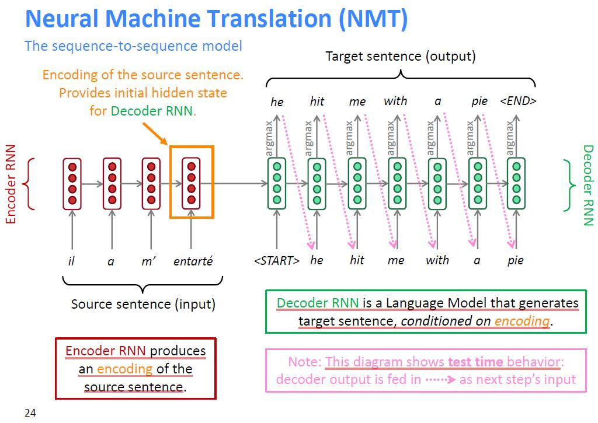

训练方法为计算输出的交叉熵损失函数，然后进行梯度下降，以机器翻译为例，其损失函数计算方法如下：

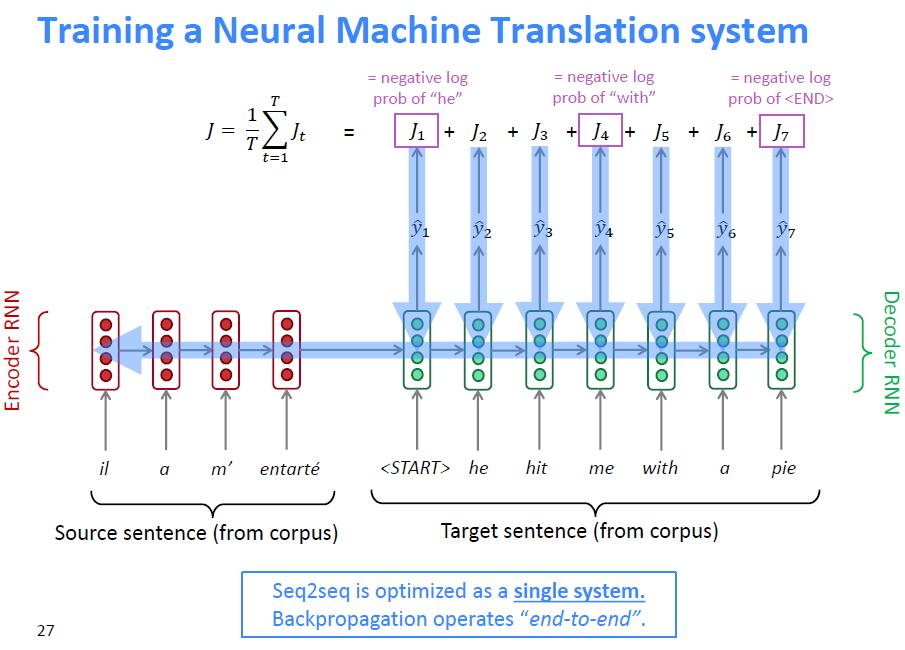

注意解码部分会用两个特殊标记表示开始和结束：START表示开始，END表示结束。

## 解码

使用模型时的重点是进行解码工作，比较好的方法是使用束搜索（Beam Search），假设束的大小为K，其思路为每个时间点保留K个候选目标：
$$
\mathcal{H}_{t}=\left\{\left(x_{1}^{1}, \ldots, x_{l_1}^{1}\right), \ldots,\left(x_{1}^{K}, \ldots, x_{l_K}^{K}\right)\right\}
$$
在更新时，选择如下集合中最好的K个目标：
$$
\tilde{\mathcal{H} }_{t+1}=\bigcup_{k=1}^{K} \mathcal{H}_{t+1}^{\tilde{k} }
$$
其中
$$
\mathcal{H}_{t+1}^{\tilde{k} }=\left\{\left(x_{1}^{k}, \ldots, x_{l_1}^{k}, v_{1}\right), \ldots,\left(x_{1}^{k}, \ldots, x_{l_k}^{k}, v_{|V|}\right)\right\}
$$
这里的好是指对数概率最大的输出，来来看一个具体例子：

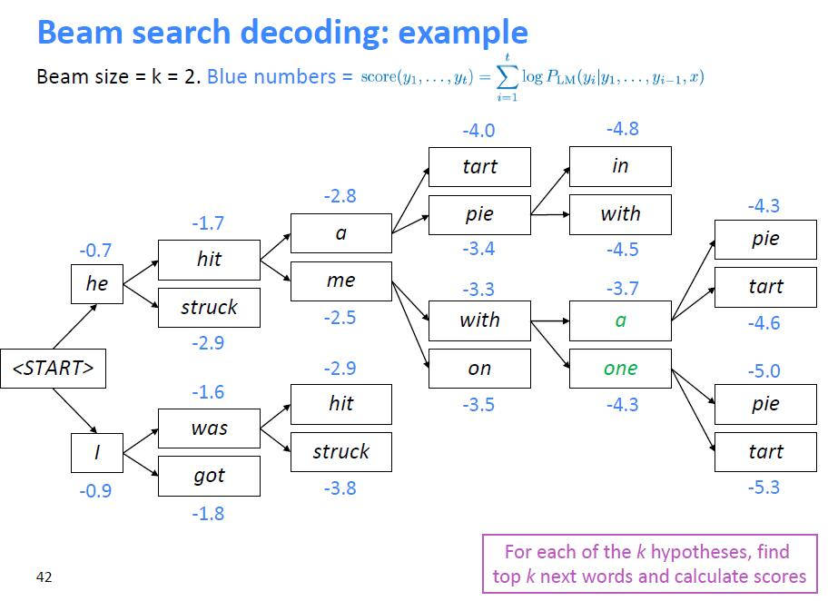

注意如果直接比较对数概率的值，那么会偏好比较短的输出，一个解决方法是比较对数概率的平均值，即
$$
\frac{1}{t} \sum_{i=1}^{t} \log P_{\mathrm{LM} }\left(y_{i} | y_{1}, \ldots, y_{i-1}, x\right)
$$
Seq2Seq模型的效果很好，但是由于是序列计算，所以计算效率比较低，一个重大的改进是Attention机制。

## Attention

- 我们有encoder的隐藏状态$h_{1}, \ldots, h_{N} \in \mathbb{R}^{h}$

- 在时间t，我们有decoder的隐藏状态$s_{t} \in \mathbb{R}^{h}$

- 我们计算当前时间点的attention分数$e^t$​​：

$$
e^{t}=\left[s_{t}^{T} {h}_{1}, \ldots, {s}_{t}^{T} {h}_{N}\right] \in \mathbb{R}^{N}
$$

- 使用softmax计算attention分布 $\alpha^t$:

$$
\alpha^{t}=\operatorname{softmax}\left(e^{t}\right) \in \mathbb{R}^{N}
$$

- 使用$ \alpha^t$计算encoder的加权和，得到attention输出$a_t$ :

$$
{a}_{t}=\sum_{i=1}^{N} \alpha_{i}^{t} {h}_{i} \in \mathbb{R}^{h}
$$

- 随后将$ \alpha^t$和$s_{t}$拼接，然后用常规的seq2seq方式进行处理：

$$
\left[{a}_{t} ; {s}_{t}\right] \in \mathbb{R}^{2 h}
$$

**图示如下：**

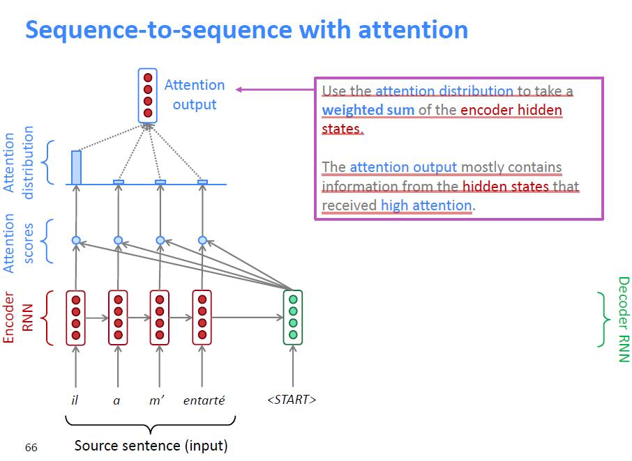

利用Attention机制，加快了计算速度，也缓解了梯度消失，还增加了可解释性。

# Question Answering

Question answering类似于阅读理解，给定原文P和问题Q，我们希望给出回答A，模式如下：

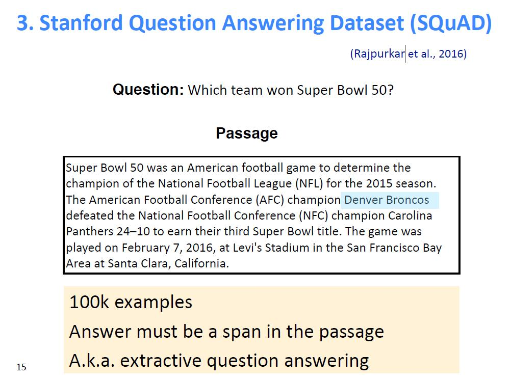

## Stanford Question Answering Dataset (SQuAD)

SQuAD是问答系统的一个经典数据集：

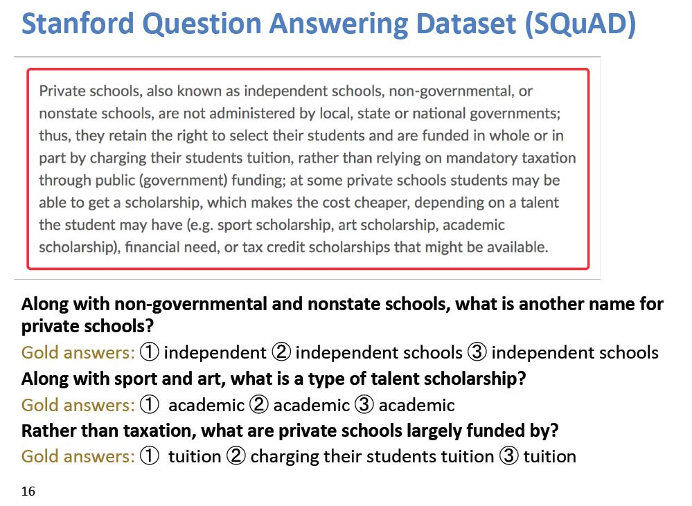

每个问题有3个答案，下面介绍两种评估结果的方式：

- Exact match：如果和3个答案之一相同则为1，否则为0
- F1：把系统和每个答案作为bag of words，计算

$$
\text { Precision }=\frac{T P}{T P+F P}, \text { Recall }=\frac{T P}{T P+F N}, \text { harmonic mean } F_1=\frac{2 P R}{P+R}
$$

注意回答A都是原文P的一段连续的话，所以输出只要指定Start和End即可，SQuAD 2.0是SQuAD数据集的改进，增加了没有回答A的数据。

## Stanford Attentive Reader

该模型的整体架构如下：

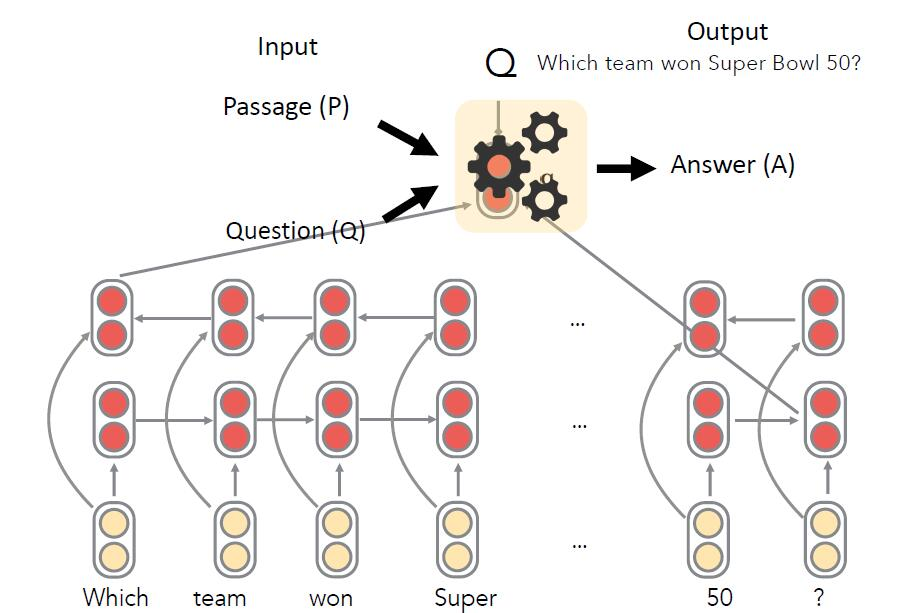

具体方式为分别对原文P以及问题Q进行编码，然后利用attention计算start以及end，具体如下:

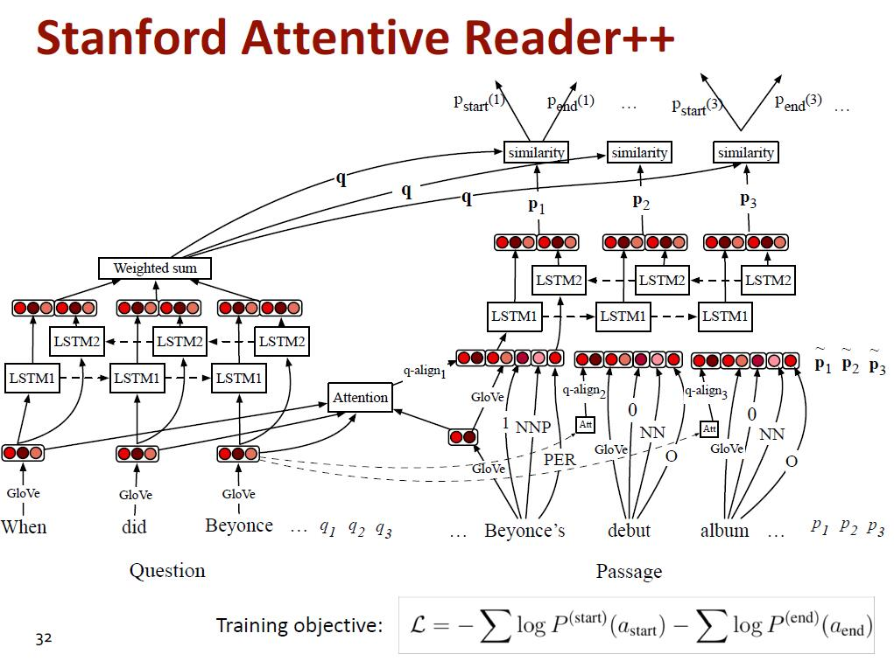

在上图中，首先利用双向LSTM对Q进行编码，最后生成加权和；另一部分，利用Q的词向量和P的词向量做attention，然后进行编码；最后将编码之后的结果利用attention计算start以及end。

这部分介绍P中单词的特征表示pi，其由如下几点构成：

- 词嵌入（GloVe 300d）
- 语言学特征：POS,NER标签，one-hot的形式
- 单词频率（一元语言模型）
- 完全匹配：单词是否出现在问题中
  - 3个二进制特征：精确，无大小写，lemma（不知道具体含义）
- 对齐问题嵌入（“汽车” vs“车辆”）

# 自然语言生成（NLG）

自然语言生成（NLG）是指生成新文本的任务。

## 解码算法

- 贪心算法：每次选择概率最高的单词
- 束搜索(k)：每一步考虑k个概率最大的序列
- Top-n采样：每次从概率最大的n个单词中采样
- Softmax温度：增加超参数$\tau$，$P_{t}(w)=\frac{\exp \left(s_{w} / \tau\right)}{\sum_{w^{\prime} \in V} \exp \left(s_{w^{\prime}} / \tau\right)}$

## NLG tasks and neural approaches to them

### Summarization

- 任务：给定输入文本x，写一个简短的摘要y，其中包含x的主要信息。
- 两种方法：
  - 提取摘要：选择原始文本的一部分（通常是句子）以形成摘要。
  - 抽象摘要：使用自然语言生成技术生成新文本。

#### 评估

ROUGE(Recall-Oriented Understudy for Gisting Evaluation)
$$
\text{ROUGE-N} =\frac{\sum_{S \in\{\text {Reference Summaries}\} } \sum_{\text{gram}_{n} \in S} \operatorname{Count}_{\operatorname{match}}\left(\operatorname{gram}_{n}\right)}{\sum_{S \in\{\text {Reference Summaries}\}}  \sum_{\text{gram}_{n} \in S}\operatorname{Count}\left(\operatorname{gram}_{n}\right)}
$$

#### Neural summarization

Neural summarization使用生成加复制机制来产生摘要：

- Seq2seq + attention系统擅长编写流畅的输出，但不擅长正确复制细节（如稀有单词）
- 复制机制要注意使seq2seq系统能够轻松地将单词和短语从输入复制到输出

复制机制的图示如下：

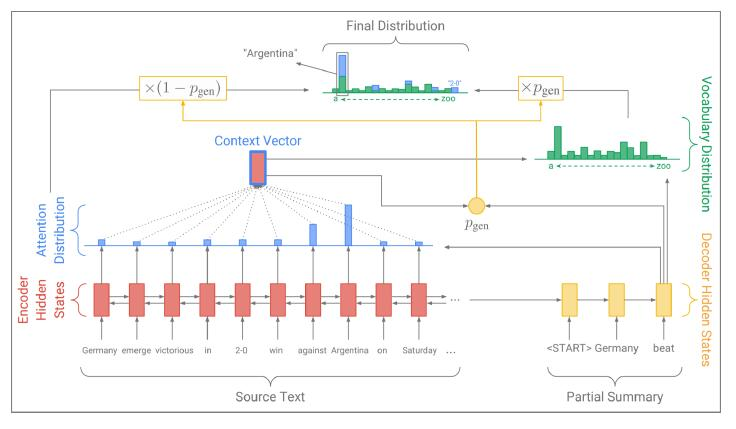

每次生成单词前计算$p_{\text {gen}}$，以$p_{\text {gen}}$的概率生成单词，$1-p_{\text {gen}}$的概率从文本中提取：
$$
P(w)=p_{\mathrm{gen}} P_{\mathrm{vocab}}(w)+\left(1-p_{\mathrm{gen}}\right) \sum_{i: w_{i}=w} a_{i}^{t}
$$

##### 复制机制的问题

- 复制太多
- 不擅长整体内容选择，尤其是在输入文档很长的情况下
- 没有选择内容的整体策略

##### bottom-up summarization

bottom-up summarization将生成摘要分为两个阶段：

- 内容选择阶段：使用神经序列标记模型将单词标记为包含或不包含
- 自下而上的注意阶段：seq2seq + attention不处理标记为不包含的单词（使用mask）

# Coreference Resolution

## What is Coreference Resolution?

识别所有提及同一现实世界实体的信息。

考虑如下文本，蓝色标注部分表示实体：

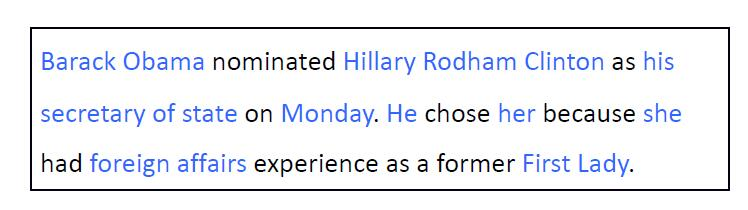

红色部分均指Obama：

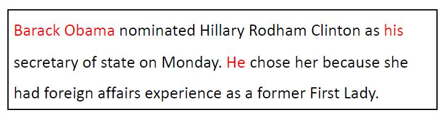

橙色部分均指Hillary：

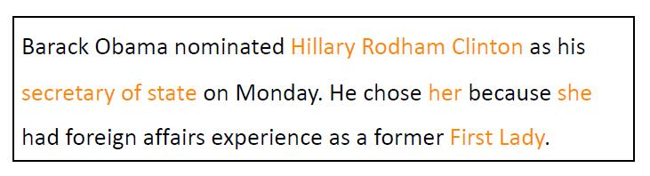

## 应用

### 全文理解

- 信息提取，问题解答，总结…
- “He was born in 1961” (Who?)

### 机器翻译

- 语言具有不同的性别，数量，代名词等特征。

### 对话系统

- “Book tickets to see James Bond”
- “Spectre is playing near you at 2:00 and 3:00 today. How many tickets would you like?”
- “Two tickets for the showing at three”

## Coreference Resolution in Two Steps

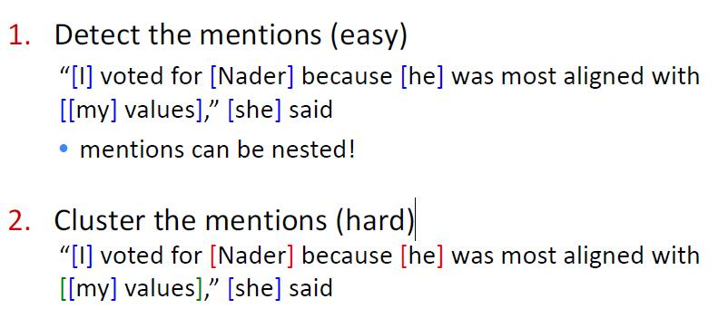

#### Mention Detection

- Mention：涉及某个实体的文本范围
- 三种Mention：
  - 1.代词
    - I, your, it, she, him, etc.
    - 使用词性标记器
  - 2.命名实体
    - People, places, etc.
    - 使用NER系统
  - 3.名词短语
    - “a dog,” “the big fluffy cat stuck in the tree”
    - 使用解析器

#### Coreference and anaphora

- coreference是指两个提及指向世界上的同一实体
- 一个相关的语言概念是anaphora：当一个术语（anaphora）指另一个术语（antecedent）时
  - anaphora的解释在某种程度上取决于antecedent的解释

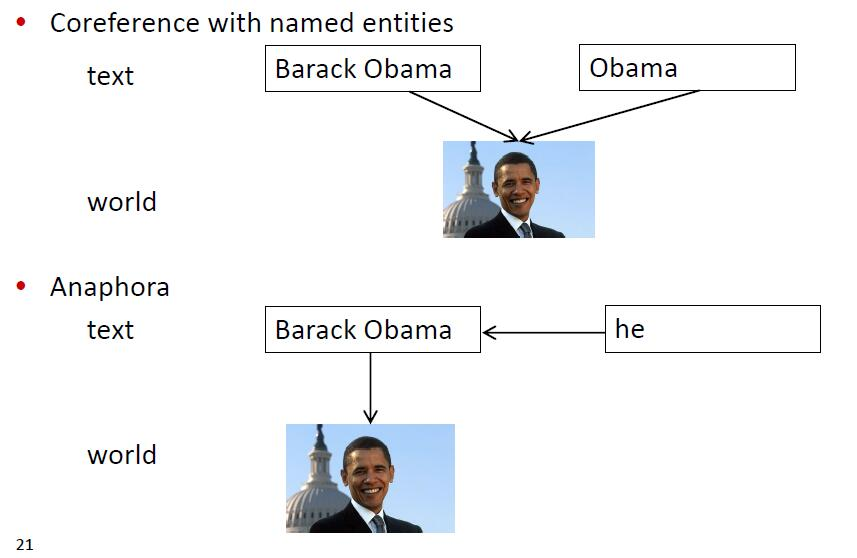

#### Four Kinds of Coreference Models

- 基于规则（代词照应度解析）
- Mention Pair
- Mention Ranking
- 聚类

##### Mention Pair

- 训练一个二元分类器，该分类器计算每对单词为coreferent的概率$p\left(m_{i}, m_{j}\right)$
- 希望正样本概率接近1，负样本概率接近0

损失函数为
$$
J=-\sum_{i=2}^{N} \sum_{j=1}^{i} y_{i j} \log p\left(m_{j}, m_{i}\right)
$$
测试时，选择阈值，当概率大于阈值时为coreferent。

##### Mention Ranking

- 根据模型为每个mention分配得分最高的候选对象
- NA mention允许模型拒绝将当前提及链接到任何内容

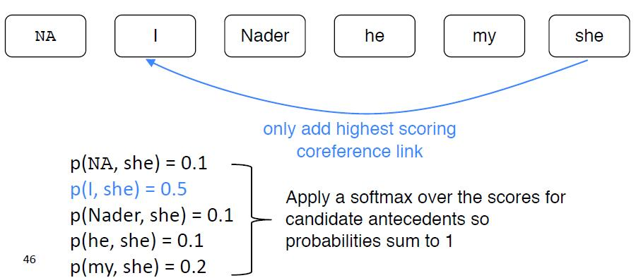

在上述模型下，我们希望最大化如下概率:
$$
\sum_{j=1}^{i-1} \mathbb{1}\left(y_{i j}=1\right) p\left(m_{j}, m_{i}\right)
$$
损失函数定义为:
$$
J=\sum_{i=2}^{N}-\log \left(\sum_{j=1}^{i-1} \mathbb{1}\left(y_{i j}=1\right) p\left(m_{j}, m_{i}\right)\right)
$$

##### End-to-end Model

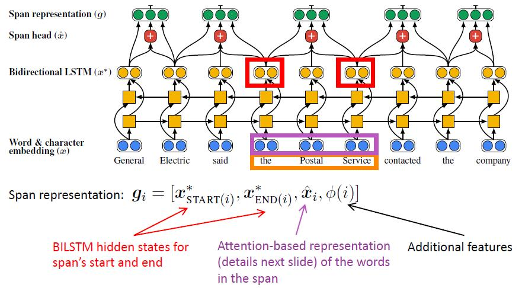

计算i,j为mention的依据为:
$$
s(i, j)=s_{\mathrm{m}}(i)+s_{\mathrm{m}}(j)+s_{\mathrm{a}}(i, j)
$$
其中:
$$
\begin{aligned}
s_{\mathrm{m}}(i) &=\boldsymbol{w}_{\mathrm{m}} \cdot \mathrm{FFNN}_{\mathrm{m}}\left(\boldsymbol{g}_{i}\right) \\
s_{\mathrm{a}}(i, j) &=\boldsymbol{w}_{\mathrm{a}} \cdot \mathrm{FFNN}_{\mathrm{a}}\left(\left[\boldsymbol{g}_{i}, \boldsymbol{g}_{j}, \boldsymbol{g}_{i} \circ \boldsymbol{g}_{j}, \phi(i, j)\right]\right)
\end{aligned}
$$

##### 聚类

- Coreference是一项聚类任务，让我们使用聚类算法！
  - 特别是，我们将使用聚集聚类
- 将每个mention视为一个cluster
- 在每个步骤中合并一对集群
  - 使用模型来评估哪些聚类合并是好的

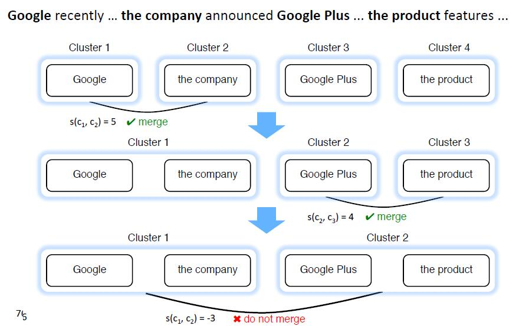

