# 模型压缩

## 模型压缩概述

引入问题：
  1. 为什么要进行模型压缩？
    端侧设备存在资源限制，在边缘设备中，受到计算资源，功率，以及存储空间等诸多条件的限制。效果很好的网络模型可能难以部署到边缘设备中。因此要对模型进行压缩，提高其推理速度，功率消耗，以及模型所占用的空间等资源。
  2. 为什么能模型压缩
    深度学习神经网络模型存在冗余性。在神经网络中，可能大部分的参数，分布在0附近，在网络前向推理时起到的作用很小，而真正对网络的推理结果起到决定性作用的是一些所占比例很小的权重，所以，通过将网络中的冗余参数消除，可以提高网络的效率。
    在Predicting Parameters in Deep Learning中展示，通过研究发现网络中存在很强的冗余性，仅用一小部分权重就可以预测出剩余的权重值。不仅可以对权重进行预测，甚至可以不需要这部分权重值。
  3. 什么是模型压缩
    利用网络模型冗余性的特点，减小模型规模的。

目前主流的模型压缩方法有：
  - 剪枝：修剪不重要的网络连接
  - 量化：将连续型数据量化为低位宽离散数据
  - 知识蒸馏：大模型指导小模型学习
  - 低秩分解：通过低秩矩阵近似原矩阵
  - 轻量化网络：使用轻量化卷积核代替传统卷积核
  - 网络结构搜索：自动化地设计优异网络模型

## 知识蒸馏

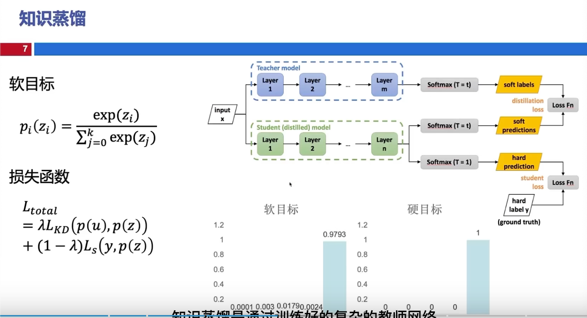

让学生模型学习模仿教师模型。以使学生模型得到与教师模型接近的效果。

学生模型同时学习hard label和soft label。

### 知识蒸馏简介

知识蒸馏是指通过教师模型指导学生模型训练，通过蒸馏的方式让学生模型学习教师的知识，最终让学生模型达到或者媲美老师模型的准确度。

蒸馏的结构一般如下：

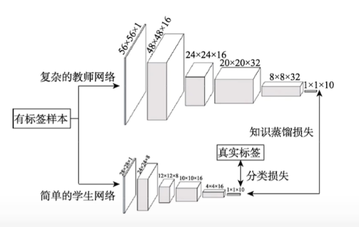

### 知识的种类

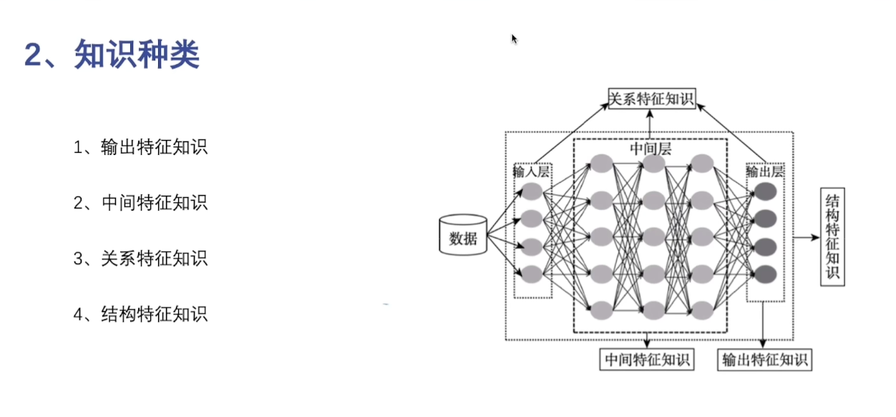

- 输出特征知识：logits或者软目标
- 中间特征知识：网络推理中的中间结果
- 关系特征知识：教师模型不同层和不同样本数据之间的关系知识
- 结构特征知识：是教师模型的完整知识体系，不仅包括上面的知识类型，同时包含了教师知识以及样本的数据分布结构。

### 蒸馏机制

通过教师模型是非随着学生模型一起更新，分为下面三种蒸馏机制。

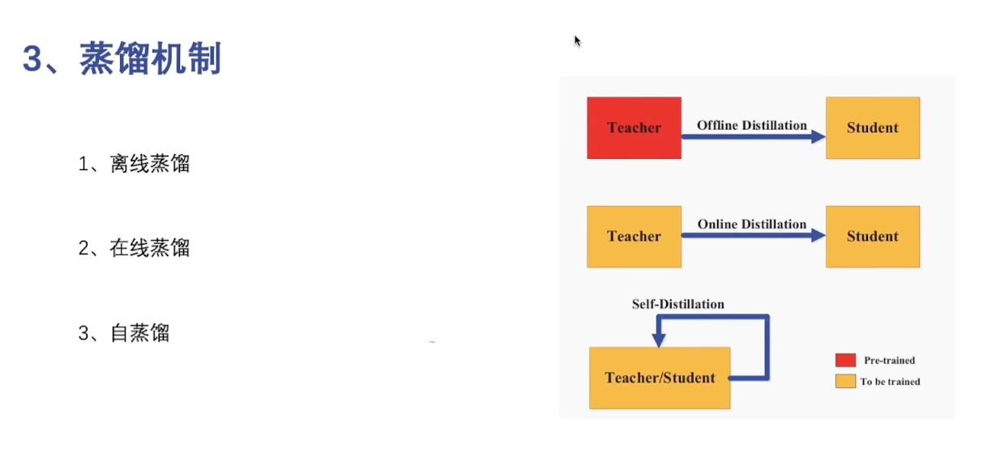

- 离线蒸馏：教师指导学生，学生以及训练数据不在过程中向教师反馈提供指导。
- 在线蒸馏：教师指导学生，学生以及训练数据同时在过程中向教师反馈提供指导。
- 自蒸馏： 教师和学生是同一个模型。

### 师生网络架构

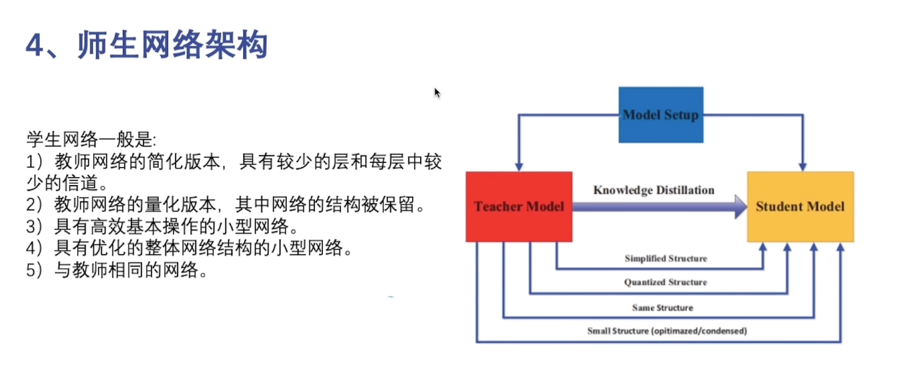

### 蒸馏算法

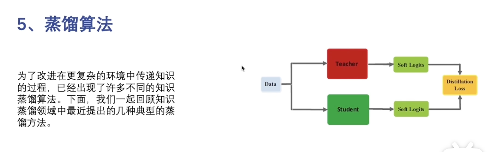

#### 对抗蒸馏

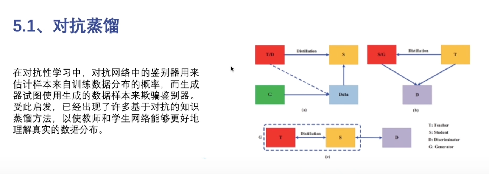

#### 多教师蒸馏

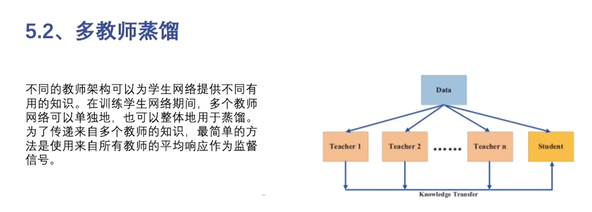

#### 交叉模式蒸馏

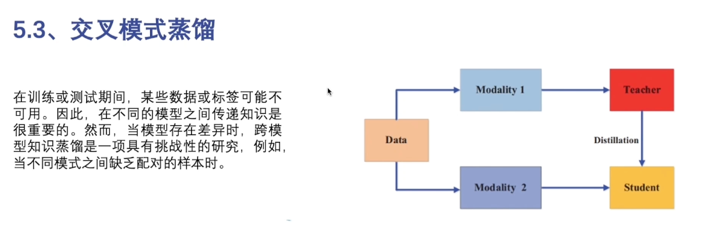

#### 基于特性的蒸馏

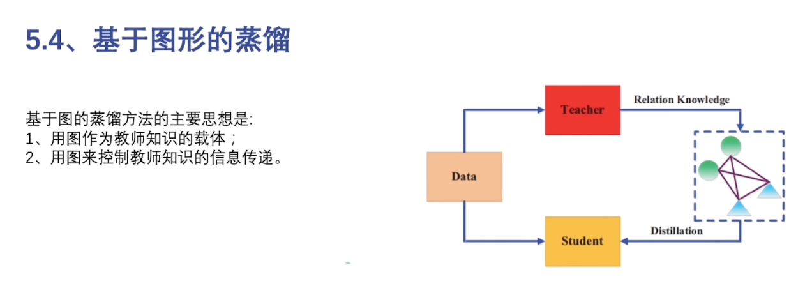

## 剪枝

### 剪枝简介

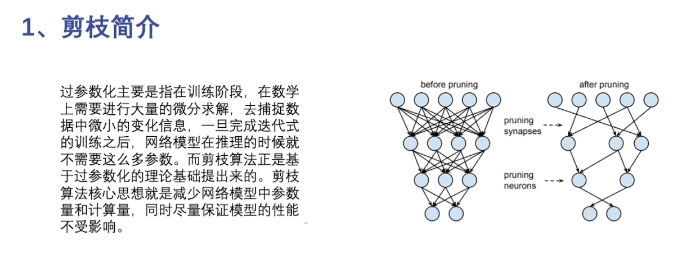

在深度学习模型中存在过参数的现象（一些权重接进0，对网络的推理的作用小）。

### 剪枝步骤

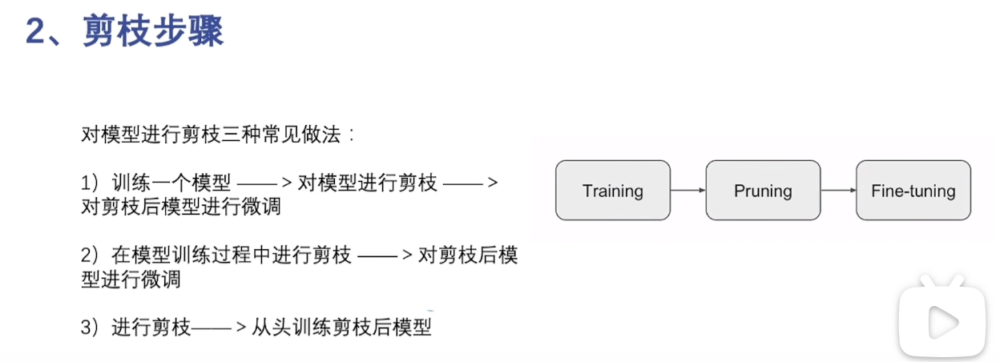

上面是常见的三种剪枝方法。

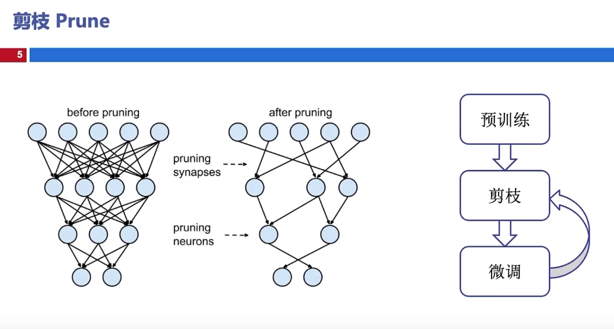

目前阶段中，剪枝的流程一般是：先对目标剪枝模型进行预训练（稀疏化训练），然后根据预训练结果进行剪枝，最后再对剪枝之后的模型进行微调。

一个常用的方法是Network Slimming中使用结构剪枝，通过BN层中的$\gamma$，作为剪枝因子进行网络模型的剪枝。

### 结构化剪枝和非结构化剪枝

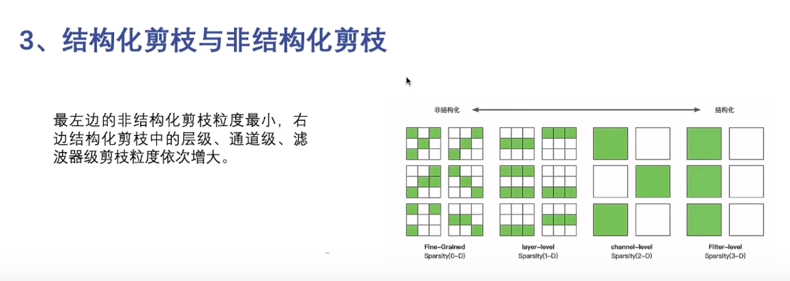

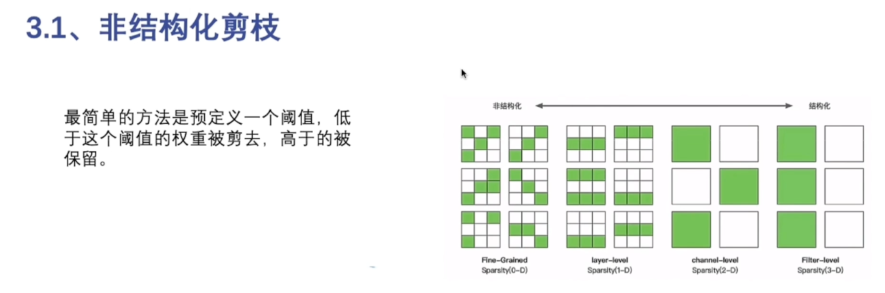

非结构化剪枝的缺点：
  1. 阈值和稀疏性无关
  2. 不同的层应该具有不同的灵敏度
  3. 通过设置阈值可能会剪掉太多信息

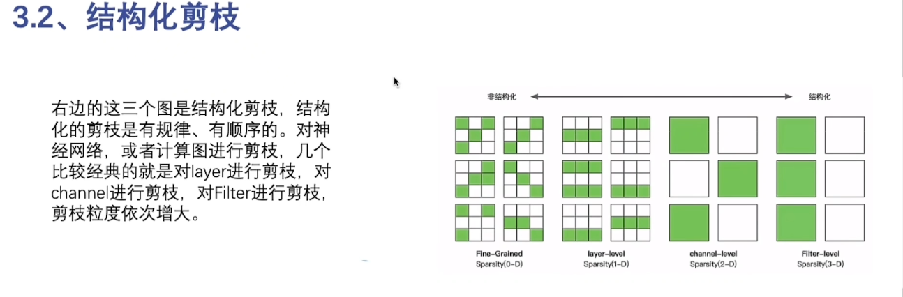

### 动态剪枝和静态剪枝

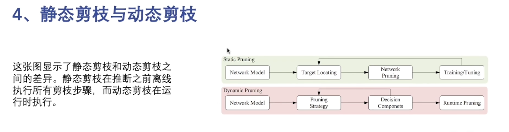

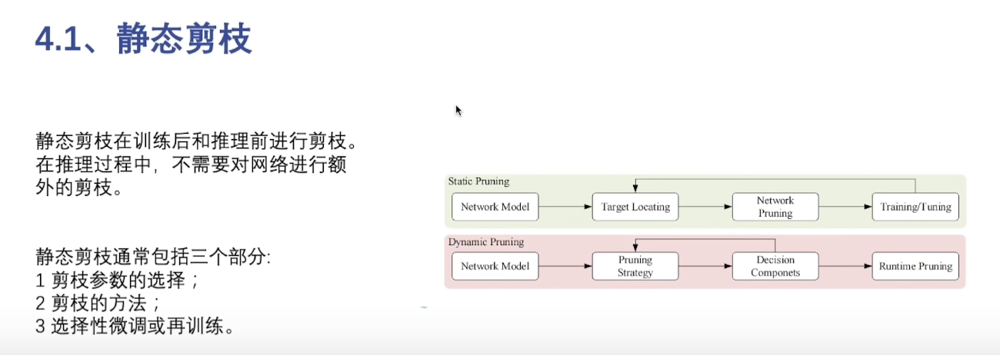

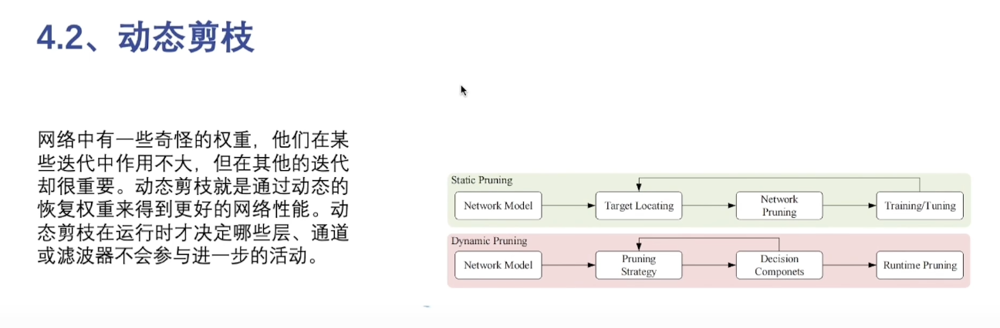

## 量化

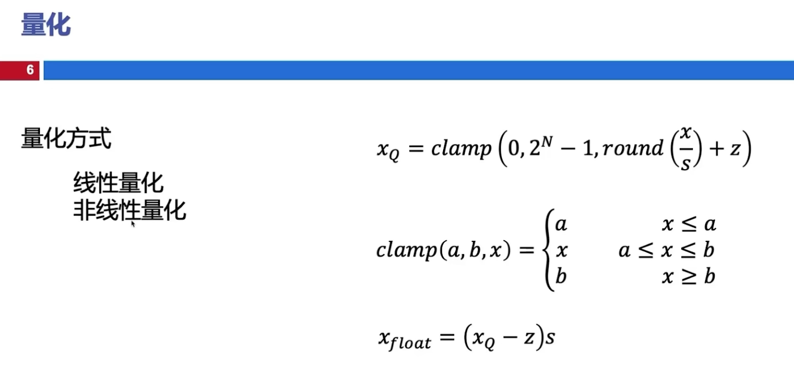

将连续取值的变量变为离散的变量，降低模型的精度。

量化分为线性量化和非线性量化，非线性量化在推理时的复杂度更高。

## 低秩分解

优化大规模矩阵的计算过程。下面的例子是CP分解的过程。

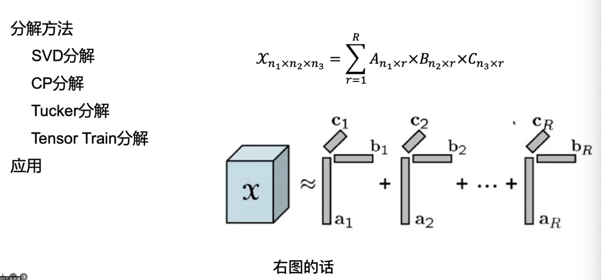

## 轻量化网络

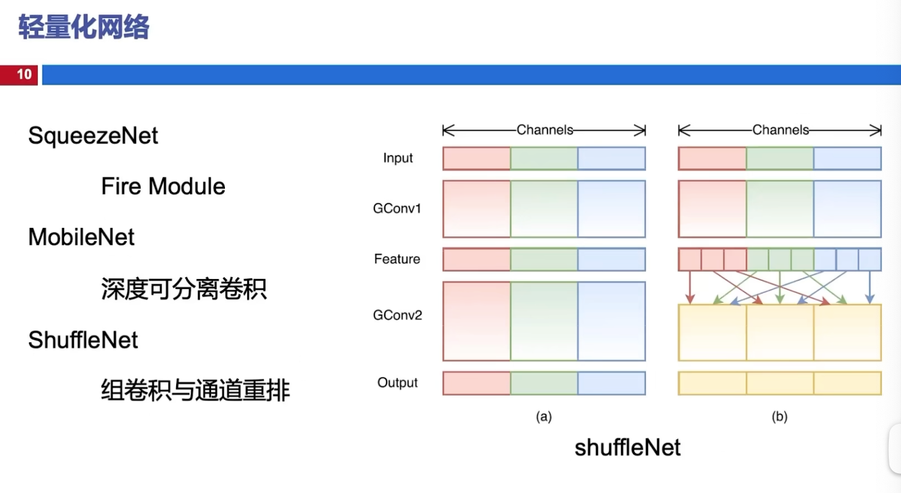

设计新型的轻量化网络，减小模型的尺寸。将一般模型中的卷积核替换为小尺寸的卷积核。